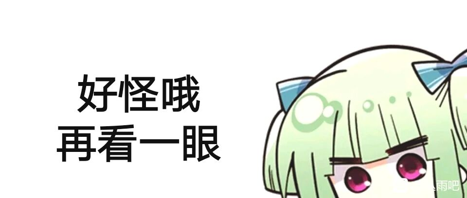
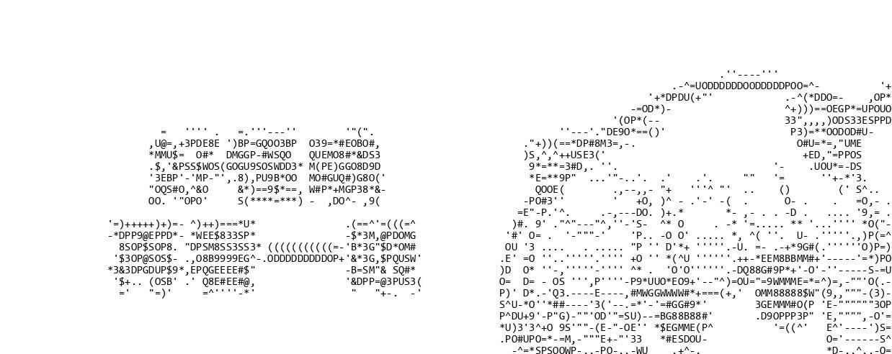
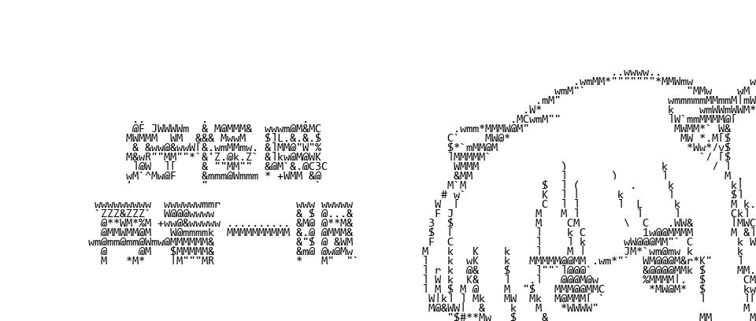
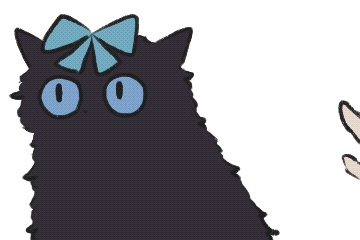
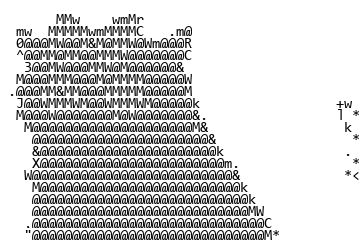
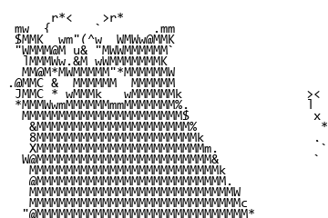

最近玩字符画，查了一下主流的字符画算法，基本采用**平均灰度**这一指标将图片区域映射到单个字符。

他们的具体做法是，建立灰度级别到字符的查找表，类似`[0~255]->[0-9a-zA-Z!@#$%^&*()]`，然后做一些位置对齐、直方图均衡等额外操作使得成图更加美观。

以上实现具体可参考[知乎：字符画——从入门到不屑](https://zhuanlan.zhihu.com/p/48941293)

这样的实现直观而简洁，但是**平均灰度**这一指标是不完美的。请见下图：





图中“好”字的上沿出现了一行独立的单引号'，“一”字的上沿变成了纵向延伸而横线断裂的左括号(，这些类似的误差导致这张字符画的观感较差。

事实上，基于**平均灰度**的字符画生成更像是一种**降采样+添加噪声**的图像处理：算法按像素区域将灰度转化为字符，而字符形状的不匹配相当于引入了一种结构化的随机噪声。

这个算法是不完美的，那么有没有完美的算法呢？本文就来探究这件事。

# 图像-字符形状匹配原理
在字符画生成算法中，受应用限制，我们一般预先设定好字符的种类、样式、大小，然后把字符堆起来，希望它尽可能地还原原画。例如一个3x3字符大小的“工”字图像，使用字符{1-+}可以拼成下面字符画：

```
-+-
 1
-+-
```

从图像像素层面考虑，一般一个字符位在字符画图像中所占的区域是固定的，该区域包含若干个像素。

那么对于这块区域来说，为达成尽可能还原原画的目标，就应当**尽量让每个像素都与原图一致**。

当然，如果每个位置的像素都完全一致，那么字符画和原图就一模一样——但这件事很少发生。100个字符只能对应100个区域图形，而8x16的像素区域即有$256^{8*16}$种可能。

因此我们需要一个**损失函数**来指导字符匹配。它需要衡量每个字符与原图的一致性，从而使得每个区域的字符能最佳表达原图区域。

一致性和表现力这些概念对我来说比较复杂，这里暂时选用常用的**像素均方误差**来衡量字符一致性，即$J=\Sigma_i\Sigma_j{(I_{ij}-\hat{I}_{ij})^2}$

有了这样一个损失函数以后，我们就可以为每块区域给出最优的字符，从而组成整幅字符画。

# 图像-字符形状匹配实现
整个实现主要分为两个部分：
## 字符图像预生成
字符**数量少而且图像是固定**的，如果每次生成字符画都计算字符图像会带来较大的重复计算开销，所以可以预生成并存储字符的灰度图像。

为计算损失函数，这里将图像转为科学计算库numpy存储。
中间操作采用numpy进行以加速计算，在最后生成图像前从numpy转换到PIL.Image。

为了排版工整和计算方便，需要**裁剪字符图片使它们等宽**。
目前有一些等宽字体，但主流使用的字体并不严格等宽。
这里我简单地将较大的字符图片裁剪到最小字符的大小（本来宽度只差1个像素）。

最后将字符图像数组stack为维度（num, h, w）的数组，便于**批量计算**。

## 字符画生成
按原图像字符区域计算损失函数，然后把最优字符的图像贴上去。

实现效果如下：







可以看到，生成字符画的字形轮廓已经非常好了，手的轮廓和猫的翘毛非常还原。不过黑猫的面部太模糊了...

# 额外改进
我认为字符的表达力比黑白画要弱，需要进一步对原图像额外做一些艺术性处理，比如**直方图均衡**。
改进效果如下：



可以看到黑猫的眼睛和蝴蝶结亮了，而手的轮廓相对没有以前清楚了。

直方图均衡**不是一个稳定的改进方案**，它会带来一些额外的问题：
1. 不同帧的同一物体可能被映射到不同灰度，导致动画观感下降。可以选取某一关键帧构建全局的灰度映射；
2. 字符画整体偏亮，在较亮的区域可以表现更多细节，而直方图均衡后的图整体会更暗一些。计划直接匹配一种较亮的灰度直方图，目前还没实现。

等待后续补充完善。

# Nonebot2 源码
我在QQ机器人Nonebot2框架中完成了上述思路的Python实现。

```python

import numpy as np
from PIL import Image, ImageFilter, ImageDraw
from PIL.Image import Image as IMG
from PIL.ImageOps import equalize
from typing import List, Dict, Optional

from nonebot_plugin_imageutils.fonts import Font
from nonebot_plugin_imageutils import BuildImage, Text2Image

from .download import load_image
from .utils import UserInfo, save_gif, make_jpg_or_gif, translate
from .depends import *

charpic_char_map = r' `1234567890-=qwertyuiop[]\\asdfghjkl;\'zxcvbnm,./!@#$%^&\*\(\)_\+QWERTYUIOP{}\|ASDFGHJKL:"ZXCVBNM<>\?'
charpic_char_num = len(charpic_char_map)
charpic_char_font = Font.find("Consolas").load_font(15)
charpic_char_img = None  # (char_num, h, w)
def _init_charpic():
    global charpic_char_img
    def make(char) -> BuildImage:
        text = "\n".join([char])
        w, h = charpic_char_font.getsize_multiline(text)
        text_img = Image.new("RGB", (w, h), "white")
        draw = ImageDraw.Draw(text_img)
        draw.multiline_text((0, 0), text, font=charpic_char_font, fill="black")
        return BuildImage(text_img)
    charpic_char_img = list()
    for char in charpic_char_map:
        img = np.asarray(make(char).convert("L").image)
        charpic_char_img.append(img)
    char_h, char_w = charpic_char_img[0].shape
    for i in range(charpic_char_num):
        charpic_char_img[i] = charpic_char_img[i][:char_h, :char_w]
    charpic_char_img = np.stack(charpic_char_img, axis=0)  # (char_num, h, w)

def charpic(img: BuildImage = UserImg(), arg: str = Arg()):
    if charpic_char_img is None:
        _init_charpic()
    _, char_h, char_w = charpic_char_img.shape

    def make(img: BuildImage) -> BuildImage:
        img = img.convert("L").image
        if '平衡' in arg:
            img = equalize(img)
        img = np.asarray(img)
        img_h, img_w = img.shape
        img_h_ = img_h if img_h % char_h == 0 else ((img_h // char_h) + 1) * char_h
        img_w_ = img_w if img_w % char_w == 0 else ((img_w // char_w) + 1) * char_w
        img_ = np.ones((img_h_, img_w_), dtype=np.int32) * 255
        img_[:img_h, :img_w] = img

        p_h = 0
        while p_h < img_h_:
            img_h = np.repeat(np.expand_dims(img_[p_h:p_h + char_h], axis=0), charpic_char_num, axis=0)
            p_w = 0
            while p_w < img_w_:
                loss = np.square(img_h[:, :, p_w:p_w + char_w] - charpic_char_img).mean(2).mean(1)
                img_[p_h:p_h + char_h, p_w:p_w + char_w] = charpic_char_img[loss.argmin()]
                
                p_w = p_w + char_w
            p_h = p_h + char_h
        img_ = Image.fromarray(img_)
        return BuildImage(img_)

    return make_jpg_or_gif(img, make)

```