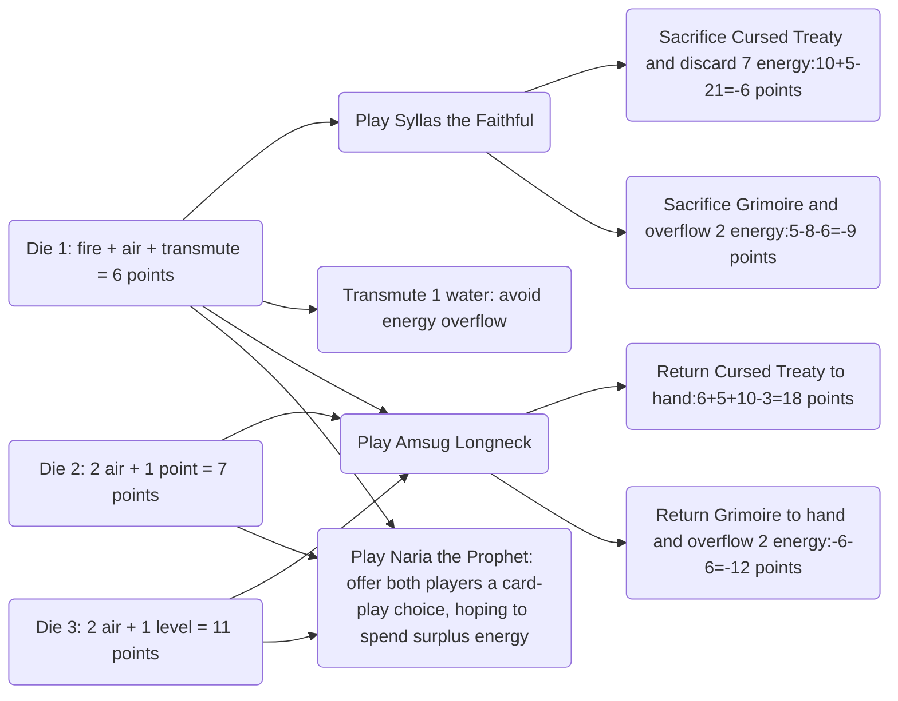

*Seasons* is a card-drafting and combination-building game for 2–4 players. Players manage energy, their Summoning gauge, and crystals while using season dice and Power-card effects to increase their final Prestige points.

Card draws and dice create variance, while energy reserves, the Summoning gauge, card combinations, and game speed remain open to planning. This guide converts those choices into estimated Prestige points so that draft picks and in-game actions can be compared on one scale.

The estimates come from the author's play experience and simplifying assumptions. They have no status as official rules or a proven optimal strategy.

The guide is intended for players who already know the basic rules and want to review resource efficiency. New players should start with the [official Libellud English rulebook](https://cdn.svc.asmodee.net/production-libellud/uploads/2022/03/SEASONS_RULES_EN.pdf).

On 27 September 2023, I revised Die of Malice, Divine Chalice, **5.3.5 Game Speed**, and **5.3.6 Using Randomness** after discussion with [hdfbuaa](https://boardgamearena.com/player?id=91665234), winner of the 2022 BGA *Seasons* World Championship final. The strategic judgments remain the author's responsibility.

## Terms and Valuation Symbols

- **Energy token:** one of the four water, earth, fire, and air tokens. The guide uses “energy” throughout.
- **Summoning gauge:** the maximum number of Power cards a player may have in play.
- **Play a card (Summon):** pay a card's summoning cost and move it from hand into play. The guide uses “play a card” in later sections.
- **Transmute:** exchange Energy tokens for crystals at the current season's rate.
- **Crystal:** a marker on the crystal track; crystals also pay for some effects.
- **Prestige point:** the official victory-point unit. “Points,” “printed points,” and “estimate” in the tables all use Prestige points.
- **Card estimate:** this model's estimate of a card's contribution to Prestige points. Timing, combinations, and opponents can change it.

## I. Some Assumptions

### 1.1 Total Number of Rounds

The minimum total length of a game is 36 months.

| Game speed/player preference | Average months advanced per round | Estimated total rounds |
| :--: | :--: | :--: |
| Slow | ~1.5 months | ~24 rounds |
| Medium | ~2 months | ~18 rounds |
| Fast | ~2.5 months | ~14 rounds |

As shown above, **a game is expected to last 14–24 rounds**.

### 1.2 Average Number of Cards Played

An ordinary player plays at least about eight cards (because an effect discards cards from hand, or because they cannot be played) and at most about fifteen (because effects sacrifice cards in play, allowing still more cards to be played).

Because there are many card-drawing and group-dealing effects, and most players tend to draw cards, they generally play more cards. Based on experience, this article estimates that **a player plays an average of eleven cards**.

## II. Quantifying Resource Values

### 2.1 Energy

The baseline model assumes that each Energy token is transmuted in its most valuable season for 3 crystals, so **each Energy token is worth 3 points**. Lower transmutation rates, a full reserve, and bonus actions are adjusted separately later.

### 2.2 Summoning Gauge

The baseline model assumes that players put every planned card into play before the game ends. Each additional space on the Summoning gauge can support one more card in play and may avoid the 5-point penalty for a card left in hand.

While the Summoning gauge still limits card play, **each additional space is worth 5 points**. Extra spaces beyond the required capacity are worth 0 points in this model.

Drawing a card that will remain in hand adds a 5-point penalty. Spare capacity removes this cost.

### 2.3 Transmutation

Transmutation is valued through the crystals it produces and the alternative action forgone that round.

## III. Card Values and Strategy Analysis

### 3.1 Card Value Table

The table preserves the author's original estimates for cards across the expansions and sorts them by the Estimate column. “Card value” gives the calculation and “Assessment” records play experience. Card names and text follow the English edition used by the author; consult the relevant rulebook and card for exact wording. “First-pick candidates” are the cards the author selected under the current model and for opening flexibility. The first eleven entries, from Mesodae's Lantern through Crystal Titan, form this group; each assessment states the relevant timing, resource burden, and interaction conditions.

| Card | Estimate | Cost | Printed points | Effect | Card value | Assessment |
| :--: | :--: | :--: | -- | :--: | -- | ---- |
| Mesodae's Lantern | 44 | 3 water, 3 air | 24 points | Ongoing: cannot be played for free. Energy reserve limit -1. End of each round: gain 3 points. | Slow: ~(24-4)x3+24-3x6=66 points Medium: ~(18-4)x3+6=48 points Fast: ~(14-4)x3+6=36 points | When played early, the model estimates 36–66 points. |
| Die of Malice | 40 | - | 8 points | Activate: reroll your own die and gain 2 points. | Slow: 8+2x(24-2)=52 points Medium: 8+2x(18-2)=40 points Fast: 8+2x(14-2)=32 points | It is rerolled in most rounds and is worth 32–52 points depending on game speed. The expected value of rerolling **each** die differs and is generally estimated at 8 points: 1) the expected value of the face chosen by the player and of the reroll can be treated as equal; 2) rerolls other than two energy plus a level, and card draws, usually have a higher expected return; 3) leaving an unfavorable face or controlling game speed can create a score difference. |
| Demonic Dagger | 40 | water, air, air | 6 points | Activate: sacrifice or discard a familiar to gain 4 energy. | Each discard: 5+3x4+6-3x3=14 points Each sacrifice: 14-printed points | With at least two familiars, each discard adds 14 points under the model. The card also supplies energy, frees Summoning-gauge capacity, and removes negative-point familiars. |
| Scepter of Winter | 40 | 2 water | 6 points | Ongoing: during winter, all your energy can be used as earth energy. Activate: discard one magic item to gain 3 energy. | Number of activations x14 points | The larger number of magic items usually provides a discard target; each activation converts one card into an estimated 14 points. |
| Elemental Vase | 34 | water, earth, fire | 6 points | Ongoing: gain 1 energy whenever you play a card. | Ordinary: (11-1)x3-3=27 points Limit: (15-1)x3-3=39 points | Playing 11–15 cards gives a model estimate of 27–39 points. The trigger fits most builds and supplies energy throughout the game. |
| Wondrous Chest | 34 | water, fire | 4 points | End of round: if you have at least 4 energy, gain 3 points. | Slow: (24-4)x3-2=58 points Medium: (18-4)x3-2=40 points Fast: (14-4)x3-2=28 points | Depending on game speed, the model estimates 28–58 points. Keeping at least four energy satisfies the trigger. |
| Scepter of Spring | 33 | 3 earth | 9 points | Ongoing: gain 3 points each time you play a card. | Year one: ~33 points Year two: ~24 points | At an average of eleven cards played, playing it in year one or year two gives an estimate of about 33 or 24 points. The trigger fits most builds. |
| Heart of Argos | 33 | 2 earth | 7 points | End of round: if an activation was triggered this round, gain 1 earth. | Slow: ~16x3+7-6=~49 points Medium: ~12x3+1=~37 points Fast: ~8x3+1=~25 points | If played in year two and triggered every round, the model estimates 25–49 points. With Horn of Plenty, the earth gained each round can become 5 points. |
| Cursed Leech | 30 | 2/5/8 points | 8 points | An opponent must pay you 1 point before playing a card. | 2 players: 2x11+8-2=28 points 3 players: 3x11+8-5=36 points 4 players: 4x11+8-8=44 points | At eleven cards played per player, the 2–4 player estimates are about 28, 36, and 44 points, with no further action required. |
| Crystal Orb | 30 | earth, fire | 6 points | Activate: 1) look at the top card of the deck and pay 4 energy to play it for free; 2) pay 3 points to discard the top card of the deck. | (estimated value of the target card on top of the deck-12)xnumber played-3xnumber discarded | Playing the top card produces a positive return when its estimated value exceeds the 12-point energy cost. Seeing the top card also improves the value of other draw effects. |
| Crystal Titan | 30 | fire/fire+3 points/fire+8 points | 9 points | Sacrifice: discard all cards in hand and all crystals, then choose one opponent's card to sacrifice. Ongoing: an opponent must give you 3 crystals before sacrificing a card. | Sacrifice: estimated value of the opponent's sacrificed card+card cost-(12 points/15 points/20 points)=28 points/25 points/20 points No sacrifice: (6 points/4.5 points/4 points)xnumber of triggers+(6 points/3 points/-2 points) | The active sacrifice is usually scheduled after emptying the hand and crystal reserve in year one. Removing a key card is worth about 20–28 points by player count and also removes the opponent's central effect. Without the active sacrifice, one trigger per opponent is close to the model baseline, while two triggers exceed it. Track sacrifice effects created by passed cards. |
| Figrim the Avaricious | 28 | 3/6/9 points | 7 points | When the season changes: steal 1 point from each opponent. | Year one: 28/35/46 points Year two: 20/23/30 points Year three: 12/11/14 points | While opponents still have points to transfer, playing it in year one is worth about 28–46 points by player count; later play reduces the estimate. |
| Idol of Eolis | 28 | water, earth, fire | 6 points | When played: energy reserve limit -1. Whenever the season changes: gain 1 energy, or gain 2 points and look at the top card of the deck. | ~(12-1)x3+6-3x3=30 points | If played early in year one and triggered eleven times, the model estimate is about 30 points. The one-space reduction requires spare energy-reserve capacity. |
| Familiar Statue | 28 | water, earth, fire, air | - | When played: gain 10 crystals. Activate: gain points equal to your number of familiars. | Year two, 2 familiars: ~10x2-2=~18 points Year two, 3 familiars: ~10x3-2=~28 points | When played in year two, two familiars are worth about 18 points and three are worth about 28 points. |
| Arcane Telescope | 26 | - | 8 points | Activate: pay 2 points, look at the top 3 cards of the deck, and return them in any order. | 8 points+number of activationsx(card value difference-2) | At the best-of-three estimate, each activation adds about 6 points. It also raises the hit rate of single-card draw effects or restricts an opponent's draw; repeated activations can make it the center of a build. |
| Vampire Crown | 25 | water, air | - | When played: draw or discard one card, then gain energy equal to its printed points. | 7 energy: 3x7-6=15 points 10 energy: 3x10-6=24 points Draw: card value-5 Discard: +5 | Discarding a card worth 7 or 10 printed points produces 7 or 10 energy, for model net values of about 15 or 24 points. The transmutation bonus and extra reserve capacity help convert that energy into points. |
| Divine Chalice | 25 | water, earth, fire, air | 10 points | When played: reveal four cards, choose one, and play it for free. | Card value-2+cost-7=~25 points | Revealing four cards and immediately playing one gives a model estimate of about 25 points; reserve two Summoning-gauge spaces before use. **The tournament deck contains fewer matching cards, so the estimate is lower there.** |
| Chalice of Eternity | 25 | water, earth, fire, air | 10 points | End of round: you may place one energy on this card. Activate: spend the 4 energy on this card, reveal four cards, choose one, and play it for free. | Number of activationsx(card value-2+card cost-17)-2=number of activationsx(~12)-2 | At about 12 points per activation, two activations approach the model baseline and a third adds roughly 12 more points. The revealed cards create substantial variance. **The tournament deck contains fewer matching cards, so the estimate is lower there.** |
| Amulet of Time | 25 | 2 water | 9 points | When played: gain 2 energy. Discard any number of cards from hand and draw the same number. | 9 points+increase in card value=~20 points | Used alone, it is worth about 9 points; when replacing low-value cards, the net gain is the difference between the old and new card estimates. |
| Shield of Zera | 25 | air | 5 points | When a sacrifice is required: sacrifice this card instead and gain 10 points. | Triggered effect: sacrifice benefit+10+5-3=sacrifice benefit+12 With Potion of Knowledge: 3x5+12=27 points | Replacing another sacrifice adds about 12 points beyond the original sacrifice benefit; with Potion of Knowledge, the model estimate is 27 points. |
| Heart of Magma | 25 | fire/2 fire/3 fire | - | Ongoing: gain 1 fire whenever an opponent plays a card. Sacrifice: gain 3 fire. | 2 players: (3-1)x(11-2)+3x3+5-3=30 points 3 players: 2x9x2+8=44 points 4 players: 2x9x3+5=59 points | The estimate is about 30–59 points by player count. Fire that exceeds the reserve limit or is transmuted at a low rate reduces the realized return. |
| Igram the Banisher | 25 | 3 points | 7 points | When played: name a card. All opponents reveal their hands; any opponent holding that card discards every copy, and you gain the energy in its cost. | 3x4+7-3=15 points | A hit removes an opponent's central card and replenishes energy. Its realized value depends on hand tracking, timing, and whether the named card remains in hand. |
| Ragfield's Orb | 25 | water, earth, fire, air | -5 points | When played: gain 20 points. Ongoing: each of your cards worth less than 12 points costs 5 crystals. | 3 points+cost value difference=~20 points | The higher the original energy costs in hand, the more value crystal payment saves; another effect is still needed to spend energy that may overflow. |
| Temporal Circle | 25 | water, earth, 2 points/water, earth, 1 point/water, earth | 12 points | Ongoing: when the Season token moves at least 3 spaces in one round, gain 4 crystals or 1 energy. | ~5x4+(4/5/6)=24 points/25 points/26 points | Four triggers give model estimates of 24–26 points by player count. Competition for slow die faces reduces the trigger count. |
| Kroff's Dial | 25 | water, earth, fire | 12 points | When played: +2 levels. End of round: if you have played more cards than an opponent, you may reroll the season die. | 5x2+12-3x3=13 points Can gain an extra 10–20 points with cards related to the number of rounds. | Its standalone estimate is about 13 points; cards that trigger by round can add another 10–20 points. |
| Scepter of Splendor | 24 | water, earth, fire, air | 8 points | When played: gain 3 points for each magic item you have played. | Ordinary: ~7x3-4=17 points Limit: 14x3-4=38 points | With many magic items, its late-game model estimate is about 17–38 points. |
| Potion of Antiquity | 23 | water, earth, fire, air | - | Sacrifice: choose two of four: 1) each energy transmutes for 4 points; 2) draw two and keep one; 3) +2 levels; 4) gain 4 energy. | 5-12+ 1) 1 pointxnumber of energy 2) card value-5=\~15 points 3) 2x5=10 points 4) 3x4=12 points =\~20 points | The four effects can be combined around the current resource shortage; common choices are worth about 10–20 points under the model. |
| Beggar's Horn | 23 | earth, air | 8 points | End of round: if you have no more than 1 energy, gain 1 energy. | 2+3x(~8)=26 points | The trigger requires ending a round with at most one energy. At about eight triggers, the model estimate is 26 points. |
| Destined for Greatness | 23 | - | - | At the end of the draw phase, each player draws two cards and keeps one. | Average value 23 points |  |
| Hand of Fortune | 22 | earth, fire, air, 3 points | 9 points | Ongoing: reduce the energy cost of playing a card by 1 (to a minimum of 1). | ~8x3-3=21 points | This likewise saves one energy when playing a card, but its condition is stricter than Elemental Vase, and its high cost makes it difficult to play early. |
| Hourglass of Time | 22 | water, earth, fire, air | 6 points | When the season changes: gain 1 energy. | Year one: (11-1)x3-6=24 points Year two: 7x3-6=15 points Year three: 3x3-6=3 points | Playing it earlier adds triggers, but reserve space must be kept available to prevent energy overflow. |
| Glutton Cauldron | 21 | - | - | Activate: place one energy on the card. At 7 energy, sacrifice the card, gain 15 crystals, and return the energy. | 15+5=20 points | After seven energy placements and the sacrifice, the model net value is 20 points. Using the transmutation bonus on the returned seven energy in the same round adds further value. Thieving Fairies scores from the repeated activations. |
| Dragon Skull | 21 | water, earth, fire | 9 points | Activate: you may sacrifice 3 cards to gain 15 points. | Benefit each time: 3x5+15-?=~20 points | Sacrificing three zero- or negative-point cards frees three Summoning-gauge spaces; subtract the sacrificed cards' printed points from the realized return. |
| Io's Treasure Bag | 20 | fire, air | 6 points | Ongoing: each transmuted energy gains 1 additional point. | 1xtransmutations | Each transmuted Energy token adds 1 point; transmuting about twenty tokens makes the effect worth about 20 points. |
| Grimoire | 20 | water, earth | 8 points | When played: gain 2 energy. Ongoing: energy reserve limit +3. | 8 points Gains ~15 points of added value with Vampire Crown and Ragum's Pendant. | Its standalone estimate is about 8 points; with Vampire Crown or Ragum's Pendant, the added reserve space can contribute about 15 points. |
| Thieving Fairies | 20 | 0/3/6 points | 6 points | Ongoing: whenever an opponent activates a card, steal 1 point from that player, then gain 1 point. | 2 players, triggered twice: (2+1)x2+6=12 points 2 players, triggered ten times: (2+1)x10+6=36 points | Each trigger returns more than most other activation effects; primarily used to restrict an opponent's activation cards. |
| Amulet of Fire | 20 | 2 fire | 6 points | When played: reveal four cards and keep one. | Highest estimated value among the four revealed cards-5=~20 points | Reveal four cards and keep the one with the highest estimate. With a target estimate of about 25 points, the card's net value is about 20 points. |
| Shadow Mice | 20 | 2/4/6 points | 8 points | When played: steal 2 energy from each opponent. | 18/22/26 points | The estimates by player count are about 18, 22, and 26 points; opponents with fewer than two energy reduce the realized return. |
| Raven the Usurper | 20 | fire | 2 points | When played: copy one of an opponent's magic items and additionally pay that card's energy cost. When the corresponding card leaves play, sacrifice this card. | Card value-1=~24 points | Copying a magic item estimated at about 25 points gives a net value of about 24 points after the one-fire cost; the return depends on a suitable target being in play. |
| Entanglement of Argos | 20 | earth, air | 14 points | When played: nullify the effect of one opposing familiar. | 8 points+effect value | Generally worth about 20 points when active; it is a counter card for ongoing familiar effects. |
| Potion of Power | 19 | 2 fire | - | Sacrifice: +2 levels and draw 1 card. | Card value+4=~19 points | Effectively provides three summoning levels and is crucial when levels are scarce. |
| Servant of Io | 19 | air | (-5 points) | Ongoing: cannot gain crystals. When played: gain 1 air and +1 level. Activate: pay 1 air to pass this card to the next player. | Ongoing: 10 points+points lost by opponents Last player at game end: 15 points+points lost by opponents | Preventing crystal gains reduces the holder's endgame return. Passing it in the final round leaves the opponent the fewest actions with which to remove it. |
| Scroll of Ishtar | 18 | 2 fire | 7 points | When played: name an energy type and reveal cards from the top of the deck until finding a card that costs that energy, then add it to your hand. You may discard the first such card and trigger the effect again. | Estimated value of the revealed target card+7-5-6=~18 points | Commonly used to find a target card with water in its cost; the first matching card can be discarded for a second search. |
| Arus's Mimicry | 18 | water, earth, air | 10 points | When played: discard or sacrifice 1 card and gain 12 points. | 12+5+10-9=18 points Sacrifice: 18 points-printed points | Discarding one card gives an 18-point model estimate. A sacrifice also subtracts the target's printed points, so zero- or negative-point cards are preferred. |
| Potion of Knowledge | 17 | 2 water | - | Sacrifice: gain 5 energy. | 3x5+5-2x3=14 points | The base model estimate is 14 points. When the five energy pays for opening cards, supplies endgame transmutation, or enters a transmutation-bonus round, also count the downstream effect it enables. |
| Amulet of the Tomb | 17 | 2 fire | 8 points | When played: look at the top 3 cards of the discard pile; add 1 to your hand, place 1 on top of the deck, and 1 on the bottom. | Card value-3 points=~17 points | Retrieving a card estimated at about 20 points from the top three cards gives a net value of about 17 points after the two-fire cost. Discard order determines the available targets. |
| Temporal Boots | 16 | - | 8 points | When played: move the Season token 1–3 spaces. | 8 points | Its standalone printed value is 8 points. At game end, advancing one to three months can change unplayed-card penalties and the remaining number of per-round triggers. |
| Amulet of the Elements | 16 | water, earth, fire, air (optional) | 2 points | When played: 2 energy/5 points/1 card/1 level. | 2 points+3 points/2 points/card value-8/2 points=~16 points | Choose two energy, 5 points, one card, or one Summoning-gauge space according to the current shortage. After Demon of Argos removes a gauge space, the +1-space option restores it. |
| Familiar Snare | 16 | fire, air | 7 points | When played: reveal cards from the top of the deck until finding a familiar, then add it to your hand. You may discard the first familiar and trigger the effect again. | Estimated value of the revealed target familiar+7-5-6=~16 points | Used to find a specific familiar; the first familiar can be discarded for a second search. |
| Oracle Owl | 16 | water, air | 10 points | When played: reveal a number of cards equal to the player count; every player may buy one of them each round. | 4 points+2x(card value-5 points) | With enough energy and Summoning-gauge capacity, acting last allows the owner to buy first. At two purchases, the model estimate is about 16 points. |
| Amsug Longneck | 15 | water, air | 8 points | When played: each player returns one magic item to hand. | Normally: 2 points Last player at game end: +5 points+card effect points=7+? | Its return equals the replayed magic item's effect value plus the timing benefit, and depends on which cards each player can return. |
| Titus the Watcher | 15 | 1 fire/2 fire/3 fire | 4 points | End of each round: each opponent gives you 1 point. If an opponent has no points, sacrifice this card. | 2 players: ~10x2-3+4=21 points 3 players: ~8x3-6+4=22 points 4 players: ~8x4-9+4=27 points | Continuous triggering gives an estimate of 21–27 points. Any opponent can force its sacrifice by reaching zero points, so the actual trigger count is usually below the upper bound. |
| Cursed Treaty | 15 | water | -10 points | When played: gain 2 energy, 10 points, and 1 level. When sacrificed: discard all energy. | 2x3+10+5-10-3=8 points | The base model estimate is 8 points. The two energy, 10 points, and one Summoning-gauge space can immediately support other cards; spending held energy before a sacrifice reduces the discard loss. |
| Ragum's Pendant | 15 | water, fire, air | - | When played: gain energy equal to the number of magic items you have played. | 7 energy: 7x3-3x3=12 points | Gaining seven energy gives a model net value of about 12 points; Grimoire's extra reserve space can reduce overflow. |
| Dragon Soul | 15 | - | 8 points | Activate: spend 1 point to reset another card. | 8 points+activation effect value | The net return is the reset effect's value minus 1 point; useful targets include Familiar Statue and Demonic Dagger. |
| Ethel's Fountain | 15 | 2 earth | 7 points | End of round: if your hand is empty, gain 3 points. | ~8x3+1=25 points | The condition is relatively strict: cards generally have to be played very early, and drawing will probably prevent scoring from the Fountain. It therefore greatly restricts the value of other cards and draws, producing a low overall return. |
| Throne of Rebirth | 15 | water, fire, fire | 10 points | When played: discard 1 card; draw 1 card and lose one available bonus use. | 6–8 points+card value difference=~15 points | Under the table's assumptions, its estimate is about 15 points, below the article's 17-point average card estimate. |
| Ragfield's Servant | 14 | fire, air | 10 points | When played: every player with 10 crystals gains 1 level and draws a card; the drawn card may be discarded. | Exclusive benefit: card value+4 points Exclusive benefit+discard: 5+4=9 points | If only the owner has 10 crystals, the owner alone gains one Summoning-gauge space and draws a card. Discarding that card gives a 9-point model gain. |
| Shadow Trick | 14 | fire | 4 points | When played: draw 2 cards, then give 1 card from your hand to the opponent who has played the fewest cards. | 1 point+2xcard value difference Game end: +5 points | A relatively low-scoring but reliable way to draw cards. |
| Amulet of Water | 14 | 2 water | 6 points | When played: gain 4 energy. | 12 points |  |
| Potion of Resurrection | 14 | earth, fire | - | Sacrifice: choose 1 of the top 5 cards of the discard pile and add it to your hand; place the others on the bottom of the discard pile. | Estimated value of the retrieved target card-6 points=~14 points | It usually retrieves a known target among the top five cards, so subtract the 6-point energy cost from that card's estimate. |
| Um's Sealed Chest | 13 | water, water, earth | 10 points | Game end: if only magic items are in your play area, gain 20 crystals. | 20+10-9=21 points | Meeting the endgame condition gives a 21-point model estimate; sacrifice effects usually remove the remaining familiars. |
| Eagle of Argos | 13 | earth, air | 4 points | When played: gain 10 points and 1 level. Sacrifice: each opponent gains 6 points and loses 1 level. | 10+5+4-2x3=13 points Sacrifice: 5-6+5=4 points | The sacrifice has a 4-point model net value. Removing a needed Summoning-gauge space from an opponent adds further value. |
| Speterway the Defector | 13 | points equal to levels | 7 points | Activate: when an opponent draws a card, you may draw it instead and place Speterway in that opponent's play area. | 2-levels+card value | Its printed points are higher below level 6. Each intercepted draw can offset the transfer cost with the new card's value, while the final holder bears the cost of being unable to pass it again. |
| Carnivorous Ironbark | 13 | earth, fire, air | 12 points | End of round: if you have no energy, look at the top card of the deck and optionally spend 1 level to draw it. | 3 points+number of triggersx(card value-10 points) | Triggering requires an empty energy reserve and one Summoning-gauge space; the draw is likely to exceed its cost only when that capacity is already surplus. |
| Naria the Prophet | 12 | 3 points | 8 points | When played: draw a number of cards equal to the player count and distribute one to each player yourself. | 5 points+~7 points=~12 points | The owner assigns every revealed card. Keeping the highest-estimated card and distributing the rest gives a model estimate of about 12 points. |
| Lewis Greyface | 12 | fire, air | 6 points | When played: copy all energy held by one opponent. | 3x(~4)=~12 points | Copying about four energy from an opponent gives a model estimate of about 12 points at 3 points per token. |
| Cursed Soul | 12 | water | -5 points | When played: gain 10 crystals and 1 water. Activate: spend 1 water to pass this card to the next player. End of round: lose 3 points. | Assuming it ultimately remains with an opponent: 10-3+3+5=15 points | If the card ends with an opponent and costs that player at least one 3-point end-of-round loss, the model estimate is about 15 points. The plan requires one water and an available activation window. |
| Selena's Codex | 12 | water, air | 6 points | When played: return one magic item with an energy cost to its owner's hand. | Card value-card cost | The net return is the replayed card's effect value minus the energy cost paid again. |
| Watcher of Argos | 12 | air | 6 points | When played, choose one: 1) every player discards 1 card; 2) every player discards 4 energy. | 2 points+ 1) discard a card: card value-5 2) discard energy: 3x4=12 points | A flexible card, commonly used to discard energy; it can also discard an opponent's final key card or one of your own surplus cards. |
| Horn of Plenty | 12 | water, earth | 4 points | End of each round: discard 1 energy. If earth was discarded, gain 5 points. | 8 rounds: (5-3)x8+4-6=14 points | Limited standalone value; interactions with other cards can raise its return. |
| Harp of Isthar | 12 | air | 8 points | Activate: spend 2 identical energy to gain 3 points and 1 level. | 5 points+number of activationsx2 points | Each activation adds 2 points under the model. Repeated use consumes matching energy and must be checked against other energy costs. |
| Syllas the Faithful | 11 | 3 fire | 14 points | When played: each opponent sacrifices one card. | Opponent sacrifices 0 points: 5 points Opponent sacrifices 6 points: 5+6=11 points Opponent sacrifices more: 11+ points | A common opening threat; opponents will usually reserve a low-point card as the sacrifice target. |
| Potion of Dreams | 11 | 2 air | - | Sacrifice: discard all energy and play one card for free. | Cost-1 Runic Cube of Eolis: 19 points Familiar Statue: 11 points Sidit's Lantern: 17 points | Net value equals the avoided card cost minus the value of discarded energy. The table's examples for Runic Cube of Eolis, Familiar Statue, and Sidit's Lantern are 19, 11, and 17 points. |
| Olaf's Blessed Statue | 11 | 3 water | - | When played: gain 20 points. | 11 points | Playing it for free avoids an energy cost worth about 9 points; it can also serve as a later sacrifice target. |
| Ragfield's Helm | 11 | 3 air | 10 points | Game end: if you have played more cards than every opponent, gain 20 crystals. | 20+10-3x3=21 points | Playing strictly more cards than every opponent gives a 21-point model net value at game end; a tie does not award the 20 crystals. |
| Sid Nightshade | 11 | earth/2 earth/3 earth | 6 points | When played: if you have the most points, steal 5 points from each opponent. | 13/20/27 points | The effect triggers while the owner has the highest score. The 2–4 player model estimates are 13, 20, and 27 points. |
| Amulet of Air | 10 | 2 air | 6 points | When played: +2 levels. | 10 points | A summoning-level amulet. |
| Runic Cube of Eolis | 10 | 20 points | 30 points | - | 10 points | Playing it for free removes the 20-point cost, raising its net value from 10 to 30 points. |
| Um's Soul Cage | 10 | 2 points | 10 points | When played: the next player to play a card chooses one: discard the played card without triggering its effect, or sacrifice one card. | 8 points+- Sacrifice: 5-printed points | If you play the next card, a zero- or negative-point card can absorb the sacrifice. If an opponent plays next without a low-point sacrifice target, that opponent bears a larger loss. |
| Amulet of Earth | 9 | 2 earth | 6 points | When played: +9 points. | 9 points | A small scoring amulet. |
| Tree of Light | 7 | 2 earth | 12 points | Activate: 1) discard one energy to transmute this round; 2) pay 3 crystals to buy one energy. | 12-6=6 points | An energy-support card with no score production of its own. |
| Sidit's Lantern | 7 | 3 earth, 3 fire | 24 points | Game end: each energy is worth 3 points. | 24-6x3=6 points | Its normal net value is about 6 points; playing it for free avoids an energy cost worth about 18 points. |
| Ancient Jewel | 7 | fire, fire | 10 points | Game end: if the card holds 3 energy, gain 35 points; otherwise lose 10 points. Activate: spend 3 identical energy to place one energy on the card. | 35+10-3x9-3x2=12 points | Completing the condition gives a model net value of about 12 points and requires nine matching energy. It can absorb repeated mid-game overflow; otherwise it competes with other card costs. |
| Kairn the Destroyer | 6 | 3 air | 9 points | Activate: spend 1 energy to make every other opponent lose 4 points. | 1 pointxnumber of uses | The model assigns only 1 net point per activation; its main use is consuming surplus energy. |
| Io's Transmuter | 6 | water, earth | 6 points | Ongoing: when choosing a die face that grants points, you may transmute; after doing so, gain 2 points at the end of the round. | 2 pointsxnumber of triggers | Each trigger adds 2 points under the model; its main use is consuming surplus energy. |
| Eolis's Replicator | 6 | water | 7 points | Activate: spend 1 water to place a 7-point copy card in play. | 4 points-1 pointxnumber of activations | Converts surplus summoning levels into points. |
| Demon of Argos | 5 | water, earth, fire, air | 16 points | When played: every opponent loses 1 level and draws one card. | Normally: 16-3x4+10-card value=14 points-card value Last player at game end: 16-3x4+5=7 points | At ordinary timing, the net return depends on the cards opponents draw. Acting last at game end, or targeting opponents constrained by their Summoning gauges, makes the counter effect more reliable. |
| Mirror of the Seasons | 5 | 3 points | 8 points | Activate: convert any number of identical energy into another type at a cost of 1 crystal each. | 6 points-1 pointxnumber of activations | Pay 1 crystal per token to convert existing identical energy into the needed type; the effect does not increase the number of Energy tokens. |
| Potion of Life | 4 | 2 earth | - | Sacrifice: sell each energy for 4 points. | 1 pointxenergy-1 | Generally used to consume surplus energy. |
| Fairy Monolith | 4 | 2 earth | 6 points | End of round: you may store 1 energy on this card. Activate: take any amount of energy from the card. | 0 points | The baseline model assigns 0 points. Its realized return comes from storing energy that would otherwise exceed the reserve limit. |
| Die of Zen | 4 | earth, air | 10 points | Ongoing: instead of a die action, take one of the following: 1) +1 summoning level; 2) gain 1 energy; 3) transmute this round. | 4 points | The three replacement effects usually return less than a normal die action under the model and are used only for a specific resource shortage. |
| Wind Spirit Caller | 3 | 3 air | 12 points | When played: turn all opponents' energy into air. | 12-3x3=3 points | After the three-air cost, the model net value is about 3 points. The conversion adds further value when an opponent needs non-air energy for card costs. |
| Balance of Ishtar | 2 | 2 points | 4 points | Activate: transmute 3 identical energy. | 2 points | Its model net value is about 2 points; it serves only as an auxiliary transmutation route. |

### 3.2 Card Value Analysis

According to the card-estimate table, the overall distribution is approximately linear, with a visible gap between roughly the top ten cards and the remainder.

The mean card value is 18, with a standard deviation of 9.1.

After 100,000 random samples, the results were as follows:

| Number drawn | Mean card value | Card-value standard deviation |
| -------- | ------------ | ------------ |
| Draw 2, keep 1 | 23.3 | 8.5 |
| Draw 3, keep 1 | 26.0 | 8.0 |
| Draw 4, keep 1 | 28.0 | 7.6 |

The timing of a draw also causes a certain proportion of cards to lose value substantially over time, including effects that score each round and effects that reward playing cards.

The **value of a card-drawing action can be treated as 6–13 points**, depending on timing. The standard deviations in the table are 7.6–8.5 points, so a single draw can differ materially from the mean.

- Draw 2, keep 1: 8–18 points
- Draw 3, keep 1: 9–21 points
- Draw 4, keep 1: 10–23 points

Cards played immediately through Divine Chalice and Chalice of Eternity also differ from cards in hand that can be played at any time, because some cards depend on particular timing, such as Vampire Crown and Temporal Boots. I estimate that a card played immediately should lose another 2 points of value (4–11 points). Forced timing also reduces control over card interactions and increases variance. Check the remaining capacity, costs, and timing-dependent effects before using either Chalice.

## IV. Comparing Action Values and Analyzing Strategy

### 4.1 Die Actions

| Resource combination | Value |
| :--: | :--: |
| Draw a card | 10~13 |
| 2 energy + 1 level | 6+5=11 |
| 1 energy + 1 level | 3+5=8 |
| 2 energy + 3 points | 6+3=9 |
| 2 energy + 2 points | 6+2=8 |
| 2 energy + 1 point | 6+1=7 |
| 6 points | 6 |

Card draw and Summoning-gauge increases have high baseline estimates. When planning additional draws, first confirm that the gauge can support the extra cards; once that condition is met, drawing more cards usually raises expected value.

When you have enough levels and no card-draw action is available, two energy plus points is the most valuable choice.

## V. Combination Strategy Analysis

The preceding sections analyzed the expected value of individual cards and actions.

In actual play, however, cards and actions constantly interact. They realize their full value only under favorable conditions, and some combinations can push their value even higher.

The following sections therefore examine combination strategies created by resource constraints and effect interactions.

### 5.1 Resource Constraints That Affect Card Value, and Balancing Strategies

#### 5.1.1 Time

Many cards derive part of their value from timing.

- Cards that produce value every round, such as Die of Malice and Wondrous Chest, lose one round of scoring for every round they enter play late. A fast game also cuts roughly six rounds from their total production.

Because energy and levels are scarce in the opening rounds, only a limited number of cards can be played.

- For example, in year one you can place at most three opening cards into your hand, and in the first round you can gain at most two energy and one level from a die...

If too many cards need to enter play early, resource constraints will delay some of them and reduce their value. During the draft, account for this and adjust the estimated value of such cards dynamically.

When selecting time-sensitive cards, consider how Temporal Boots and Kroff's Dial alter game speed.

- Kroff's Dial is especially influential. If an opponent holds it, try to reduce the benefit they can obtain from it; if you hold it, try to exploit it fully.

#### 5.1.2 Summoning Gauge

Your Summoning gauge determines the maximum number of cards you can have in play. Gauge advances come from three sources: dice, card effects, and bonuses.

In a two-player game, the proportion of gauge-advancing faces across the twelve dice is $27/60=0.45$. The probability that the first player is guaranteed an advance is $1-(1-0.45)^3=0.83$, while the probability for the second player is $3 \times 0.45^2 \times (1-0.45)+0.45^3=0.43$. The expected number of Summoning-gauge spaces a player can obtain from dice is therefore as follows.

| Game speed | Expected gauge spaces |
| :--: | :---------------------: |
| Fast | $14 \times (0.83+0.43)/2=8.8$  |
| Medium | $18 \times (0.83+0.43)/2=11.3$ |
| Slow | $24 \times (0.83+0.43)/2=15.1$ |

These calculations show that Summoning-gauge spaces are generally plentiful in a slow game. When the Season token advances by more than two months per round, or die results fail to provide the required spaces, some cards may remain unplayed. Their estimate must then subtract the 5-point hand penalty and the lost card effect.

During the draft, track the Summoning-gauge requirements created by card effects. Adjust the deck's total requirement so that insufficient capacity does not lock cards out of play.

Several card effects change this requirement:

- **Amulet of Air** advances the gauge by two spaces while occupying one space itself, so its net requirement is −1. Keeping it during the draft reduces the original total requirement by 2; drawing it later reduces that requirement by 1.
- After **Potion of Antiquity** is sacrificed, it no longer occupies a gauge space. Its effect can either add one card to your hand or advance the gauge by two spaces, so its requirement ranges from −2 to 1.
- **Divine Chalice** requires one additional card to be played. Revealing another Divine Chalice creates two additional cards, so its requirement is 2–3.
- **Chalice of Eternity** usually triggers two or three times and requires two to four additional cards to be played. Its requirement is therefore 3–5; a fast game makes it difficult to obtain both that capacity and those trigger counts.

In my view, a total requirement of 7–8 gauge spaces across the drafted hand is conservative enough.

When gauge spaces will be scarce, use bonuses to advance the Summoning gauge early and preserve the value of drafted cards.

#### 5.1.3 Energy

The timing and types of energy a player obtains affect when cards can be played and therefore affect their value. Because energy types resist simple generalization, the analysis below focuses on quantity.

In a two-player game, the faces across the twelve dice produce energy at a rate of $85/60=1.42$. Because the amount of energy on a face is only weakly correlated with pick priority, the expected amount a player obtains from dice can be calculated as follows.

| Pace | Expected per year | Expected total |
| :--: | :------------: | --------------- |
| Fast | $5 \times 1.42=7.10$  | $14 \times 1.42=19.88$ |
| Medium | $6 \times 1.42=8.52$  | $18 \times 1.42=25.56$ |
| Slow | $8 \times 1.42=11.36$ | $24 \times 1.42=34.08$ |

The calculations show an expected gain of roughly nine energy per year. These figures use the average output of three dice each round; in practice, players can actively choose faces that increase the amount.

Many cards can generate large amounts of energy. Players must jointly consider how much energy their year-one and year-two cards require: too much demand may leave cards unplayed, while too little may cause energy overflow. They should also plan how any overflow can be converted or spent.

- For example, if a player puts Die of Malice, Cursed Leech, and Watcher of Argos into play during year one, the reserve may exceed its limit in the second half of that year. Deduct 3 points for each energy that cannot be transmuted, and consider replacing Watcher of Argos with a card that consumes more energy.

### 5.2 Transmuting Energy

Although this article assumes that each energy transmutes for 3 points, the points earned from energy can vary greatly in an actual game.

One reason is overflow and forced transmutation, discussed above. Another is the added value created by the **[bonus: transmutation +1]** action.

Let us calculate the maximum added value this action can produce in one round, using simple multiplication:

| Related effects | Maximum energy transmuted | Added value from 1 bonus (round -5 points) | Added value from 2 bonuses (round -12 points) | Added value from 3 bonuses (round -20 points) | Added value from 4 bonuses (round -29 points) |
| :---------------------------------------------------: | :--------------: | :-------------------------: | :---------------------------: | :---------------------------: | :---------------------------: |
| Energy reserve | 7 | 7 | 14 | 21 | 28 |
| Amulet of Water Demonic Dagger | 4 | 4 | 8 | 12 | 16 |
| Potion of Knowledge | 5 | 5 | 10 | 15 | 20 |
| Glutton Cauldron | 6 | 6 | 12 | 18 | 24 |
| Fairy Monolith Vampire Crown Ragum's Pendant | 7 | 7 | 14 | 21 | 28 |
| (+Grimoire) Fairy Monolith Vampire Crown Ragum's Pendant | 10 | 10 | 20 | 30 | 40 |

According to the table, suppose a player has stockpiled seven energy worth 3 points each in the current season and has already played Potion of Knowledge. Using the transmutation bonus three times then yields 21+15-20=16 extra points, roughly the value of an ordinary card.

The more energy transmuted in one round, the more value the bonus adds. Under the table's assumptions, twenty energy combined with different storage and gain effects can add about 20–40 points across four bonus uses.

The following strategies help exploit this added value:

- Because of this action, a modest energy surplus can potentially generate extra points. If the draft reveals many effects that acquire or store energy, consider collecting them as a package and using the transmutation bonus to build a scoring lead.
- When stockpiling energy early with cards such as Amulet of Water, Glutton Cauldron, and Fairy Monolith, decide which season you intend to sell it in and store the high-value energy for that season. This avoids losing points through an arbitrary mix when transmutation finally occurs. Because Temporal Boots can accelerate the game to its end, selling in the autumn of year two or the spring of year three is generally safer.
- Before using the transmutation bonus, play cards such as Potion of Knowledge and Amulet of Water in advance. Otherwise, spending energy to play them during the bonus round reduces the amount available to transmute.

The other bonuses—gaining a level, exchanging energy, and drawing two cards then discarding one—usually return no more than their cost under the model. The **transmutation bonus directly increases the points from each energy**, so players commonly preserve bonus uses for a round with many energy tokens to transmute.

**Case: [The Power of Transmutation](https://boardgamearena.com/gamereview?table=341140729)**

Although yiyuiii's opponent put no pressure on yiyuiii in this game, making the score unusually high, that does not diminish the spectacle of yiyuiii using three bonuses to transmute twenty-five energy and gain a vast number of crystals.

### 5.3 Competitive Strategy

*Seasons* focuses on managing a personal engine, but the complete card pool also contains several effects that act directly on opponents. Temporal Boots changes when a critical season arrives, while Syllas the Faithful forces opponents to sacrifice cards. In some positions, these effects can shift more than 30 points of value.

For competitive interactions, the objective analyzed here is to maximize **your own value minus your opponent's value**.

The following sections examine each relevant mechanism and card effect.

#### 5.3.1 Season Dice

During season-die selection, players take turns choosing a die and receiving its resources. The die left at the end determines how fast time advances.

The following table lists several features of season dice and their possible effects:

| Feature | Possible effects |
| :------: | :--------------------------------: |
| Amount of energy | Energy overflow; trigger conditions for certain effects |
| Energy types | Conditions for playing cards; timing of future transmutation |
| Levels | Timing of card play; management of energy |
| Transmutation | Management of energy; trigger conditions for certain effects |
| Card draw | Management of energy; timing of card play; effects unknown to the opponent |
| Pace of time | Value and trigger conditions of effects across the game |

Advantage is relative: taking points away from an opponent is equivalent to gaining points yourself. Compare the resources supplied by the chosen die with the value that each remaining die would give the opponent.

The following example explains the related strategy in detail.

**Case: [Choosing Between Resources](https://boardgamearena.com/archive/replay/230119-1002/?table=340323492&player=84626341&comments=)**

In this position, yiyuiii chooses a die first, pys88 chooses second, and yiyuiii will also act first. Let us examine how yiyuiii should play the round.

First, here is the main decision tree for the round:

Now compare the returns from the four possible actions:

- **Naria the Prophet:** pys88's reserve is close to its limit. Playing Naria may give them a card that spends energy, lowering the value of this action.
- **Amsug Longneck:** pys88 will return Cursed Treaty to hand, gaining 18 points of positive value. It is therefore better to save Amsug Longneck until the end of the game.
- **Syllas the Faithful:** pys88's optimal response is to sacrifice Cursed Treaty. Because this also discards seven energy, the response produces -6 points of value for pys88.
- **Transmute one water:** 0 value.

The decision tree shows that playing Amsug gives pys88 about 18 points of positive value, so its net return is clearly below the other three, relatively close options.

The round has three stronger choices:

- **Choice 1:** take fire, air, and transmutation; play Syllas the Faithful; then let the opponent take two air and one level. The round value is 6-11=-5 points, and Syllas the Faithful creates 6 points of effect value.
- **Choice 2:** take fire, air, and transmutation; transmute one water; then let the opponent take two air and one level. The round value is 6-11=-5 points.
- **Choice 3:** take two air and one level; play Naria the Prophet in the hope of spending energy; then let the opponent take fire, air, and transmutation. The round value is 11-6=5 points.

Taking two air and one level has an apparent round value of 5 points, but yiyuiii may exceed the energy reserve limit next round, while pys88 can adjust their reserve through transmutation. After those downstream effects are included, Choice 3 may be worth only about 1 point.

Another key question is how much Syllas the Faithful's card value changes if it is not played this round and is saved for later.

This is a question of opportunity cost. Pys88's Cursed Treaty is very likely to remain in play, so Syllas the Faithful will cause it to be sacrificed whenever it is played. This round also allows seven energy to be discarded. If pys88 remembers that yiyuiii drafted Syllas the Faithful, they will try to hold less energy later. If a later play discards only five energy, waiting costs two energy, or 6 points; subtracting those 6 points makes Choice 3 equal to Choice 1. If a later play discards only three energy, the opportunity cost is 12 points, making Choice 3 worth 6 points less than Choice 1.

After including the opportunity cost of delaying Syllas the Faithful, Choice 1 has the highest estimate and should be taken.

#### 5.3.2 First or Last Player at a Specific Moment

Competition over a particular moment usually revolves around specific effects. Effects whose value depends on timing include:

- Servant of Io, Cursed Soul, Demon of Argos, Shadow Trick, Naria the Prophet, and Amsug Longneck: being last to act in the final round can force an opponent to receive a card they cannot play or transfer, making them lose points.
- Igram the Banisher: being the first player of each year lets you attack an opponent's hand before they have played any cards.
- Transmutation bonus: being first in the chosen transmutation round prevents an opponent's Temporal Boots from advancing the season too early.

Effects that help contest timing include:

- Temporal Boots can skip an opponent's desired moment or reach your own. A player with the only copy of Temporal Boots is guaranteed to obtain the timing they want.
- Kroff's Dial can adjust game speed before the critical moment so that its owner reaches it, but it cannot beat Temporal Boots.

Missing an important timing window can cost as little as 5 points—being given one extra card—or more than 20 points through a poor energy sale, destroyed cards, a disrupted plan, and similar consequences. This can create a substantial score gap.

Whenever timing is contested, build the strategy by weighing both the value at stake and each player's ability to claim the moment.

#### 5.3.3 Card Effects

Card effects often interact and continually change one another's value. Because these interactions are numerous and specific, the table below lists several common cases for reference.

| Key card or combination | Related cards | Explanation |
| :----------------------------------------------------------: | :----------------------------------------------------------: | :----------------------------------------------------------: |
| Thieving Fairies | Familiar Statue, Glutton Cauldron, Crystal Orb, Die of Malice, Cursed Soul, and other activated-effect cards | Thieving Fairies becomes far more valuable when the opponent has many activated effects. During passing, you can therefore leave Cursed Soul for yourself to play early and pass the other activated effects to the opponent. |
| Entanglement of Argos | Cursed Leech, Thieving Fairies, Figrim the Avaricious, Entanglement of Argos, and other familiars with ongoing effects | When an opponent relies on an ongoing familiar to score or restrict actions, Entanglement of Argos nullifies one such familiar. |
| Grimoire | Vampire Crown, Ragum's Pendant, Fairy Monolith, and other effects that gain large amounts of energy | Grimoire adds three reserve spaces, allowing each large energy gain to retain up to three additional tokens. The baseline model values that capacity at up to 9 points before a transmutation bonus. |
| Familiar Statue | Familiar cards | Two familiars approach the valuation baseline; the additional trigger from a third raises the return clearly above it, so the combination can be planned during the draft. |
| Shield of Zera | Potion of Antiquity, Potion of Knowledge, Shield of Zera, and other cards that can be sacrificed | Pairing it with a valuable sacrifice effect allows that effect's return to be gained again. |
| Arcane Telescope, Idol of Eolis | Cards with effects that draw one card | Knowing the top card of the deck greatly increases the value of effects that draw one card. |
| Dragon Skull, Arus's Mimicry, Um's Soul Cage | Cursed Treaty, Ragfield's Orb, Vampire Crown, and other cards worth 0 points or less | Sacrificing them both frees a level and gains points. |
| Amsug Longneck, Selena's Codex | Temporal Boots, Vampire Crown, Cursed Treaty, and other magic items with when-played effects | Return the target magic item to hand and play it again. Net return equals the repeated effect value minus the replay cost and depends on the available timing window. |
| Amulet of the Tomb, Potion of Resurrection | Dragon Skull, Arus's Mimicry, Shield of Zera, potions, and other sacrifice-effect cards | Sacrifice + resurrection means using an effect twice. |
| Ragfield's Servant | Cursed Treaty, Heart of Argos, Eagle of Argos, and other effects that gain crystals | Reach 10 crystals early, then play it while every opponent remains below 10 to gain one Summoning-gauge space and draw one card exclusively. |
| Heart of Argos + Horn of Plenty + many activated-effect cards |  | A stable 5 points of production every round. |
| Demonic Dagger + Um's Sealed Chest |  | The dagger can clear your familiars before game end, increasing the probability that Um's Sealed Chest meets its condition. |
| Carnivorous Ironbark + Steadfast Die |  | Reliably draw one card every round. |
| Glutton Cauldron and/or Potion of Knowledge and/or Vampire Crown and/or Amulet of Water and/or other cards that gain energy |  | All can benefit from the transmutation bonus in the same round. |
| Hand of Fortune + Elemental Vase + Elemental Vase/Scepter of Spring + Potion of Resurrection x2 + a discard pile of no more than 5 cards |  | This can form an infinite scoring loop within one round. Its component requirements are strict, so it is rarely assembled in play. |

During the draft in particular, break up the opponent's high-value combinations while collecting your own.

Once we understand how card effects interact, we can begin analyzing the game from a broader perspective.

**Case: [A Glimpse Through a Narrow Opening](https://boardgamearena.com/archive/replay/230119-1002/?table=339038924&player=89973675&comments=)**

This case comes from [JeroenDemeyer](https://boardgamearena.com/player?id=89973675), a player ranked in BGA's top five. The game lasted sixteen rounds. Assuming that the opponent's effects do not change this player's score, estimate the ideal final score from this opening hand.

At an average die output of 9 points per round, sixteen rounds produce 144 points. The nine opening cards count as -45 points. We can estimate the cards' value as follows.

| Card in hand | Estimated value | Explanation |
| :------------: | :--: | :----------------------------------------------------------: |
| Bottle of Oblivion | 33 points | Number of cards played: 9-1(Potion of Dreams)+2(Oracle Owl)+1(Potion of Antiquity)+2(ordinary draws)=13 cards. Card value is 6-9+3x12=33 points. |
| Temporal Circle | 24 points | Estimated to trigger three or four times, for 24 points. |
| Entanglement of Argos | 8 points | Used as protection against hostile effects. |
| Potion of Dreams | 11 points | Used to retrieve Potion of Antiquity: 12-1=11 points. |
| Potion of Antiquity | 26 points | If used for two levels and four energy: 15+10=25 points. If used for a card draw and four energy: because the draw occurs in year two, estimate 15+12=27 points. |
| Oracle Owl | 28 points | Because its draws occur in year two, estimate 4+12x2=28 points. |
| Scepter of Splendor | 20 points | Number of magic items: 13-4-1=8 cards, estimated at 20 points. |
| Steadfast Die | 4 points |  |
| Igram the Banisher | 12 points | Expected to destroy three energy, estimated at 12 points. |

The estimated total value of the hand is 166 points.

The ideal final score is therefore 144-45+166=265 points. The actual final score was 212, a difference of 53 points.

The actual final score will usually fall below the ideal estimate because some resource losses cannot be avoided. In this game, the gap came from below-baseline transmutation, using the exchange-energy bonus, low-value draws, and two cards left unplayed at game end.

#### 5.3.4 Drafting

At an average card estimate of 17 points, the nine drafted cards total 153 points, about 60% of the ideal final score. The preceding cases show draft choices creating estimated gaps above 50 points, making drafting one of the main stages that determines the result.

Drafting is a competitive process. The hidden first pick creates uncertainty; each later visible pick reveals part of an opponent's plan and may remove a card they need. Tracking those selections supports later adjustments for offense, defense, and card interactions.

Drafting contains a sequence of interdependent actions. A detailed analysis can represent later choices and outcomes with a [game tree](https://zhuanlan.zhihu.com/p/161492435).

In general, once each card's expected value has been assessed, take cards in descending order of value while remaining alert to potential interactions between their effects.

The following draft illustrates how a player can use a game tree to analyze the process and guide card selection.

**Case: [The Drafting Game](https://boardgamearena.com/archive/replay/221214-1000/?table=328390269&player=93342702&comments=84626341;)**

This case comes from a game between two players ranked in BGA's top five, [Korekiyo Shinguji](https://boardgamearena.com/player?id=93342702) and [JeroenDemeyer](https://boardgamearena.com/player?id=89973675). We begin with the opening from Korekiyo Shinguji's perspective.

This group has no visible effect interactions, so the cards can initially be ranked by their standalone estimates.

Figrim the Avaricious and Wondrous Chest have the highest estimates in this group. Thieving Fairies and Dragon Soul need activated effects, and none are visible yet. Because later cards may complete those interactions and the first pick remains hidden, Thieving Fairies is also a candidate for the opening selection.

The first-pick candidates are Wondrous Chest and Thieving Fairies. Korekiyo Shinguji chose Thieving Fairies. Wondrous Chest has the higher expected value, while the opponent would struggle to exploit Thieving Fairies, so I would first-pick Wondrous Chest.

Now consider the opening from JeroenDemeyer's perspective.

In this hand, Scepter of Winter and Potion of Power both add Summoning-gauge capacity and may create a surplus. Entanglement of Argos and Amsug Longneck still need interaction targets. Scepter of Winter and Idol of Eolis have the highest remaining estimates. Scepter of Winter can also convert magic items into energy, so it should be the first pick; Entanglement of Argos and Amsug Longneck can be considered on the second or third pick.

After both first picks, the players see all sixteen remaining cards and the draft becomes a game of nearly complete information.

The relevant card interactions are listed below, with first picks in square brackets:

- Idol of Eolis + Carnivorous Ironbark/Potion of Power: choose who draws, or learn what the opponent draws.
- [Scepter of Winter] + Potion of Power/Carnivorous Ironbark: Scepter of Winter increases the value of card-draw effects.
- Carnivorous Ironbark + Steadfast Die: reliably draw one card every round.
- [Scepter of Winter] - Harp of Ishtar: surplus levels create a conflict. There is little need to trigger Harp of Ishtar, reducing its value.
- [Thieving Fairies] - [Scepter of Winter]/Harp of Ishtar/Dragon Soul: these activated effects greatly increase the value of Thieving Fairies.
- Io's Treasure Bag - Harp of Ishtar: Harp of Ishtar reduces the energy that Io's Treasure Bag can transmute, reducing its value.
- [Thieving Fairies] - Entanglement of Argos: Entanglement blocks the additional value of Thieving Fairies.

The players selected cards in this order:

- Korekiyo Shinguji: [Thieving Fairies] -> Carnivorous Ironbark -> Figrim the Avaricious -> Idol of Eolis -> Titus the Watcher -> Entanglement of Argos -> Watcher of Argos -> Steadfast Die -> Amulet of Air.

- JeroenDemeyer: [Scepter of Winter] -> Dragon Soul -> Harp of Ishtar -> Io's Treasure Bag -> Potion of Power -> Lewis Greyface -> Potion of Resurrection -> Wondrous Chest -> Amsug Longneck.

Some details are worth noting:

- Carnivorous Ironbark has a low standalone estimate, but it interacts with Scepter of Winter. Korekiyo Shinguji's second pick therefore also reduced JeroenDemeyer's combination return.
- JeroenDemeyer's second pick, Dragon Soul, may have been intended to let Scepter of Winter produce six energy in one round for the transmutation bonus, followed by Harp of Ishtar on the third pick. The two cards still had modest standalone estimates, and their activated effects also increased the return from Thieving Fairies.
- Korekiyo Shinguji waited until the sixth pick to take Entanglement of Argos. JeroenDemeyer had little reason to prioritize it before seeing a relevant familiar; delaying further risked losing it as the remaining card estimates fell, so the sixth pick was a defensible time to secure it.
- Both players underestimated Wondrous Chest.
- Amsug Longneck had no useful interaction in this game and therefore limited value, so it remained a low priority.

Korekiyo Shinguji won the game by 18 points.

My own assessment is that Korekiyo Shinguji's hand had roughly 50 points more expected value. During the game, however, he repeatedly drew cards with Steadfast Die and Carnivorous Ironbark; the quality of those draws may explain why the final gap was smaller.

#### 5.3.5 Game Speed

Game speed is a major influence on value and an easy target for opponents. It mainly affects:

- **Card value.** Players usually combine cards that favor the same game speed. Wondrous Chest and Die of Malice score by round and favor a slow game; Temporal Circle favors a fast game. Mixing speed preferences lowers the peak value of the hand but reduces variance when speed changes.
- **Summoning-gauge and energy constraints.** Game speed changes how many gauge spaces and Energy tokens can be obtained. A slow game provides more die opportunities when either resource is scarce. When both are abundant, drawing cards and reaching final scoring sooner may be stronger.

The corresponding strategies include:

- Analyze each side's preferred game speed from card effects, Summoning-gauge requirements, and energy requirements.
- Choose the game speed with the higher net benefit. A slow game favors per-round scoring, rewards for playing cards, larger hands, and recovery from resource shortages. A fast game is stronger when the opponent gains more from extra rounds.
- Use Die of Malice, Sundial, and die selection to control game speed.

**Case: [Disrupting the Rhythm](https://boardgamearena.com/archive/replay/230920-1000/?table=419786402&player=91665234&comments=84626341;)**

This case comes from the 2022 BGA Seasons World Championship final between [hdfbuaa](https://boardgamearena.com/player?id=91665234) and [abcdefujii](https://boardgamearena.com/player?id=87707530). Hdfbuaa used a fast game to reduce the time available for the opponent's slow deck to gain Summoning-gauge spaces, eventually opening a 76-point lead.

During the draft, abcdefujii appears to have intended to combine Mirror of the Seasons with two Horns of Plenty. This combination needs additional rounds, while hdfbuaa's cards did not, so hdfbuaa accelerated the game. Divine Chalice and Syllas the Faithful occupied three Summoning-gauge spaces for abcdefujii in year one. Mirror of the Seasons and Temporal Circle entered play in year two, leaving too little capacity for the two Horns of Plenty; the planned per-round scoring interaction never came into play.

Under this model, abcdefujii could have held Syllas the Faithful, Mirror of the Seasons, and Horn of Plenty in year one, then added the second Horn of Plenty and Divine Chalice in year two. This sequence would have realized more interaction value and narrowed the gap. The first-picked Horn of Plenty still has a low standalone estimate, so I would not build chiefly around it.

#### 5.3.6 Using Luck

Random outcomes can decide an individual game, while long-term records also show that decision quality has a persistent effect. Earlier sections rank choices by mean value; this section uses win probability to compare risk while ahead or behind.

Consider an abstract example first.

In a two-player game, you have 100 points and your opponent has 200. You have two final choices:

1. Gain 50 points with certainty.
2. Gain 0 points with 99% probability, or 200 points with 1% probability.

Choice 1 has an expected return of 50 points and a 0% win probability. Choice 2 has an expected return of 2 points and a 1% win probability. Because the objective is to win this game, Choice 2 trades expected return for a 1% comeback chance.

This example shows that the metric should follow the objective. When the objective is to win a single game, win probability is more direct than expected score.

Strategies for using randomness have two main parts:

- **Increase variance when behind in expected score.** Card draws create the most variance, followed by dice and Die of Malice. A weaker hand can slow the game and create more draw opportunities.
- **Reduce variance when ahead in expected score.** Speed up the game, deny opposing draws, and avoid high-variance effects such as Oracle Owl and Shadow Trick. [hdfbuaa](https://boardgamearena.com/player?id=91665234) manages this kind of lead well; I often overlooked it in my own games.
