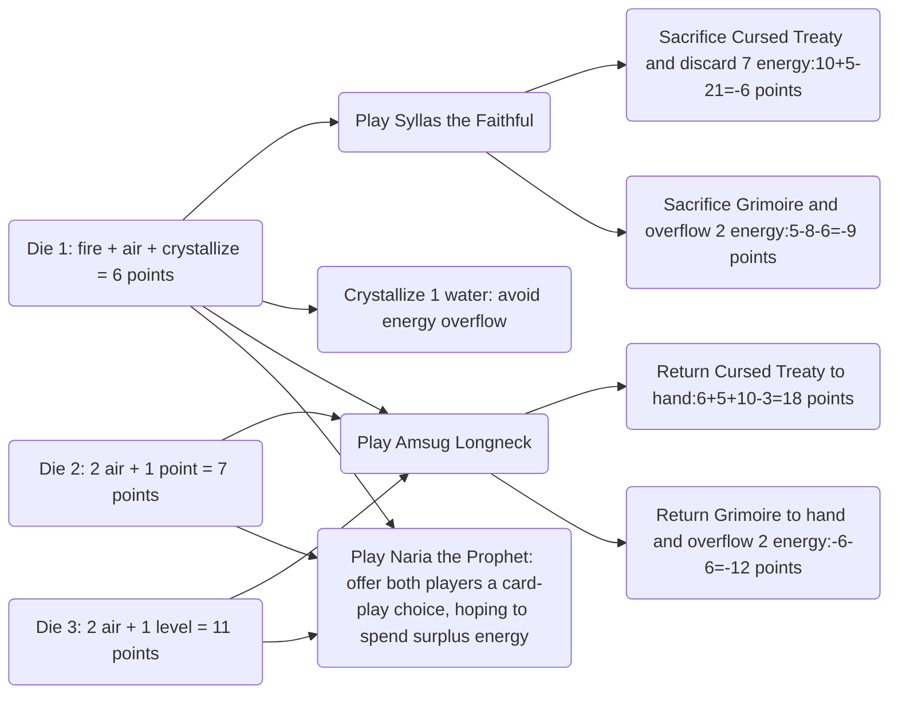

*Seasons* is a popular board game for 2–4 players. It has a magic-and-nature theme, a light visual style, a brisk pace, and rules that are simple without sacrificing depth.

Perhaps because the cards in *Seasons* look attractive and luck also plays a fairly large role, most players tend to play by intuition and experience. I believe, however, that apart from the enormous variation in card draws, most of the game can be controlled or predicted to a considerable extent. This includes a card's expected contribution to the final score, energy reserves, development of the summoning level, and so on. The quality of draft choices and in-game actions should therefore be relatively easy to evaluate, making it possible to derive a player's “theoretically optimal strategy”. To compare cards or actions in detail, their contributions need to be quantified in terms of the final score.

This article attempts to quantify the elements of the game and analyse them on the basis of those results, in the hope of finding near-optimal strategies that can guide players.

**This article may suit players who can already play the game fluently or have a BGA rating of 150+ ELO**; complete beginners probably will not make it through.

Update on 27 September 2023: thanks to [hdfbuaa](https://boardgamearena.com/player?id=91665234), winner of the 2022 *Seasons* World Championship final (and, at the time, undefeated throughout 2023). He discussed many views on *Seasons* strategy and this guide with me. I then made a few revisions based on my new understanding, including Die of Malice, Divine Chalice, **5.3.5 Pace of Time**, and **5.3.6 Using Luck**.

## I. Some Assumptions

### 1.1 Total Number of Rounds

The minimum total length of a game is 36 months.

| Game speed/player preference | Average months advanced per round | Estimated total rounds |
| :--: | :--: | :--: |
| Slow | ~1.5 months | ~24 rounds |
| Medium | ~2 months | ~18 rounds |
| Fast | ~2.5 months | ~14 rounds |

As shown above, **a game is expected to last 14–24 rounds**.

### 1.2 Average Number of Cards Played

An ordinary player plays at least about eight cards (because an effect discards cards from hand, or because they cannot be played) and at most about fifteen (because effects sacrifice cards in play, allowing still more cards to be played).

Because there are many card-drawing and group-dealing effects, and most players tend to draw cards, they generally play more cards. Based on experience, this article estimates that **a player plays an average of eleven cards**.

## II. Quantifying Resource Values

### 2.1 Energy

Assume that every energy token is sold in its most valuable season—a very common situation—at a value of 3 points.

I therefore assign **a value of 3 points to each energy token**.

Selling energy at a loss, overflowing the energy reserve, the crystallization bonus, and similar situations will be quantified separately.

### 2.2 Summoning Level

Skilled players plan their resources so that they can play every card in hand before the end of the game. Under this assumption, a player begins at summoning level 0, and each increase of one level allows one additional card to be played, avoiding the 5-point loss from still holding that card at the end.

I therefore assign **a value of 5 points to each summoning level** until increasing the level no longer increases the number of cards that can be played; each level beyond that is worth 0 points.

Correspondingly, drawing a card carries a value of -5 points; when the player has spare levels, the additional value becomes 0 points.

### 2.3 Crystallization

Crystallization **does not generate a separate score by itself**; its value can be quantified by the opportunity cost of the current round.

## III. Card Values and Strategy Analysis

### 3.1 Card Value Table

The table below lists cards from all expansions, calculates their values under several assumptions, and orders them by estimated value in descending order. TODO: estimate scores by play timing.

| Card | Estimate | Cost | Printed points | Effect | Card value | Assessment |
| :--: | :--: | :--: | -- | :--: | -- | ---- |
| Mesodae's Lantern | 44 | 3 water, 3 air | 24 points | Ongoing: cannot be played for free. Energy reserve limit -1. End of each round: gain 3 points. | Slow: ~(24-4)x3+24-3x6=66 points Medium: ~(18-4)x3+6=48 points Fast: ~(14-4)x3+6=36 points | Extremely valuable when played early. One of the leading first picks. |
| Die of Malice | 40 | - | 8 points | Activate: reroll your own die and gain 2 points. | Slow: 8+2x(24-2)=52 points Medium: 8+2x(18-2)=40 points Fast: 8+2x(14-2)=32 points | It will almost always be rerolled and generates a substantial score, making it a leading first pick. Its value is relatively complex to calculate: the expected value of rerolling **each** die differs, and is generally 8 points. 1) The expected value of the face chosen by the player and of the reroll can be treated as equal; 2) rerolls other than two energy plus a level, and card draws, are expected to be more profitable; 3) a score margin can be created by leaving an unfavourable die face or pace of time to the opponent. |
| Demonic Dagger | 40 | water, air, air | 6 points | Activate: sacrifice or discard a familiar to gain 4 energy. | Each discard: 5+3x4+6-3x3=14 points Each sacrifice: 14-printed points | A high-value card with at least two familiars. It can provide a great deal of energy and summoning levels, and dispose of negative-point familiars. One of the leading first picks. |
| Scepter of Winter | 40 | 2 water | 6 points | Ongoing: during winter, all your energy can be used as earth energy. Activate: discard one magic item to gain 3 energy. | Number of activations x14 points | Because magic items greatly outnumber familiars, this is an almost reliable source of energy, or a way to exchange one card for 14 points. One of the leading first picks. |
| Elemental Vase | 34 | water, earth, fire | 6 points | Ongoing: gain 1 energy whenever you play a card. | Ordinary: (11-1)x3-3=27 points Limit: (15-1)x3-3=39 points | High-scoring, reliable, and strongly supportive. One of the leading first picks. |
| Wondrous Chest | 34 | water, fire | 4 points | End of round: if you have at least 4 energy, gain 3 points. | Slow: (24-4)x3-2=58 points Medium: (18-4)x3-2=40 points Fast: (14-4)x3-2=28 points | Generates an enormous score, and its condition is easy to satisfy. A personal favourite and one of the leading first picks. |
| Scepter of Spring | 33 | 3 earth | 9 points | Ongoing: gain 3 points each time you play a card. | Year one: ~33 points Year two: ~24 points | Based on an average of eleven cards played, Scepter of Spring combines extremely high reliability, general usefulness, and value. One of the leading first picks. |
| Heart of Argos | 33 | 2 earth | 7 points | End of round: if an activation was triggered this round, gain 1 earth. | Slow: ~16x3+7-6=~49 points Medium: ~12x3+1=~37 points Fast: ~8x3+1=~25 points | Assuming it is played in year two and activated every round, this is a high-value card. Its greatest return comes with Horn of Plenty. One of the leading first picks. |
| Cursed Leech | 30 | 2/5/8 points | 8 points | An opponent must pay you 1 point before playing a card. | 2 players: 2x11+8-2=28 points 3 players: 3x11+8-5=36 points 4 players: 4x11+8-8=44 points | Absorbs a high score while doing nothing. One of the leading first picks. |
| Crystal Orb | 30 | earth, fire | 6 points | Activate: 1) look at the top card of the deck and pay 4 energy to play it for free; 2) pay 3 points to discard the top card of the deck. | (value of a good card-12)xnumber played-3xnumber discarded | Profitable whenever it reveals a good card, and particularly strong through interactions with other draw effects. One of the leading first picks. |
| Crystal Titan | 30 | fire/fire+3 points/fire+8 points | 9 points | Sacrifice: discard all cards in hand and all crystals, then choose one opponent's card to sacrifice. Ongoing: an opponent must give you 3 crystals before sacrificing a card. | Sacrifice: good card value+card cost-(12 points/15 points/20 points)=28 points/25 points/20 points No sacrifice: (6 points/4.5 points/4 points)xnumber of triggers+(6 points/3 points/-2 points) | When sacrificing, it is generally used after emptying the hand in year one to eliminate a key card; hitting the target is enormously profitable. It is even more despair-inducing than Igram the Banisher. Without sacrificing, an average of one trigger per opponent breaks even and two yields a small profit. Remember the sacrifice effects of cards passed between players. One of the leading first picks. |
| Figrim the Avaricious | 28 | 3/6/9 points | 7 points | When the season changes: steal 1 point from each opponent. | Year one: 28/35/46 points Year two: 20/23/30 points Year three: 12/11/14 points | An undisputed scoring powerhouse, as long as there are points to steal. |
| Idol of Eolis | 28 | water, earth, fire | 6 points | When played: energy reserve limit -1. Whenever the season changes: gain 1 energy, or gain 2 points and look at the top card of the deck. | ~(12-1)x3+6-3x3=30 points | A relatively high-scoring card that readily tests the energy reserve limit. |
| Familiar Statue | 28 | water, earth, fire, air | - | When played: gain 10 crystals. Activate: gain points equal to your number of familiars. | Year two, 2 familiars: ~10x2-2=~18 points Year two, 3 familiars: ~10x3-2=~28 points | A high-value card when the number of familiars is greater than two. |
| Arcane Telescope | 26 | - | 8 points | Activate: pay 2 points, look at the top 3 cards of the deck, and return them in any order. | 8 points+number of activationsx(card value difference-2) | If drawing the best of three is estimated at 8 points, an activation is worth 8-2=6 points. It sharply increases the value of effects that draw a single card and can also restrict an opponent's draw. If it can be used frequently and efficiently, it is unquestionably a central card. |
| Vampire Crown | 25 | water, air | - | When played: draw or discard one card, then gain energy equal to its printed points. | 7 energy: 3x7-6=15 points 10 energy: 3x10-6=24 points Draw: card value-5 Discard: +5 | An energy-generating card whose value rises in a strategy built around selling energy. |
| Divine Chalice | 25 | water, earth, fire, air | 10 points | When played: reveal four cards, choose one, and play it for free. | Card value-2+cost-7=~25 points | High expected value; it is advisable to reserve two summoning levels before using it. **Its value falls greatly in the tournament deck because fewer cards match it.** |
| Chalice of Eternity | 25 | water, earth, fire, air | 10 points | End of round: you may place one energy on this card. Activate: spend the 4 energy on this card, reveal four cards, choose one, and play it for free. | Number of activationsx(card value-2+card cost-17)-2=number of activationsx(~12)-2 | Two activations break even on average and three make a small profit, but the value has high variance and actual performance ranges from heaven to earth. **Its value falls greatly in the tournament deck because fewer cards match it.** |
| Amulet of Time | 25 | 2 water | 9 points | When played: gain 2 energy. Discard any number of cards from hand and draw the same number. | 9 points+increase in card value=~20 points | Not highly valuable by itself, but a miracle when facing a terrible hand. |
| Shield of Zera | 25 | air | 5 points | When a sacrifice is required: sacrifice this card instead and gain 10 points. | Triggered effect: sacrifice benefit+10+5-3=sacrifice benefit+12 With Potion of Knowledge: 3x5+12=27 points | A high-value card; two shields can generate an extra 10 points. |
| Heart of Magma | 25 | fire/2 fire/3 fire | - | Ongoing: gain 1 fire whenever an opponent plays a card. Sacrifice: gain 3 fire. | 2 players: (3-1)x(11-2)+3x3+5-3=30 points 3 players: 2x9x2+8=44 points 4 players: 2x9x3+5=59 points | Fire generally has to overflow the reserve or be sold at low value, but Heart of Magma still has a high expected value. |
| Igram the Banisher | 25 | 3 points | 7 points | When played: name a card. All opponents reveal their hands; any opponent holding that card discards every copy, and you gain the energy in its cost. | 3x4+7-3=15 points | It can target an opponent's central card while replenishing energy. Its unique strategic position makes it valuable. Its very low usage condition and considerable destructiveness make many players hate it. |
| Ragfield's Orb | 25 | water, earth, fire, air | -5 points | When played: gain 20 points. Ongoing: each of your cards worth less than 12 points costs 5 crystals. | 3 points+cost value difference=~20 points | This card produces a high return when the cards in hand have high energy costs. Some way of disposing of energy is needed to prevent the reserve from exploding. |
| Temporal Circle | 25 | water, earth, 2 points/water, earth, 1 point/water, earth | 12 points | Ongoing: when the season marker moves at least 3 spaces in one round, gain 4 crystals or 1 energy. | ~5x4+(4/5/6)=24 points/25 points/26 points | It can produce good value when triggered four times; competition among other players slows the pace of time. |
| Kroff's Dial | 25 | water, earth, fire | 12 points | When played: +2 levels. End of round: if you have played more cards than an opponent, you may reroll the season die. | 5x2+12-3x3=13 points Can gain an extra 10–20 points with cards related to the number of rounds. | High-value when cards related to the number of rounds are present. |
| Scepter of Splendor | 24 | water, earth, fire, air | 8 points | When played: gain 3 points for each magic item you have played. | Ordinary: ~7x3-4=17 points Limit: 14x3-4=38 points | A late-game scoring powerhouse with many magic items. |
| Potion of Antiquity | 23 | water, earth, fire, air | - | Sacrifice: choose two of four: 1) each energy crystallizes for 4 points; 2) draw two and keep one; 3) +2 levels; 4) gain 4 energy. | 5-12+ 1) 1 pointxnumber of energy 2) card value-5=\~15 points 3) 2x5=10 points 4) 3x4=12 points =\~20 points | A potion with extremely powerful effects that can balance resources according to the situation. |
| Beggar's Horn | 23 | earth, air | 8 points | End of round: if you have no more than 1 energy, gain 1 energy. | 2+3x(~8)=26 points | Its condition is difficult to satisfy; if triggered frequently, it is highly valuable. |
| Destined for Greatness | 23 | - | - | At the end of the draw phase, each player draws two cards and keeps one. | Average value 23 points |  |
| Hand of Fortune | 22 | earth, fire, air, 3 points | 9 points | Ongoing: reduce the energy cost of playing a card by 1 (to a minimum of 1). | ~8x3-3=21 points | This likewise saves one energy when playing a card, but its condition is stricter than Elemental Vase, and its high cost makes it difficult to play early. |
| Hourglass of Time | 22 | water, earth, fire, air | 6 points | When the season changes: gain 1 energy. | Year one: (11-1)x3-6=24 points Year two: 7x3-6=15 points Year three: 3x3-6=3 points | Recommended as early as possible, but it can readily overflow the energy reserve. |
| Glutton Cauldron | 21 | - | - | Activate: place one energy on the card. At 7 energy, sacrifice the card, gain 15 crystals, and return the energy. | 15+5=20 points | One of the high-scoring cards; its value rises in an energy-selling strategy and it is countered by fairies. |
| Dragon Skull | 21 | water, earth, fire | 9 points | Activate: you may sacrifice 3 cards to gain 15 points. | Benefit each time: 3x5+15-?=~20 points | Uses: consume negative-point cards and free summoning levels. |
| Io's Treasure Bag | 20 | fire, air | 6 points | Ongoing: each crystallized energy gains 1 additional point. | 1xcrystallizations | When many energy tokens are crystallized, this card returns ~20 points and is a high-scoring card for an energy strategy. |
| Grimoire | 20 | water, earth | 8 points | When played: gain 2 energy. Ongoing: energy reserve limit +3. | 8 points Gains ~15 points of added value with Vampire Crown and the Pendant. | High-value when paired with supporting effects. |
| Thieving Fairies | 20 | 0/3/6 points | 6 points | Ongoing: whenever an opponent activates a card, steal 1 point from that player, then gain 1 point. | 2 players, triggered twice: (2+1)x2+6=12 points 2 players, triggered ten times: (2+1)x10+6=36 points | Each trigger returns more than most other activation effects; primarily used to restrict an opponent's activation cards. |
| Amulet of Fire | 20 | 2 fire | 6 points | When played: reveal four cards and keep one. | Good card value-5=~20 points | An advanced card-generating amulet. |
| Shadow Mice | 20 | 2/4/6 points | 8 points | When played: steal 2 energy from each opponent. | 18/22/26 points | An easily overlooked, high-value card. |
| Raven the Usurper | 20 | fire | 2 points | When played: copy one of an opponent's magic items and additionally pay that card's energy cost. When the corresponding card leaves play, sacrifice this card. | Card value-1=~24 points | High-value when a suitable card is available. |
| Entanglement of Argos | 20 | earth, air | 14 points | When played: nullify the effect of one opposing familiar. | 8 points+effect value | Generally worth ~20 points when active and a good counter card. |
| Potion of Power | 19 | 2 fire | - | Sacrifice: +2 levels and draw 1 card. | Card value+4=~19 points | Effectively provides three summoning levels and is crucial when levels are scarce. |
| Servant of Io | 19 | air | (-5 points) | Ongoing: cannot gain crystals. When played: gain 1 air and +1 level. Activate: pay 1 air to pass this card to the next player. | Ongoing: 10 points+points lost by opponents Last player at game end: 15 points+points lost by opponents | A highly confrontational card that can ruin the end-game value of some cards. |
| Scroll of Ishtar | 18 | 2 fire | 7 points | When played: name an energy type and reveal cards from the top of the deck until finding a card that costs that energy, then add it to your hand. You may discard the first such card and trigger the effect again. | Good card value+7-5-6=~18 points | Commonly used to find cards that cost water. |
| Arus's Mimicry | 18 | water, earth, air | 10 points | When played: discard or sacrifice 1 card and gain 12 points. | 12+5+10-9=18 points Sacrifice: 18 points-printed points | Fair value; generally sacrifices a zero- or negative-point card. |
| Potion of Knowledge | 17 | 2 water | - | Sacrifice: gain 5 energy. | 3x5+5-2x3=14 points | Common uses include playing cards quickly at the start, replenishing energy at the end, and selling energy with the crystallization bonus. Its value in a combination is much higher than 14 points. |
| Amulet of the Tomb | 17 | 2 fire | 8 points | When played: look at the top 3 cards of the discard pile; add 1 to your hand, place 1 on top of the deck, and 1 on the bottom. | Card value-3 points=~17 points | A relatively cost-effective way to draw a card. |
| Temporal Boots | 16 | - | 8 points | When played: move the time marker 1–3 spaces. | 8 points | Strong at the end of the game and in combinations. |
| Amulet of the Elements | 16 | water, earth, fire, air (optional) | 2 points | When played: 2 energy/5 points/1 card/1 level. | 2 points+3 points/2 points/card value-8/2 points=~16 points | A universal card that can defend against a big threat. |
| Familiar Snare | 16 | fire, air | 7 points | When played: reveal cards from the top of the deck until finding a familiar, then add it to your hand. You may discard the first familiar and trigger the effect again. | Good card value+7-5-6=~16 points | Commonly used to find a particular familiar. |
| Oracle Owl | 16 | water, air | 10 points | When played: reveal a number of cards equal to the player count; every player may buy one of them each round. | 4 points+2x(card value-5 points) | When energy and levels are plentiful, using it as the last player has a relatively high expected value. |
| Amsug Longneck | 15 | water, air | 8 points | When played: each player returns one magic item to hand. | Normally: 2 points Last player at game end: +5 points+card effect points=7+? | Can work wonders with powerful cards. |
| Titus the Watcher | 15 | 1 fire/2 fire/3 fire | 4 points | End of each round: each opponent gives you 1 point. If an opponent has no points, sacrifice this card. | 2 players: ~10x2-3+4=21 points 3 players: ~8x3-6+4=22 points 4 players: ~8x4-9+4=27 points | Absorbs points quickly but is very easy for opponents to target, so its actual value is relatively low. |
| Cursed Treaty | 15 | water | -10 points | When played: gain 2 energy, 10 points, and 1 level. When sacrificed: discard all energy. | 2x3+10+5-10-3=8 points | Not valuable by itself; its strength lies in gaining resources for other cards and combinations with sacrifice cards. |
| Ragum's Pendant | 15 | water, fire, air | - | When played: gain energy equal to the number of magic items you have played. | 7 energy: 7x3-3x3=12 points | Provides a great deal of energy and is more valuable with Grimoire. |
| Dragon Soul | 15 | - | 8 points | Activate: spend 1 point to reset another card. | 8 points+activation effect value | High-value with Familiar Statue, Demonic Dagger, and similar cards. |
| Ethel's Fountain | 15 | 2 earth | 7 points | End of round: if your hand is empty, gain 3 points. | ~8x3+1=25 points | The condition is relatively strict: cards generally have to be played very early, and drawing will probably prevent scoring from the Fountain. It therefore greatly restricts the value of other cards and draws, producing a low overall return. |
| Throne of Rebirth | 15 | water, fire, fire | 10 points | When played: discard 1 card; draw 1 card and lose one available bonus use. | 6–8 points+card value difference=~15 points | Generally a low-value card. |
| Ragfield's Servant | 14 | fire, air | 10 points | When played: every player with 10 crystals gains 1 level and draws a card; the drawn card may be discarded. | Exclusive benefit: card value+4 points Exclusive benefit+discard: 5+4=9 points | The exclusive benefit has relatively high value. |
| Shadow Trick | 14 | fire | 4 points | When played: draw 2 cards, then give 1 card from your hand to the opponent who has played the fewest cards. | 1 point+2xcard value difference Game end: +5 points | A relatively low-scoring but reliable way to draw cards. |
| Amulet of Water | 14 | 2 water | 6 points | When played: gain 4 energy. | 12 points |  |
| Potion of Resurrection | 14 | earth, fire | - | Sacrifice: choose 1 of the top 5 cards of the discard pile and add it to your hand; place the others on the bottom of the discard pile. | Good card value-6 points=~14 points | Most of the time it retrieves a known card, so the card value is certain. |
| Um's Sealed Chest | 13 | water, water, earth | 10 points | Game end: if only magic items are in your play area, gain 20 crystals. | 20+10-9=21 points | High-value when triggered and generally used with sacrifice effects. |
| Eagle of Argos | 13 | earth, air | 4 points | When played: gain 10 points and 1 level. Sacrifice: each opponent gains 6 points and loses 1 level. | 10+5+4-2x3=13 points Sacrifice: 5-6+5=4 points | The sacrifice is more valuable when both the opponents' and your own levels are tight. |
| Speterway the Defector | 13 | points equal to levels | 7 points | Activate: when an opponent draws a card, you may draw it instead and place Speterway in that opponent's play area. | 2-levels+card value | High card value below level 6; drawing any card prevents a loss, and only the player who ends with this card loses. |
| Carnivorous Ironbark | 13 | earth, fire, air | 12 points | End of round: if you have no energy, look at the top card of the deck and optionally spend 1 level to draw it. | 3 points+number of triggersx(card value-10 points) | Not highly valuable and its condition is difficult to meet; when levels are especially abundant, it can generate cards. |
| Naria the Prophet | 12 | 3 points | 8 points | When played: draw a number of cards equal to the player count and distribute one to each player yourself. | 5 points+~7 points=~12 points | A good card-generating card. |
| Lewis Greyface | 12 | fire, air | 6 points | When played: copy all energy held by one opponent. | 3x(~4)=~12 points | Used to replenish energy. |
| Cursed Soul | 12 | water | -5 points | When played: gain 10 crystals and 1 water. Activate: spend 1 water to pass this card to the next player. End of round: lose 3 points. | Assuming it ultimately remains with an opponent: 10-3+3+5=15 points | A strong confrontational card that needs to be used with the right situation and cards. |
| Selena's Codex | 12 | water, air | 6 points | When played: return one magic item with an energy cost to its owner's hand. | Card value-card cost | Can work wonders in some combinations. |
| Watcher of Argos | 12 | air | 6 points | When played, choose one: 1) every player discards 1 card; 2) every player discards 4 energy. | 2 points+ 1) discard a card: card value-5 2) discard energy: 3x4=12 points | A flexible card, commonly used to discard energy; it can also discard an opponent's final key card or one of your own surplus cards. |
| Horn of Plenty | 12 | water, earth | 4 points | End of each round: discard 1 energy. If earth was discarded, gain 5 points. | 8 rounds: (5-3)x8+4-6=14 points | Not highly valuable alone, but interactions with other cards may produce high value. |
| Harp of Isthar | 12 | air | 8 points | Activate: spend 2 identical energy to gain 3 points and 1 level. | 5 points+number of activationsx2 points | A low-value card; excessive use causes an energy shortage. |
| Syllas the Faithful | 11 | 3 fire | 14 points | When played: each opponent sacrifices one card. | Opponent sacrifices 0 points: 5 points Opponent sacrifices 6 points: 5+6=11 points Opponent sacrifices more: 11+ points | A common card for ruining an opening hand; most people will guard against it. |
| Potion of Dreams | 11 | 2 air | - | Sacrifice: discard all energy and play one card for free. | Cost-1 Runic Cube: 19 points Familiar Statue: 11 points Sidit's Lantern: 17 points | Provides a good score bonus with high-cost cards. |
| Olaf's Blessed Statue | 11 | 3 water | - | When played: gain 20 points. | 11 points | Enormously profitable if played for free and can serve as a sacrifice. |
| Ragfield's Helm | 11 | 3 air | 10 points | Game end: if you have played more cards than every opponent, gain 20 crystals. | 20+10-3x3=21 points | High-value when the condition is met, but difficult to complete. |
| Sid Nightshade | 11 | earth/2 earth/3 earth | 6 points | When played: if you have the most points, steal 5 points from each opponent. | 13/20/27 points | Sometimes the condition is very easy to satisfy and sometimes very difficult. |
| Amulet of Air | 10 | 2 air | 6 points | When played: +2 levels. | 10 points | A summoning-level amulet. |
| Runic Cube of Eolis | 10 | 20 points | 30 points | - | 10 points | Enormously profitable if played for free. |
| Um's Soul Cage | 10 | 2 points | 10 points | When played: the next player to play a card chooses one: discard the played card without triggering its effect, or sacrifice one card. | 8 points+- Sacrifice: 5-printed points | More valuable when you have a low-point card or the opponent does not. |
| Amulet of Earth | 9 | 2 earth | 6 points | When played: +9 points. | 9 points | A small scoring amulet. |
| Tree of Light | 7 | 2 earth | 12 points | Activate: 1) discard one energy to crystallize this round; 2) pay 3 crystals to buy one energy. | 12-6=6 points | An energy-support card with no score production of its own. |
| Sidit's Lantern | 7 | 3 earth, 3 fire | 24 points | Game end: each energy is worth 3 points. | 24-6x3=6 points | High-value if played for free. |
| Ancient Jewel | 7 | fire, fire | 10 points | Game end: if the card holds 3 energy, gain 35 points; otherwise lose 10 points. Activate: spend 3 identical energy to place one energy on the card. | 35+10-3x9-3x2=12 points | Spends a great deal of energy for few points. It suits situations with frequent mid-game energy overflow; otherwise it can readily cause an energy shortage. |
| Kairn the Destroyer | 6 | 3 air | 9 points | Activate: spend 1 energy to make every other opponent lose 4 points. | 1 pointxnumber of uses | Extremely low value; used to consume surplus energy. |
| Io's Transmuter | 6 | water, earth | 6 points | Ongoing: when choosing a die face that grants points, you may crystallize; after doing so, gain 2 points at the end of the round. | 2 pointsxnumber of triggers | A low-value card used to dispose of surplus energy. |
| Eolis's Replicator | 6 | water | 7 points | Activate: spend 1 water to place a 7-point copy card in play. | 4 points-1 pointxnumber of activations | Converts surplus summoning levels into points. |
| Demon of Argos | 5 | water, earth, fire, air | 16 points | When played: every opponent loses 1 level and draws one card. | Normally: 16-3x4+10-card value=14 points-card value Last player at game end: 16-3x4+5=7 points | Playing it normally may not even be profitable; suitable as the last player at game end or when opponents are blocked by levels. |
| Mirror of the Seasons | 5 | 3 points | 8 points | Activate: convert any number of identical energy into another type at a cost of 1 crystal each. | 6 points-1 pointxnumber of activations | A support card used to replenish the right energy. |
| Potion of Life | 4 | 2 earth | - | Sacrifice: sell each energy for 4 points. | 1 pointxenergy-1 | Generally used to consume surplus energy. |
| Fairy Monolith | 4 | 2 earth | 6 points | End of round: you may store 1 energy on this card. Activate: take any amount of energy from the card. | 0 points | Has no value; its purpose is to increase the energy reserve limit. |
| Die of Zen | 4 | earth, air | 10 points | Ongoing: instead of a die action, take one of the following: 1) +1 summoning level; 2) gain 1 energy; 3) crystallize this round. | 4 points | A low-value support card; these replacement effects lose points and are rarely used. |
| Wind Spirit Caller | 3 | 3 air | 12 points | When played: turn all opponents' energy into air. | 12-3x3=3 points | Limited ability. |
| Balance of Ishtar | 2 | 2 points | 4 points | Activate: crystallize 3 identical energy. | 2 points | A low-value support card. |

### 3.2 Card Value Analysis

According to the card-value table, card values are approximately linearly distributed, with only the top ten or so being exceptionally valuable.

The mean card value is 18, with a standard deviation of 9.1.

After 100,000 random samples, the results were as follows:

| Number drawn | Mean card value | Card-value standard deviation |
| -------- | ------------ | ------------ |
| Draw 2, keep 1 | 23.3 | 8.5 |
| Draw 3, keep 1 | 26.0 | 8.0 |
| Draw 4, keep 1 | 28.0 | 7.6 |

The timing of a draw also causes a certain proportion of cards to lose value substantially over time, including effects that score each round and effects that reward playing cards.

The **value of a card-drawing action can be treated as 6–13 points** (changing over time), but note that its **variance is enormous**. Games where the supremely lucky soar and the profoundly unlucky eat dirt are both commonplace.

- Draw 2, keep 1: 8–18 points
- Draw 3, keep 1: 9–21 points
- Draw 4, keep 1: 10–23 points

Cards played immediately through Divine Chalice and Chalice of Eternity also differ from cards in hand that can be played at any time, because some cards depend on particular timing, such as Vampire Crown and Temporal Boots. I estimate that a card played immediately should lose another 2 points of value (4–11 points). The greatest impact, however, is that interactions between card effects become harder—or, in other words, the variance grows further. It is therefore best to prepare thoroughly before using such effects.

## IV. Comparing Action Values and Analyzing Strategy

### 4.1 Die Actions

| Resource combination | Value |
| :--: | :--: |
| Draw a card | 10~13 |
| 2 energy + 1 level | 6+5=11 |
| 1 energy + 1 level | 3+5=8 |
| 2 energy + 3 points | 6+3=9 |
| 2 energy + 2 points | 6+2=8 |
| 2 energy + 1 point | 6+1=7 |
| 6 points | 6 |

The table shows that drawing cards and gaining levels are highly valuable. Drawing cards also enables levels to retain their 5-point value instead of falling to 0 when levels are already abundant. Provided that all cards can be played, you should therefore draw as many cards as possible.

When you have enough levels and no card-draw action is available, two energy plus points is the most valuable choice.

## V. Combination Strategy Analysis

The preceding sections analyzed the expected value of individual cards and actions.

In actual play, however, cards and actions constantly interact. They realize their full value only under favorable conditions, and some combinations can push their value even higher.

The following sections therefore examine combination strategies created by resource constraints and effect interactions.

### 5.1 Resource Constraints That Affect Card Value, and Balancing Strategies

#### 5.1.1 Time

Many cards derive part of their value from timing.

- Cards that produce value every round, such as Die of Malice and Wondrous Chest, lose one round of scoring for every round they enter play late. A fast game also cuts roughly six rounds from their total production.

Because energy and levels are scarce in the opening rounds, only a limited number of cards can be played.

- For example, in year one you can place at most three opening cards into your hand, and in the first round you can gain at most two energy and one level from a die...

If too many cards need to enter play early, resource constraints will delay some of them and reduce their value. During the draft, account for this and adjust the estimated value of such cards dynamically.

When selecting time-sensitive cards, also consider how Temporal Boots and Kroff's Dial can alter the pace of time.

- Kroff's Dial is especially influential. If an opponent holds it, try to reduce the benefit they can obtain from it; if you hold it, try to exploit it fully.

#### 5.1.2 Summoning Levels

Your summoning level determines the maximum number of cards you can have in play. Levels come from three sources: dice, card effects, and bonuses.

In a two-player game, the proportion of level-granting faces across the twelve dice is $27/60=0.45$. The probability that the first player is guaranteed a level is $1-(1-0.45)^3=0.83$, while the probability for the second player is $3 \times 0.45^2 \times (1-0.45)+0.45^3=0.43$. The expected number of levels a player can obtain from dice is therefore as follows.

| Pace | Expected levels |
| :--: | :---------------------: |
| Fast | $14 \times (0.83+0.43)/2=8.8$  |
| Medium | $18 \times (0.83+0.43)/2=11.3$ |
| Slow | $24 \times (0.83+0.43)/2=15.1$ |

These calculations show that levels are generally plentiful in a slow game. In a faster game—where time advances by more than two seasons per round—or with poor luck, however, a player may fail to obtain enough levels from dice to play every card, sharply reducing those cards' value.

Conversely, players should start tracking the level requirements created by card effects during the draft. Adjust the total number of levels the deck will require so that a level shortage does not lock cards out of play.

Here are several examples of how card effects change level requirements:

- **Amulet of Air** provides two levels while occupying one itself, so its net level requirement is -1. Keeping it during the draft reduces the original total level requirement by 2; drawing it later reduces that requirement by 1.
- After **Potion of Antiquity** is sacrificed, it no longer occupies a level. Its effect can either add one card to your hand or provide two levels, so its level requirement ranges from -2 to 1.
- **Divine Chalice** requires one additional card to be played. A very lucky player might reveal another Divine Chalice and need to play two additional cards, so its level requirement is 2–3.
- **Chalice of Eternity** usually triggers two or three times and requires two to four additional cards to be played. Its level requirement is therefore 3–5, which makes it particularly awkward in a fast game.

In my view, a total level requirement of 7–8 across the drafted hand is conservative enough.

Once you know levels will be scarce, use bonuses to raise your summoning level early so that card value is maximized.

#### 5.1.3 Energy

The timing and types of energy a player obtains affect when cards can be played and therefore affect their value. Because energy types resist simple generalization, the analysis below focuses on quantity.

In a two-player game, the faces across the twelve dice produce energy at a rate of $85/60=1.42$. Because the amount of energy on a face is only weakly correlated with pick priority, the expected amount a player obtains from dice can be calculated as follows.

| Pace | Expected per year | Expected total |
| :--: | :------------: | --------------- |
| Fast | $5 \times 1.42=7.10$  | $14 \times 1.42=19.88$ |
| Medium | $6 \times 1.42=8.52$  | $18 \times 1.42=25.56$ |
| Slow | $8 \times 1.42=11.36$ | $24 \times 1.42=34.08$ |

The calculations show an expected gain of roughly nine energy per year. These figures use the average output of three dice each round; in practice, players can actively choose faces that increase the amount.

Many cards can generate large amounts of energy. Players must jointly consider how much energy their year-one and year-two cards require: too much demand may leave cards unplayed, while too little may cause energy overflow. They should also plan how any overflow can be converted or spent.

- For example, if a player puts Die of Malice, Cursed Leech, and Watcher of Argos into play during year one, their reserve is very likely to overflow in the second half of that year, losing value. Consider replacing Watcher of Argos with a card that consumes more energy.

### 5.2 Crystallizing Energy

Although this article assumes that each energy crystallizes for 3 points, the points earned from energy can vary greatly in an actual game.

One reason is overflow and forced crystallization, discussed above. Another is the added value created by the **[bonus: crystallization +1]** action.

Let us calculate the maximum added value this action can produce in one round, using simple multiplication:

| Related effects | Maximum energy crystallized | Added value from 1 bonus (round -5 points) | Added value from 2 bonuses (round -12 points) | Added value from 3 bonuses (round -20 points) | Added value from 4 bonuses (round -29 points) |
| :---------------------------------------------------: | :--------------: | :-------------------------: | :---------------------------: | :---------------------------: | :---------------------------: |
| Energy reserve | 7 | 7 | 14 | 21 | 28 |
| Amulet of Water Demonic Dagger | 4 | 4 | 8 | 12 | 16 |
| Potion of Knowledge | 5 | 5 | 10 | 15 | 20 |
| Glutton Cauldron | 6 | 6 | 12 | 18 | 24 |
| Fairy Monolith Vampire Crown Ragum's Pendant | 7 | 7 | 14 | 21 | 28 |
| (+Grimoire) Fairy Monolith Vampire Crown Ragum's Pendant | 10 | 10 | 20 | 30 | 40 |

According to the table, suppose a player has stockpiled seven energy worth 3 points each in the current season and has already played Potion of Knowledge. Using the crystallization bonus three times then yields 21+15-20=16 extra points, roughly the value of an ordinary card.

If a player can acquire and crystallize even more energy in the same round, the bonus becomes remarkably valuable. Crystallizing more than twenty energy with it can almost decide the game.

The following strategies help exploit this added value:

- Because of this action, a modest energy surplus can potentially generate extra points. If the draft reveals many effects that acquire or store energy, consider collecting them as a package and using the crystallization bonus to build a scoring lead.
- When stockpiling energy early with cards such as Amulet of Water, Glutton Cauldron, and Fairy Monolith, decide which season you intend to sell it in and store the high-value energy for that season. This avoids losing points through an arbitrary mix when crystallization finally occurs. Because Temporal Boots can accelerate the game to its end, selling in the autumn of year two or the spring of year three is generally safer.
- Before using the crystallization bonus, play cards such as Potion of Knowledge and Amulet of Water in advance. Otherwise, spending energy to play them during the bonus round reduces the amount available to crystallize.

By comparison, the other bonuses—gaining a level, exchanging energy, and drawing two cards then discarding one—cannot explicitly create value and may even lose it. The **crystallization bonus can create a large number of points directly**, which is one reason players generally preserve their bonus uses for a crystallization round.

**Case: [The Power of Crystallization](https://boardgamearena.com/gamereview?table=341140729)**

Although yiyuiii's opponent put no pressure on yiyuiii in this game, making the score unusually high, that does not diminish the spectacle of yiyuiii using three bonuses to crystallize twenty-five energy and gain a vast number of crystals.

### 5.3 Competitive Strategy

Although Seasons is largely a game in which each player builds their own engine, its mechanisms contain many forms of player interaction. The complete card pool also includes plenty of cards that benefit their owner at someone else's expense; one moment of inattention can make you want to flip the table. I suspect nearly every new player has lost more than 30 points of value to Temporal Boots or Syllas the Faithful...

For competitive interactions, the objective analyzed here is to maximize **your own value minus your opponent's value**.

The following sections examine each relevant mechanism and card effect.

#### 5.3.1 Season Dice

During season-die selection, players take turns choosing a die and receiving its resources. The die left at the end determines how fast time advances.

The following table lists several features of season dice and their possible effects:

| Feature | Possible effects |
| :------: | :--------------------------------: |
| Amount of energy | Energy overflow; trigger conditions for certain effects |
| Energy types | Conditions for playing cards; timing of future crystallization |
| Levels | Timing of card play; management of energy |
| Crystallization | Management of energy; trigger conditions for certain effects |
| Card draw | Management of energy; timing of card play; effects unknown to the opponent |
| Pace of time | Value and trigger conditions of effects across the game |

Advantage is relative: taking points away from an opponent is equivalent to gaining points yourself. A player must therefore consider not only the resources each die provides to them, but also the value the remaining dice would give the opponent.

The following example explains the related strategy in detail.

**Case: [Choosing Between Resources](https://boardgamearena.com/archive/replay/230119-1002/?table=340323492&player=84626341&comments=)**

In this position, yiyuiii chooses a die first, pys88 chooses second, and yiyuiii will also act first. Let us examine how yiyuiii should play the round.

First, here is the main decision tree for the round:

Now consider the payoff of the four possible actions:

- **Naria the Prophet:** from yiyuiii's perspective, pys88 risks overflowing energy. Playing Naria may give the opponent a card with which to spend that energy, so this is not a particularly good choice.
- **Amsug Longneck:** pys88 will return Cursed Treaty to hand, gaining 18 points of positive value. It is therefore better to save Amsug until the end of the game.
- **Syllas the Faithful:** pys88's optimal response is to sacrifice Cursed Treaty. Because this also discards seven energy, the response produces -6 points of value for pys88.
- **Crystallize one water:** 0 value.

The decision tree shows that playing Amsug is extremely costly, while the other actions are relatively close in value.

Overall, the three better choices this round are:

- **Choice 1:** take fire, air, and crystallization; play Syllas the Faithful; then let the opponent take two air and one level. The round value is 6-11=-5 points, and Syllas creates 6 points of effect value.
- **Choice 2:** take fire, air, and crystallization; crystallize one water; then let the opponent take two air and one level. The round value is 6-11=-5 points.
- **Choice 3:** take two air and one level; play Naria the Prophet in the hope of spending energy; then let the opponent take fire, air, and crystallization. The round value is 11-6=5 points.

Taking two air and one level appears profitable, but it exposes yiyuiii to energy overflow next round and therefore to a potential loss. By contrast, pys88 can use crystallization to adjust their energy reserve and will have considerable flexibility afterward. Choice 3 may therefore be worth only about 1 point in practice.

Another key question is how much Syllas's card value changes if it is not played this round and is saved for later.

This is a question of opportunity cost. First, pys88's Cursed Treaty is very likely to remain in play, so whenever Syllas is played, it will cause that card to be sacrificed. Second, destroying seven energy this round is an unusually strong result. If pys88 remembers that yiyuiii drafted Syllas, they will try to keep less energy in reserve. If a later play destroys only five energy, the opportunity cost of waiting this round is two energy, or 6 points. Choice 3 then takes an additional -6 points of round value and becomes equal to Choice 1. If a later play destroys only three energy, the opportunity cost rises to 12 points, and Choice 3 is worth 6 points less than Choice 1.

On this analysis, Choice 1 is actually highly valuable and should be taken.

#### 5.3.2 First or Last Player at a Specific Moment

Competition over a particular moment usually revolves around specific effects. Effects whose value depends on timing include:

- Servant of Io, Cursed Soul, Demon of Argos, Shadow Trick, Naria the Prophet, and Amsug Longneck: being last to act in the final round can force an opponent to receive a card they cannot play or transfer, making them lose points.
- Igram the Banisher: being the first player of each year lets you attack an opponent's hand before they have played any cards.
- Crystallization bonus: being first in the chosen crystallization round prevents an opponent's Temporal Boots from advancing the season too early.

Effects that help contest timing include:

- Temporal Boots can skip an opponent's desired moment or reach your own. A player with the only copy of Temporal Boots is guaranteed to obtain the timing they want.
- Kroff's Dial can adjust the pace before the critical moment so that its owner reaches it, but it cannot beat Temporal Boots.

Missing an important timing window can cost as little as 5 points—being given one extra card—or more than 20 points through a poor energy sale, destroyed cards, a disrupted plan, and similar consequences. This can create a substantial score gap.

Whenever timing is contested, build the strategy by weighing both the value at stake and each player's ability to claim the moment.

#### 5.3.3 Card Effects

Card effects often interact and continually change one another's value. Because these interactions are numerous and specific, the table below lists several common cases for reference.

| Key card or combination | Related cards | Explanation |
| :----------------------------------------------------------: | :----------------------------------------------------------: | :----------------------------------------------------------: |
| Thieving Fairies | Familiar Statue, Glutton Cauldron, Crystal Orb, Die of Malice, Cursed Soul, and other activated-effect cards | Thieving Fairies becomes far more valuable when the opponent has many activated effects. During passing, you can therefore leave Cursed Soul for yourself to play early and pass the other activated effects to the opponent. |
| Entanglement of Argos | Cursed Leech, Thieving Fairies, Figrim the Avaricious, Entanglement of Argos, and other familiars with ongoing effects | If you want to lift the pressure created by an opponent's familiars, looking for Entanglement of Argos is a good idea. |
| Grimoire | Vampire Crown, Ragum's Pendant, Fairy Monolith, and other effects that gain large amounts of energy | Grimoire lets each such effect gain three additional energy and has high value when combined with the crystallization bonus. |
| Familiar Statue | Familiar cards | Two familiars break even and three produce an enormous profit, so this is worth planning around during the draft. |
| Shield of Zera | Potion of Antiquity, Potion of Knowledge, Shield of Zera, and other cards that can be sacrificed | Extremely valuable when paired with high-value sacrifice effects. |
| Arcane Telescope, Idol of Eolis | Cards with effects that draw one card | Knowing the top card of the deck greatly increases the value of effects that draw one card. |
| Dragon Skull, Arus's Mimicry, Um's Soul Cage | Cursed Treaty, Ragfield's Orb, Vampire Crown, and other cards worth 0 points or less | Sacrificing them both frees a level and gains points. |
| Amsug Longneck, Selena's Codex | Temporal Boots, Vampire Crown, Cursed Treaty, and other cards with high-value effects | Doubles an effect for one round and is difficult to stop. |
| Amulet of the Tomb, Potion of Resurrection | Dragon Skull, Arus's Mimicry, Shield of Zera, potions, and other sacrifice-effect cards | Sacrifice + resurrection means using an effect twice. |
| Ragfield's Servant | Cursed Treaty, Heart of Argos, Eagle of Argos, and other effects that gain crystals | Quickly establish exclusive effects at the start of the game. |
| Heart of Argos + Horn of Plenty + many activated-effect cards |  | A stable 5 points of production every round. |
| Demonic Dagger + Um's Sealed Chest |  | The dagger can ensure that no familiars remain in play at the end, giving Um's Sealed Chest an extremely high chance to trigger. |
| Carnivorous Ironbark + Steadfast Die |  | Reliably draw one card every round. |
| Glutton Cauldron and/or Potion of Knowledge and/or Vampire Crown and/or Amulet of Water and/or other cards that gain energy |  | All can benefit from the crystallization bonus in the same round. |
| Hand of Fortune + Elemental Vase + Elemental Vase/Scepter of Spring + Potion of Resurrection x2 + a discard pile of no more than 5 cards |  | An infinite single-round scoring combination; once it starts, the game is effectively won... and it is very rarely seen. |

During the draft in particular, break up the opponent's high-value combinations while collecting your own.

Once we understand how card effects interact, we can begin analyzing the game from a broader perspective.

**Case: [A Glimpse Through a Narrow Opening](https://boardgamearena.com/archive/replay/230119-1002/?table=339038924&player=89973675&comments=)**

This case comes from [JeroenDemeyer](https://boardgamearena.com/player?id=89973675), a player ranked in BGA's top five. The game lasted sixteen rounds. Assuming that the opponent's effects do not change this player's score, estimate the ideal final score from this opening hand.

At an average die output of 9 points per round, sixteen rounds produce 144 points. The nine opening cards count as -45 points. We can estimate the cards' value as follows.

| Card in hand | Estimated value | Explanation |
| :------------: | :--: | :----------------------------------------------------------: |
| Bottle of Oblivion | 33 points | Number of cards played: 9-1(Potion of Dreams)+2(Oracle Owl)+1(Potion of Antiquity)+2(ordinary draws)=13 cards. Card value is 6-9+3x12=33 points. |
| Temporal Circle | 24 points | Estimated to trigger three or four times, for 24 points. |
| Entanglement of Argos | 8 points | Used as protection against hostile effects. |
| Potion of Dreams | 11 points | Used to retrieve Potion of Antiquity: 12-1=11 points. |
| Potion of Antiquity | 26 points | If used for two levels and four energy: 15+10=25 points. If used for a card draw and four energy: because the draw occurs in year two, estimate 15+12=27 points. |
| Oracle Owl | 28 points | Because its draws occur in year two, estimate 4+12x2=28 points. |
| Scepter of Splendor | 20 points | Number of magic items: 13-4-1=8 cards, estimated at 20 points. |
| Steadfast Die | 4 points |  |
| Igram the Banisher | 12 points | Expected to destroy three energy, estimated at 12 points. |

The estimated total value of the hand is 166 points.

The ideal final score is therefore 144-45+166=265 points. The actual final score was 212, a difference of 53 points.

It is normal for the actual score to fall below this ideal estimate. Players regularly encounter losses that are hard to avoid. Even JeroenDemeyer suffered in this game from inefficient crystallization, using the exchange-energy bonus, low-value card draws, and two unplayed cards remaining in hand at the end.

#### 5.3.4 Drafting

At an average card value of 17 points, the nine drafted cards are worth 153 points, around 60% of the ideal final score. The preceding analysis also showed the value of each game element and the corresponding strategies, and drafts that create a gap of more than 50 points are not uncommon. Card selection in the draft is therefore unquestionably one of the keys to winning.

The draft is a competitive game process. A player may make a disadvantageous pick because they do not know the opponent's first selection, but interaction goes further: each pick can interfere with the opponent's plan, and a player with a strong memory can adapt their offense and defense in real time as the opponent's selections become apparent.

Because this game process involves a sequence of actions, no simple rule can capture it. A detailed analysis of drafting can instead use a [game tree](https://zhuanlan.zhihu.com/p/161492435).

In general, once each card's expected value has been assessed, take cards in descending order of value while remaining alert to potential interactions between their effects.

The following draft illustrates how a player can use a game tree to analyze the process and guide card selection.

**Case: [The Drafting Game](https://boardgamearena.com/archive/replay/221214-1000/?table=328390269&player=93342702&comments=84626341;)**

This case comes from a game between two players ranked in BGA's top five, [Korekiyo Shinguji](https://boardgamearena.com/player?id=93342702) and [JeroenDemeyer](https://boardgamearena.com/player?id=89973675). We begin with the opening from Korekiyo Shinguji's perspective.

This is a straightforward group of cards with no interactions that require immediate attention, so for now they can be ranked by value.

Figrim the Avaricious and Wondrous Chest have relatively high value. Thieving Fairies and Dragon Soul need activated effects to become highly valuable, and none are visible yet. Given the cards that may appear later, however, and the surprise pressure created by a hidden first pick, Thieving Fairies is also a candidate for the opening selection.

Overall, the choice for this hand is between Wondrous Chest and Thieving Fairies. Korekiyo Shinguji first picked Thieving Fairies. Because Wondrous Chest has higher expected value than both Figrim and Thieving Fairies, while Thieving Fairies would be hard for the opponent to exploit, I believe Wondrous Chest should have been the first pick.

Now consider the opening from JeroenDemeyer's perspective.

In this hand, Scepter of Winter and Potion of Power conflict slightly because they both create surplus levels. Entanglement of Argos and Amsug Longneck await cards with which they can interact; the rest need no special consideration. Scepter of Winter and Idol of Eolis have the highest value among the remaining cards. Since Scepter of Winter is also a powerful support card, it has very high first-pick priority. Entanglement of Argos and Amsug Longneck can potentially be taken with the second or third pick.

Overall, Scepter of Winter is worth far more than the other cards in this hand.

After both first picks, the players see all sixteen remaining cards and the draft becomes a game of nearly complete information.

The relevant card interactions are listed below, with first picks in square brackets:

- Idol of Eolis + Carnivorous Ironbark/Potion of Power: choose who draws, or learn what the opponent draws.
- [Scepter of Winter] + Potion of Power/Carnivorous Ironbark: Scepter of Winter increases the value of card-draw effects.
- Carnivorous Ironbark + Steadfast Die: reliably draw one card every round.
- [Scepter of Winter] - Harp of Ishtar: surplus levels create a conflict. There is little need to trigger the harp, reducing its value.
- [Thieving Fairies] - [Scepter of Winter]/Harp of Ishtar/Dragon Soul: these activated effects greatly increase the value of Thieving Fairies.
- Io's Treasure Bag - Harp of Ishtar: the harp reduces the energy that Treasure Bag can crystallize, reducing its value.
- [Thieving Fairies] - Entanglement of Argos: Entanglement blocks the additional value of Thieving Fairies.

The players selected cards in this order:

- Korekiyo Shinguji: [Thieving Fairies] -> Carnivorous Ironbark -> Figrim the Avaricious -> Idol of Eolis -> Titus the Watcher -> Entanglement of Argos -> Watcher of Argos -> Steadfast Die -> Amulet of Air.

- JeroenDemeyer: [Scepter of Winter] -> Dragon Soul -> Harp of Ishtar -> Io's Treasure Bag -> Potion of Power -> Lewis Greyface -> Potion of Resurrection -> Wondrous Chest -> Amsug Longneck.

Some details are worth noting:

- Carnivorous Ironbark's potential value is not high, and I do not understand why Korekiyo Shinguji chose it second. By coincidence, however, Carnivorous Ironbark is a card that combines with Scepter of Winter, so taking it reduced JeroenDemeyer's potential gain.
- JeroenDemeyer's second pick, Dragon Soul, may have been intended to let Scepter of Winter produce six energy in one round for the crystallization bonus, followed immediately by the third pick of Harp of Ishtar. Even so, neither card has especially high expected value, and their activated effects play directly into Thieving Fairies.
- Korekiyo Shinguji waited until the sixth pick to take Entanglement of Argos. JeroenDemeyer would not prioritize it before seeing a relevant familiar, but among the weak cards later in the draft it might be selected by default, so this was the right moment to secure it.
- Both players underestimated Wondrous Chest.
- Amsug Longneck had no useful interaction in this game and therefore limited value, so it remained a low priority.

Korekiyo Shinguji won the game by 18 points.

My own assessment is that Korekiyo Shinguji's hand had roughly 50 points more expected value. During the game, however, he repeatedly drew cards with Steadfast Die and Carnivorous Ironbark; the quality of those draws may explain why the final gap was smaller.

#### 5.3.5 Pace of Time

The pace of time is both the most important influence on value and the easiest one for an opponent to target. It affects the following:

- **Card value.** When players pay attention to **5.3.3 Card Effects** and **5.3.4 Drafting**, they tend to select cards that favor the same pace so that the whole hand becomes more valuable. After a player puts Wondrous Chest into play, for example, they will probably want more rounds so that it produces more 3-point rewards. Die of Malice, another card that scores each round, then joins Wondrous Chest in gaining more value from a slow game. Temporal Circle, by contrast, gains value only in a fast game. In a hand containing both Wondrous Chest and Temporal Circle, one of them must lose value. The combination can, of course, be used to hedge risk and produce a more stable, lower-variance expected total.
- **Level and energy constraints.** As discussed in **5.1.2 Summoning Levels** and **5.1.3 Energy**, the pace greatly affects how many levels and how much energy players can obtain. When either resource is scarce, a player needs a slower pace to replenish it from die faces. When both are abundant, the player may prefer drawing cards and ending the game quickly.

The corresponding strategies include:

- **Analyze your own and your opponent's preferred pace of time** from card effects, level requirements, and energy requirements, including possible openings, strengths, and weaknesses.
- **Choose the pace with the greatest overall advantage.** A slow pace favors effects that score every round, effects that reward playing cards, playing more cards, and making up resource shortages. If the opponent gains more than you do from a slow game, favor a fast pace instead.
- Select cards such as Die of Malice and Sundial that can control the pace, or **control the pace of time** through die selection.

**Case: [Disrupting the Rhythm](https://boardgamearena.com/archive/replay/230920-1000/?table=419786402&player=91665234&comments=84626341;)**

This case comes from the 2022 BGA Seasons World Championship final between [hdfbuaa](https://boardgamearena.com/player?id=91665234) and [abcdefujii](https://boardgamearena.com/player?id=87707530). In this game, hdfbuaa used a fast pace to suppress abcdefujii's slow deck and its level requirements, eventually opening a 76-point gap.

During the draft, abcdefujii appears to have intended to gain value from the interaction between Mirror of the Seasons and two Horns of Plenty. This combination favors a slow game, while hdfbuaa had no need for one and therefore accelerated. On abcdefujii's side, Divine Chalice and Syllas occupied three levels in year one. Mirror of the Seasons and Temporal Circle entered play in year two, leaving too few levels for Horn of Plenty. By that point, abcdefujii's cards were already worth far less than hdfbuaa's.

In my view, abcdefujii should have held Syllas, Mirror of the Seasons, and Horn of Plenty in year one, then added Horn of Plenty and Divine Chalice in year two. This would have realized more of the cards' value and might have kept the game competitive. Even so, the first-picked Horn of Plenty was relatively weak, and I would not recommend building chiefly around it.

#### 5.3.6 Using Luck

Sometimes players feel they have done everything right and still cannot win—perhaps even losing to someone who draws exactly what they need. It is frustrating, and easy to call Seasons a game of luck. Yet many of its strongest players win consistently, suggesting that luck may matter less than it first appears. Here is how to use randomness to improve your chance of winning: **luck favors the prepared**.

The preceding analysis mostly discussed optimal strategy in terms of mean value. We now add value variance to the decision and examine what variance can do.

Consider an abstract example first.

In a two-player game, you have 100 points and your opponent has 200. You have two final choices:

1. Gain 50 points with certainty.
2. Gain 0 points with 99% probability, or 200 points with 1% probability.

Although Choice 1 has a higher expected value—50 rather than 2—its chance of winning is 0%, compared with 1% for Choice 2. The correct decision is therefore Choice 2, hoping that the 1% outcome arrives, instead of choosing Choice 1 and then attributing the familiar 50-point defeat to the opponent's 1% luck.

This example shows that expected score is not the only standard for success. The probability of winning is what ultimately matters.

Overall, strategies for exploiting randomness have two main parts:

- **When behind in expected score, actively seek change and variance** in the hope of overturning the deficit. In Seasons, the largest source of variance is **drawing cards**, followed by dice and Die of Malice. If your deck is at a disadvantage, consider slowing the pace and drawing more cards.
- **When ahead in expected score, improve your own consistency and suppress the opponent's opportunities for change and variance**, thereby securing the lead. [hdfbuaa](https://boardgamearena.com/player?id=91665234) appears especially adept at this, whereas I often overlook it. The main responses are the opposite of those above: accelerate the pace, deny the opponent card draws, and avoid high-variance effects such as Oracle Owl and Shadow Trick that distribute cards.
