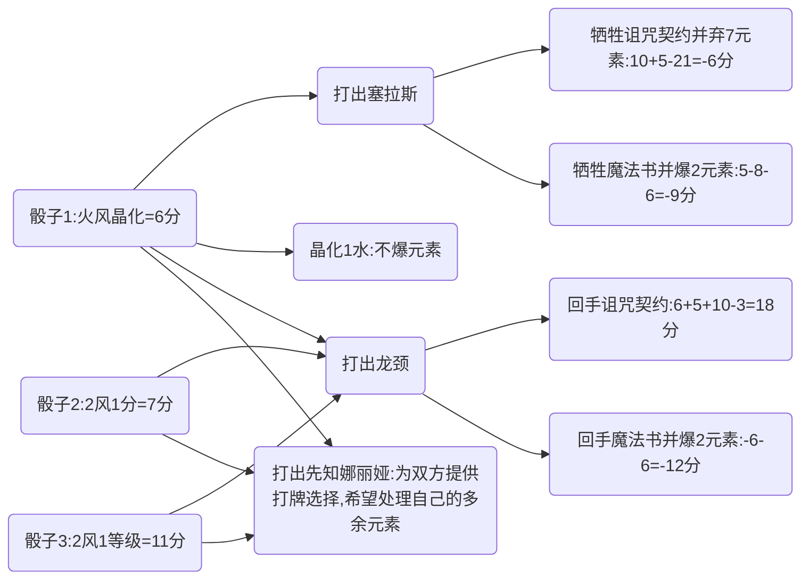

《四季物语》以魔法和自然为主题，美术风格轻快，游戏节奏紧凑，规则简单而不失深度，是一款热度很高的2~4人桌游。

可能因为《四季物语》的卡牌好看，游玩运气成分也比较大，大部分玩家倾向于通过直觉和经验进行游戏。但是作者认为，这个游戏除抽牌结果变化万千以外，其余部分很大程度上是可控制或可预测的，包括一张牌的预期贡献得分、元素储备情况、等级发展情况等等，因此轮抽选牌和局中行动应该比较容易被评估优劣，从而获得玩家的“理论最优策略”。而要比较细致地评判比较各个牌或者行动的优劣，需要把它们量化到终局分数的贡献上。

这篇文章尝试对游戏中的要素进行量化，并基于量化结果进行分析，希望得到接近最优的策略以指导玩家。

**这篇文章可能适合能够熟练游玩游戏或BGA 150+ELO的玩家**，新新手会看不下去吧

2023.09.27 更新: 感谢[hdfbuaa](https://boardgamearena.com/player?id=91665234)，作为2022四季物语世界杯锦标赛决赛第一（也是目前2023年全胜），他关于四季物语的策略和这篇攻略和我交流了许多意见，之后我根据新的理解对攻略作了些许修订，包括捣蛋魔骰、神圣金杯、**5.3.5 时间流速**和**5.3.6 利用运气**。

# **一、一些假设**

### **1.1 游戏总回合数**

游戏总月数的下限是36个月。

| 游戏速度/玩家倾向 | 平均每回合推进月数 | 推算总回合数 |
| :--: | :--: | :--: |
| 慢速 | ~1.5个月 | ~24回合 |
| 中速 | ~2个月 | ~18回合 |
| 快速 | ~2.5个月 | ~14回合 |

按上表所示，**游戏总回合数预计在14~24回合**。

### **1.2 玩家平均打出牌数**
一般玩家打出牌数最少在8张左右（由效果弃置手牌，或无法打出），最多可在15张左右（由效果牺牲场上牌，即可再多打出）。

由于抽牌和群体发牌的效果较多，且大多数玩家倾向于抽牌，玩家一般会打出更多的牌，本文根据经验估计**玩家平均打出牌数为11张**。

# **二、资源的分值量化**

### **2.1 元素**

假设每个元素都被在最有价值的季节卖出（这种情况非常常见），价值3分。

因此认定**每个元素价值3分**；

诸如亏卖元素、元素溢出，晶化特权等将在额外环节进行量化。

### **2.2 等级**

熟练的玩家会规划自己的资源以将所有手牌在终局前打出。在这一假设下，玩家初始0等级，每提升1等级将能够打出1张牌，从而避免因为在终局时留有该牌而失去5分。

因此认定**每个等级价值5分**，直到提升等级无法使打出卡牌增加，之后每个等级价值0分。

相对应地抽牌将附带-5分的价值；有多余等级时抽牌改为附带0分。

### **2.3 晶化**
**不单独产生分数**，可用当回合的机会成本量化晶化的价值。

# 三、牌价值与策略分析

### **3.1 牌价值表**

下表列出全扩的牌，其中根据一些假设计算价值，并按牌的评估价值降序列出。TODO: 按打出时间估分

| 卡牌 | 估分 | 花费 | 牌分 | 效果 | 牌价值 | 评价 |
| :--: | :--: | :--: | -- | :--: | -- | ---- |
| 麦瑟迪的魔灯 | 44 | 3水3风 | 24分 | 常时：不可被免费打出。元素上限-1。 每回合结束时：获得3分。 | 慢速：~(24-4)x3+24-3x6=66分 中速：~(18-4)x3+6=48分 快速:~(14-4)x3+6=36分 | 较早打出时是极高价值的牌。首扣牌之一。 |
| 捣蛋魔骰 | 40 | - | 8分 | 激活：重骰自己的骰子并+2分 | 慢速：8+2x(24-2)=52分 中速：8+2x(18-2)=40分 快速：8+2x(14-2)=32分 | 基本都会重骰，刷分可观，首扣牌之一。这张牌的价值计算比较复杂，**每个**骰子的重骰期望有所不同，一般是8分，1）玩家自选骰面的价值期望和重骰价值期望可以看作相同；2）除了等级2元素和抽牌以外的重骰都期望更赚；3）可以通过给对手不利的骰面或时间流速来获得分差。 |
| 恶灵匕首 | 40 | 水风风 | 6分 | 激活：牺牲或弃置一个神仆，获得4元素。 | 每次弃置：5+3x4+6-3x3=14分 每次牺牲：14-牌分 | 有2个以上神仆时的高价值牌，并可以提供大量元素、提供大量等级、解决负分神仆。首扣牌之一。 |
| 凛冬权杖 | 40 | 2水 | 6分 | 常时：冬天时你所有元素可以用作地元素。 激活：弃置一张魔器牌，获得3元素。 | 激活次数x14分 | 由于魔器牌比神仆牌多得多，是几乎稳定的元素来源，或者将1张牌换为14分。首扣牌之一。 |
| 元青花瓷 | 34 | 水地火 | 6分 | 常时：打出牌时获得1元素 | 一般：(11-1)x3-3=27分 极限：(15-1)x3-3=39分 | 分高+稳定+辅助能力强，首扣牌之一。 |
| 奇异宝箱 | 34 | 水火 | 4分 | 回合结束时：如果元素数量>=4则+3分 | 慢速：(24-4)x3-2=58分 中速：(18-4)x3-2=40分 快速：(14-4)x3-2=28分 | 刷分巨高，限制条件容易满足，个人很喜欢的牌。首扣牌之一。 |
| 春意权杖 | 33 | 3地 | 9分 | 常时：每次打出牌+3分 | 第一年：~33分 第二年：~24分 | 按玩家平均打出11张牌计算，春意权杖兼具极高的稳定性、泛用性与分值。首扣牌之一。 |
| 阿尔戈斯之心 | 33 | 2地 | 7分 | 回合结束时：如果该回合触发激活，获得1地 | 慢速：~16x3+7-6=~49分 中速：~12x3+1=~37分 快速：~8x3+1=~25分 | 假设第二年打出并每回合激活，是高价值牌。配合丰收羊角是最高收益。首扣牌之一。 |
| 邪术魔蛭 | 30 | 2分/5分/8分 | 8分 | 对手打出牌前需付给你1分 | 2人：2x11+8-2=28分 3人：3x11+8-5=36分 4人：4x11+8-8=44分 | 躺着吸高分。首扣牌之一。 |
| 水晶球 | 30 | 地火 | 6分 | 激活:1）看牌堆顶牌，可以花4元素免费拍出；2）花3分弃置牌堆顶牌。 | (好牌价值-12)x拍牌次数-3x弃置次数 | 看到好牌就赚，强在与其它抽牌效果的联动。首扣牌之一。 |
| 水晶泰坦 | 30 | 火/火+3分/火+8分 | 9分 | 牺牲：丢弃所有手牌和水晶，选择牺牲对手的一张牌 常时：对手牺牲牌前需要给你3水晶。 | 牺牲：好牌价值+牌花费-(12分/15分/20分)=28分/25分/20分 不牺牲：(6分/4.5分/4分)x触发次数+(6分/3分/-2分) | 牺牲时一般在第一年打光牌后点杀关键牌，如果点到就是血赚。比放逐者伊贵姆更令人绝望的牌。 不牺牲时平均每人触发1次回本，2次小赚，需要记住传牌的牺牲效果。首扣牌之一。 |
| 贪婪的菲格林 | 28 | 3分/6分/9分 | 7分 | 季节转换时：偷每个对手1分 | 第一年：28分/35分/46分 第二年：20分/23分/30分 第三年：12分/11分/14分| 当之无愧的分牛，只要能偷到分 |
| 伊欧里斯雕像 | 28 | 水地火 | 6分 | 打出时：元素上限-1。 每次季节转换时:获得1元素，或获得2分并看牌堆顶牌。 | ~(12-1)x3+6-3x3=30分 | 较高分值的牌，容易挑战元素上限。 |
| 神仆石像 | 28 | 水地火风 | - | 打出时：获得10水晶。 激活：获得神仆数量的分数。 | 第二年，2神仆：~10x2-2=~18分 第二年，3神仆：~10x3-2=~28分 | 神仆数量>2时的高价值牌 |
| 神秘望远镜 | 26 | - | 8分 | 激活：花费2分，观看牌堆顶3张牌并以任意顺序放回。 | 8分+激活次数x(牌价值差-2) | 根据抽3选1的价值估计激活价值在8-2=6分，能使抽单张牌的效果价值骤增，也能限制对手抽牌，如果能高效频繁利用的话是毋庸置疑的核心牌。 |
| 吸血鬼王冠 | 25 | 水风 | - | 打出时：抽一张牌或弃一张牌，获得其牌分数量的元素。 | 7元素：3x7-6=15分 10元素：3x10-6=24分 抽牌：牌价值-5 弃牌:+5 | 刷元素牌，与卖元素流搭配价值更高 |
| 神圣金杯 | 25 | 水地火风 | 10分 | 打出时：免费拍牌4选1 | 牌价值-2+花费-7=~25分 | 期望较高，建议留2等级再使用。**在锦标赛牌组中因匹配牌减少而价值大降。** |
| 永恒圣杯 | 25 | 水地火风 | 10分 | 回合结束时：可以放置一个元素到牌上 激活：花费牌上的4个元素，免费4选1打出牌 | 激活次数x(牌价值-2+牌花费-17)-2=激活次数x(~12)-2 | 平均2次不亏，3次小赚，但价值方差较大，实际表现天上地下。**在锦标赛牌组中因匹配牌减少而价值大降。** |
| 时间护符 | 25 | 2水 | 9分 | 打出时：获得2元素。弃置任意数量手牌，并抽取相等数量牌。 | 9分+提升的牌价值=~20分 | 本身价值不高，是面对一手烂牌的神器 |
| 泽拉神盾 | 25 | 风 | 5分 | 需要牺牲时：可以牺牲该牌替代，并获得10分。 | 触发效果：牺牲收益+10+5-3=牺牲收益+12 配合知识药剂：3x5+12=27分 | 高价值牌，两个神盾可以额外刷10分 |
| 熔岩之心 | 25 | 火/2火/3火 | - | 常时：对手打出牌时你获得1火。 牺牲：获得3火。 | 2人：(3-1)x(11-2)+3x3+5-3=30分 3人：2x9x2+8=44分 4人：2x9x3+5=59分 | 一般火会被迫爆仓或以低价值卖出，但这不影响熔岩之心依然拥有高价值的期望 |
| 放逐者伊贵姆 | 25 | 3分 | 7分 | 打出时：声明一种牌，所有对手展示手牌，若有该种牌，对手将所有该种牌弃置，然后你获得其花费的元素。 | 3x4+7-3=15分 | 能针对对手的核心牌，同时补充元素，独特的战略地位使其价值较高。极低的使用条件和较高的破坏性令许多玩家讨厌这张牌。 |
| 拉格菲尔德之球 | 25 | 水地火风 | -5分 | 打出时：获得20分。 常时：你小于12分的牌的花费均为5水晶。 | 3分+花费价值差=~20分 | 当手牌元素花费较高时，这张牌的收益很高。不过需要一些处理元素的效果防止元素爆炸。 |
| 时光魔环 | 25 | 水地2分/水地1分/水地 | 12分 | 常时：当季节指示物一回合移动至少3格时，获得4水晶或1元素 | ~5x4+(4/5/6)=24分/25分/26分 | 在触发4次时可以产生不错的价值，其它玩家的竞争会使时间流速减慢 |
| 克罗夫的表盘 | 25 | 水地火 | 12分 | 打出时：+2等级。回合结束时：如果打出牌比一个对手多，则可以重掷季节骰 | 5x2+12-3x3=13分 与回合数相关牌配合可以获得额外的10~20分收益 | 在有回合数相关牌时是高价值牌 |
| 辉煌权杖 | 24 | 水地火风 | 8分 | 打出时：获得打出魔器牌x3的分数 | 一般：~7x3-4=17分 极限：14x3-4=38分 | 配合多魔器牌是后期分牛 |
| 远古药剂 | 23 | 水地火风 | - | 牺牲：4选2：1）每个元素晶化4分；2）抽2选1；3）+2等级；4）获得4元素 | 5-12+ 1）1分x元素数量 2）牌价值-5=\~15分 3）2x5=10分 4）3x4=12分 =\~20分 | 效果非常强力的药剂，可以根据形势平衡资源 |
| 乞者号角 | 23 | 地风 | 8分 | 回合结束时：如果元素数量<=1则+1元素 | 2+3x(~8)=26分 | 限制条件不容易满足，如果频繁触发是价值很高的牌 |
| 天命不凡 | 23 | - | - | 抽牌阶段结束时：玩家抽2选1 | 平均价值23分 |  |
| 财富之手 | 22 | 地火风3分 | 9分 | 常时：打牌元素花费-1(至少为1) | ~8x3-3=21分 | 同样是打牌少花费1元素，这张牌限制条件严于元青花瓷，而且花费较高前期不好打出 |
| 时光沙漏 | 22 | 水地火风 | 6分 | 季节变换时：获得1元素 | 第一年：(11-1)x3-6=24分 第二年：7x3-6=15分 第三年：3x3-6=3分 | 推荐尽早打出，但容易爆元素上限 |
| 贪吃锅 | 21 | - | - | 激活：放置一个元素在牌上，7元素时牺牲该牌，获得15水晶并返还元素 | 15+5=20分 | 高分牌之一，配合卖元素流价值更高，被妖精克制 |
| 龙头骨 | 21 | 水地火 | 9分 | 激活：可以牺牲3张牌，获得15分 | 每次收益：3x5+15-？=~20分 | 用途：吃负分牌、腾等级 |
| 伊欧的藏宝袋 | 20 | 火风 | 6分 | 常时：每个晶化元素+1分 | 1x晶化 | 晶化元素较多时该牌收益~20分，是元素流的高分卡 |
| 魔法书 | 20 | 水地 | 8分 | 打出时：获得2元素 常时：储存元素上限+3 | 8分 配合吸血鬼王冠、吊饰能获得~15分的加成 | 有配合时是高价值卡 |
| 盗窃妖精 | 20 | 0分/3分/6分 | 6分 | 常时：每次对手激活牌时，你偷他1分，再获得1分 | 2人局触发2次：(2+1)x2+6=12分 2人局触发10次：(2+1)x10+6=36分 | 触发时收益高于大部分其它激活效果，主要用于限制对手的激活牌 |
| 火之护符 | 20 | 2火 | 6分 | 打出时：抽牌4选1 | 好牌价值-5=~20分 | 高级刷牌护符 |
| 暗影小鼠 | 20 | 2分/4分/6分 | 8分 | 打出时：偷取每个对手的2个元素 | 18分/22分/26分 | 容易被忽视的高价值牌 |
| 篡夺者渡鸦 | 20 | 火 | 2分 | 打出时：复制对手的一张魔器牌，额外花费该牌的元素。对应牌离场时此牌将被牺牲。 | 牌价值-1=~24分 | 有合适牌时的价值较高 |
| 阿尔戈斯的纠缠 | 20 | 地风 | 14分 | 打出时：使对手一张神仆牌的效果失效 | 8分+效果价值 | 生效时一般有~20分的价值，是不错的counter牌 |
| 力量药剂 | 19 | 2火 | - | 牺牲：2等级+抽1牌 | 牌价值+4=~19分 | 实际等于提供3等级，等级不足时的关键牌 |
| 伊欧的仆从 | 19 | 风 | (-5分) | 常时：不能获得水晶。 打出时：获得1风，+1等级。 激活：花费1风将这张牌传给下家。 | 常时：10分+对手失去分数 终局尾家：15分+对手失去分数 | 高强度对抗牌，能坑一些牌的终局大分 |
| 伊斯塔的卷轴 | 18 | 2火 | 7分 | 打出时：声明一个元素，从牌堆顶翻牌直到发现花费对应元素的牌并获得手牌，可以弃置第一张牌并再次触发效果。 | 好牌价值+7-5-6=~18分 | 常用于寻找水元素对应牌 |
| 阿鲁斯的模仿 | 18 | 水地风 | 10分 | 打出时：弃置或牺牲1张牌，+12分 | 12+5+10-9=18分 牺牲：18分-牌分 | 中规中矩的价值，一般牺牲0分或负分牌 |
| 知识药剂 | 17 | 2水 | - | 牺牲：获得5元素 | 3x5+5-2x3=14分 | 一般有以下用途：开局快速打牌、终局补充元素、特权卖元素。 在联动时价值比14分要高许多 |
| 古墓护符 | 17 | 2火 | 8分 | 打出时：看弃牌堆顶3张牌，1张加入手牌，放1张牌堆顶，1张牌堆底 | 牌价值-3分=~17分 | 性价比较高的抽牌手段 |
| 时光魔靴 | 16 | - | 8分 | 打出时：移动时间指示物1~3格 | 8分 | 强在终局与联动效果 |
| 元素护符 | 16 | 水地火风（可选） | 2分 | 打出时：2元素/5分/1牌/1等级 | 2分+3分/2分/牌价值-8/2分=~16分 | 万能牌，可防大狗 |
| 神仆罗网 | 16 | 火风 | 7分 | 打出时：从牌堆顶翻牌直到发现神仆并获得手牌，可以弃置第一个神仆并再次触发效果。 | 好牌价值+7-5-6=~16分 | 常用于寻找特定神仆 |
| 神谕猫头鹰 | 16 | 水风 | 10分 | 打出时：展示玩家数量张牌，所有玩家每回合可以买其中1张牌 | 4分+2x(牌价值-5分) | 有充足元素和等级时在尾家使用，有较高的价值期望 |
| 长颈阿姆萨格 | 15 | 水风 | 8分 | 打出时：每个玩家弹一张魔器牌回手 | 平时：2分 终局尾家：+5分+牌效果分=7+？ | 配合强牌有奇效 |
| 凝望者提图斯 | 15 | 1火/2火/3火 | 4分 | 每回合结束时：每个对手给你1分，如果有对手没有分，则牺牲这张卡 | 2人：~10x2-3+4=21分 3人：~8x3-6+4=22分 4人：~8x4-9+4=27分 | 吸分很快，但非常容易被对手针对，实际价值较低 |
| 诅咒契约 | 15 | 水 | -10分 | 打出时：获得2元素，10分和1等级。 被牺牲时：弃置所有元素 | 2x3+10+5-10-3=8分 | 本体价值不高，强在获取资源辅助其它牌，以及牺牲牌的配合 |
| 拉格姆的吊饰 | 15 | 水火风 | - | 打出时：获得已打出魔器牌数量的元素 | 7元素：7x3-3x3=12分 | 提供大量元素，配合魔法书价值更高 |
| 龙魂 | 15 | - | 8分 | 激活：弃1分重置一张其它牌 | 8分+激活效果价值 | 配合神仆石像、神仆匕首等有高价值 |
| 艾塞尔的喷泉 | 15 | 2地 | 7分 | 回合结束时：如果没有手牌，获得3分 | ~8x3+1=25分 | 限制条件较为严格，基本只能早早打牌，抽牌就大概率吃不到喷泉分，因此较大限制了其它牌和抽牌的收益，导致总体收益低 |
| 重生王座 | 15 | 水火火 | 10分 | 打出时：弃1张牌：抽1张牌+使用特权数-1 | 6~8分+牌价值差=~15分 | 一般是低价值牌 |
| 拉格斐德的仆从 | 14 | 火风 | 10分 | 打出时：所有拥有10水晶的玩家+1等级抽一张牌，抽的牌可以弃置 | 独占：牌价值+4分 独占+弃置：5+4=9分 | 独占效果价值较高 |
| 暗影诡计 | 14 | 火 | 4分 | 打出时：抽2张牌，选1张手牌给打牌最少的对手 | 1分+2x牌价值差 终局：+5分 | 相对低分而稳定的抽牌手段 |
| 水之护符 | 14 | 2水 | 6分 | 打出时：获得4元素 | 12分 |  |
| 复活药剂 | 14 | 地火 | - | 牺牲：从弃牌堆顶5张牌选1张加入手牌，其它牌放入弃牌堆底。 | 好牌价值-6分=~14分 | 大部分时候会捞已知的牌，牌价值是确定的 |
| 乌姆的封印箱 | 13 | 水水地 | 10分 | 终局：如果你的场上只有魔器，获得20水晶 | 20+10-9=21分 | 触发效果时的高价值牌，一般配合牺牲效果使用 |
| 阿尔戈斯之鹰 | 13 | 地风 | 4分 | 打出时：获得10分+1等级。 牺牲：每个对手+6分-1等级 | 10+5+4-2x3=13分 牺牲：5-6+5=4分 | 当对手和自己的等级都很紧张时牺牲价值较高 |
| 叛逃者斯彼得威 | 13 | 等级数量分数 | 7分 | 激活：当一名对手抽牌时，你可以代替其抽牌，并将斯彼得威置于对手场上 | 2-等级+牌价值 | 等级<6时有较高牌价值，但只要抽到牌就不亏，只有最后拿到这张牌的玩家亏 |
| 食肉铁青树 | 13 | 地火风 | 12分 | 回合结束时：如果你没有元素，可以看牌堆顶一张牌，并可以花1等级抽牌 | 3分+触发次数x(牌价值-10分) | 价值不高，限制条件较难达成，等级特别多时可以用于刷牌 |
| 先知娜丽娅 | 12 | 3分 | 8分 | 打出时：抽玩家人数张牌，由自己分给每个人1张 | 5分+~7分=~12分 | 刷牌好牌 |
| 灰脸路易士 | 12 | 火风 | 6分 | 打出时：复制一个对手的所有元素 | 3x(~4)=~12分 | 补元素用 |
| 诅咒灵魂 | 12 | 水 | -5分 | 打出时：获得10水晶+1水。 激活：花费1水把这张牌传给下家。 回合结束时：失去3分。 | 假设最终留给对手：10-3+3+5=15分 | 强对抗牌，需要配合场景和牌使用。 |
| 赛琳娜的法典 | 12 | 水风 | 6分 | 打出时：弹一张花费元素的魔器牌回手 | 牌价值-牌花费 | 配合一些牌有奇效 |
| 阿尔戈斯的守望者 | 12 | 风 | 6分 | 打出时：选择一项：1）每名玩家弃1张手牌；2）每名玩家弃4个元素。 | 2分+ 1)弃手牌：牌价值-5 2)弃元素：3x4=12分 | 比较灵活的牌，常用弃元素，也可用于弃对手最后一张关键牌，或弃自己多余牌 |
| 丰收羊角 | 12 | 水地 | 4分 | 每回合结束时：弃1元素。如果弃了地元素则+5分。 | 8回合：(5-3)x8+4-6=14分 | 本身价值不高，与其它牌联动可能产生较高价值 |
| 伊斯特的竖琴 | 12 | 风 | 8分 | 激活：花费2个相同元素，+3分+1等级 | 5分+激活次数x2分 | 低价值牌，过多使用将导致元素短缺 |
| 忠诚的塞拉斯 | 11 | 3火 | 14分 | 打出时：每个对手牺牲一张牌 | 对手牺牲0分：5分 对手牺牲6分：5+6=11分 对手牺牲更多：11+分 | 常见的坑起手牌，一般人都会防一手 |
| 梦境药剂 | 11 | 2风 | - | 牺牲：弃掉所有元素，免费打出一张牌 | 花费-1 魔方：19分 神仆石像：11分 席迪特的魔灯：17分 | 配合高费牌有不错的分数加成 |
| 奥拉夫的祈福雕像 | 11 | 3水 | - | 打出时：获得20分 | 11分 | 免费打出血赚，可用作牺牲的祭品 |
| 拉格菲尔德之盔 | 11 | 3风 | 10分 | 终局：打出的牌比所有对手多时获得20水晶 | 20+10-3x3=21分 | 满足条件时价值高，但是较难完成 |
| 暗影席德 | 11 | 地/2地/3地 | 6分 | 打出时：如果你拥有最多分，则偷取每个对手5分 | 13分/20分/27分 | 有时很容易满足条件，有时很难 |
| 风之护符 | 10 | 2风 | 6分 | 打出时：+2等级 | 10分 | 等级护符 |
| 伊欧里斯符文魔方 | 10 | 20分 | 30分 | - | 10分 | 免费拍出时血赚 |
| 乌姆的灵魂牢笼 | 10 | 2分 | 10分 | 打出时：下一个打出牌的玩家选择一项：弃置打出的牌并不发动效果，或牺牲一张牌 | 8分+- 牺牲：5-牌分 | 在我方有低分牌或对手没有低分牌时使用价值较高 |
| 地之护符 | 9 | 2地 | 6分 | 打出时：+9分 | 9分 | 小分护符 |
| 光之树 | 7 | 2地 | 12分 | 激活:1）弃一个元素，本回合可晶化；2）花3水晶买一个元素。 | 12-6=6分 | 元素辅助牌，本身没有分值产出 |
| 席迪特的魔灯 | 7 | 3地3火 | 24分 | 终局：每个元素价值3分 | 24-6x3=6分 | 免费拍出时具有高价值 |
| 远古珠宝 | 7 | 火火 | 10分 | 游戏结束时：若牌上有3元素，获得35分，否则-10分。 激活：花费3个相同元素在牌上放置一个元素。 | 35+10-3x9-3x2=12分 | 花费大量元素却获得不多的分，适用于游戏中期元素频繁爆仓的情况，否则很可能导致元素短缺 |
| 毁灭者凯恩 | 6 | 3风 | 9分 | 激活：花1元素扣其它对手4分 | 1分x使用次数 | 分值极低，用于消耗多余元素 |
| 伊欧的转化器 | 6 | 水地 | 6分 | 常时：当选择骰子上获得分数时可以晶化，晶化后在回合结束时获得2分 | 2分x触发次数 | 低价值牌，用于处理多余元素 |
| 伊欧里斯复制器 | 6 | 水 | 7分 | 激活：花费1水，将一张7分的复制牌置于场上。 | 4分-1分x激活次数 | 将多余等级转化为分数 |
| 阿尔戈斯恶魔 | 5 | 水地火风 | 16分 | 打出时：每个对手等级-1，抽一张牌 | 常时：16-3x4+10-牌价值=14分-牌价值 终局尾家：16-3x4+5=7分 | 常时拍出甚至不一定赚，适合在终局尾家或对手卡等级时拍出 |
| 季节之镜 | 5 | 3分 | 8分 | 激活：将任意同种元素转为另一种元素，每个花费1水晶 | 6分-1分x激活次数 | 辅助牌，用于补充元素 |
| 生命药剂 | 4 | 2地 | - | 牺牲：将每个元素以4分卖出 | 1分x元素-1 | 一般用于消耗多余元素 |
| 妖精石碑 | 4 | 2地 | 6分 | 回合结束时：可以储存1元素在牌上。 激活：获得牌上任意数量的元素。 | 0分 | 没有价值，作用在于提升元素上限 |
| 禅意骰子 | 4 | 地风 | 10分 | 常时：可以替代骰子行动执行下列行动之一：1）召唤等级+1；2）获得1元素；3）本回合可晶化 | 4分 | 低价值的辅助牌，这些替代效果亏分，很少用 |
| 风灵使者 | 3 | 3风 | 12分 | 打出时：把所有对手的元素变成风 | 12-3x3=3分 | 能力有限 |
| 伊斯塔的天平 | 2 | 2分 | 4分 | 激活：晶化3个相同元素 | 2分 | 低价值辅助牌 |

### **3.2 牌价值分析**

按牌价值表，牌价值呈近似线性分布，只有前10名左右的价值极高。

牌价值的平均值为18，标准差为9.1。

经过10万次随机采样，得到如下结果：

| 抽牌数量 | 牌价值平均值 | 牌价值标准差 |
| -------- | ------------ | ------------ |
| 抽2选1   | 23.3         | 8.5          |
| 抽3选1   | 26.0         | 8.0          |
| 抽4选1   | 28.0         | 7.6          |

而受抽牌时间影响，一定比例的牌随着时间的推移会显著减少价值，如回合收益效果、打牌收益效果等。

可以认为**抽牌行动的价值为6~13分**（随时间变化），但注意**方差极大**，欧皇飞升和非酋吃土的局都比比皆是。

- 抽2选1：8~18分
- 抽3选1：9~21分
- 抽4选1：10~23分

神圣金杯、永恒金杯的立即打出牌与手牌的随时打出也有区别，因为部分牌的价值依赖于特定的打出时机，例如吸血鬼王冠、时光魔靴等。我评估立即打出牌的价值大概需要再-2分（4~11分），但最大的影响是牌效果的联动变得困难，或者说价值方差被进一步扩大，因此使用这类效果前最好做好充分的准备。

# 四、行动的分值对比与策略分析
### **4.1 骰子行动**

| 资源组合 | 分值 |
| :--: | :--: |
| 抽牌 | 10~13 |
| 2资源+等级 | 6+5=11 |
| 1资源+等级 | 3+5=8 |
| 2资源+3分 | 6+3=9 |
| 2资源+2分 | 6+2=8 |
| 2资源+1分 | 6+1=7 |
| 6分 | 6 |

从上表可以看出，抽牌和+等级的价值很大，而抽牌又使得+等级能够提供5分价值而不是富余时的0分，在能拍完牌的前提下应当尽量多抽牌。

当等级足够且没有抽牌行动时，选择2资源+分是价值最大的。

# 五、组合策略分析
前面分析了单张牌和单个行动的期望价值。

然而游戏中的牌和行动随时有着联系，只有达到最好的条件才能使得牌和行动充分地发挥应有的价值，有时它们还会达到新的高度。

因此以下分析一些资源约束和效果联动所带来的组合策略。

### **5.1 影响牌价值的资源约束与平衡策略**
#### **5.1.1 时间**

很多牌的价值与时间有关。

- 捣蛋魔骰，奇异宝箱等每回合产出价值的牌，每晚打出一回合就少产出分数，游戏速度快时也会少产出约6回合的分数。

前几回合由于有限的元素和等级约束，能够打出的牌是有限的。

- 例如，第一年最多塞3张起手牌，第一回合最多从骰子获得2元素1等级...

因此如果需要尽早打出的牌过多，一些牌将受资源限制被延后打出，其价值将降低。在轮抽时应当考虑这种情况，动态调整一些牌的评估价值。

另外，选择时间相关牌时需要考虑时光魔靴和克罗夫的表盘两张牌对时间流速的影响。

- 尤其表盘能显著影响时间流速，当它在对手手里时考虑尽量削弱表盘作用，当它在自己手里时考虑尽量发挥表盘作用。

#### **5.1.2 等级**

召唤等级决定了打出牌的最大数量，等级的来源由3个部分组成：骰子、牌效果、以及特权。

以2人游戏为例，12个骰子的等级面比例为$27/60=0.45$，先手一定获得等级的概率为$1-(1-0.45)^3=0.83$，后手一定获得等级的概率为$3*0.45^2*(1-0.45)+0.45^3=0.43$，则玩家能够从骰子获得等级的期望按下表计算。

| 速度 |        等级期望         |
| :--: | :---------------------: |
| 快速 | $14*(0.83+0.43)/2=8.8$  |
| 中速 | $18*(0.83+0.43)/2=11.3$ |
| 慢速 | $24*(0.83+0.43)/2=15.1$ |

根据计算可以看到，虽然在慢速下等级基本是充裕的，但当游戏速度较快（每回合推进2个季节以上）或运气不好时，玩家很有可能无法从骰子获得打牌所需的等级，从而容易使牌无法打出而大幅降低牌价值。

从另一方面，玩家需要从抽牌阶段开始关注牌效果的等级需求，调整自己的等级需求总量，避免被等级卡死。

举例一些牌效果对等级需求的影响：

- **风之护符**提供2个等级，自身消耗1个等级，因此该牌的等级需求为-1。轮抽保留该牌将使原总等级需求-2，抽到该牌将使原总等级需求-1；
- **远古药剂**牺牲后不占用等级，它的效果可以获得1张手牌，也可以获得2个等级，因此该牌的等级需求为-2~1；
- **神圣金杯**需要额外拍出1张牌，欧皇可能抽到另一张神圣金杯导致额外拍出2张牌，因此该牌的等级需求为2~3；
- **永恒圣杯**一般会发动2\~3次，需要额外拍出2\~4张牌，因此该牌的等级需求为3~5。这导致永恒圣杯在快速对局中非常被动。

个人认为轮抽后手牌的等级总需求在7~8已经足够保险。

在确定等级稀缺时，玩家应尽早使用特权提升等级以最大化牌价值。

#### **5.1.3 元素**

玩家获取元素数量和元素种类的时机会影响打牌时间，从而影响牌价值。因为元素种类上难以总结得到一般规律，下面对元素数量做一些分析。

以2人游戏为例，12个骰子的面产出元素比例为$85/60=1.42$，由于骰面元素多少与选取优先级弱相关，玩家从骰子获得元素的数量期望按下表计算。

| 速度 |  每年数量期望  | 总数量期望      |
| :--: | :------------: | --------------- |
| 快速 | $5*1.42=7.10$  | $14*1.42=19.88$ |
| 中速 | $6*1.42=8.52$  | $18*1.42=25.56$ |
| 慢速 | $8*1.42=11.36$ | $24*1.42=34.08$ |

根据计算可以看到，每年获得元素的数量期望约为9。以上按照每回合3个骰子的平均期望计算，实际可以由玩家主动选择来提升数量。

有很多牌的效果可以提供大量元素，玩家需要结合考虑第一年和第二年打牌所需的元素数量，防止过多元素需求导致牌打不出来，过少元素需求导致元素溢出，以及考虑元素溢出的可能处理方式。

- 举例：如果玩家在第一年打出捣蛋魔骰、吸血魔蛭、阿尔戈斯的守望者3张牌，他的元素很有可能在第一年的后半段溢出，导致元素上亏分。考虑将守望者替换为其它消耗较多元素的牌。

### **5.2 晶化元素**

尽管本文假设每个元素晶化3分，但在实际对局中元素提供的分往往存在很大变数。

一个原因是元素爆棚和被迫晶化，相关的讨论已经在上文中提及；另一个原因则是**[特权：晶化+1]**行动带来的附加分值。

来计算一下这个行动一回合能够产生的极限附加分值（简单的乘法）：

|                       相关效果                        | 晶化元素极限数量 | 1特权附加分值 (回合-5分) | 2特权附加分值 (回合-12分) | 3特权附加分值 (回合-20分) | 4特权附加分值 (回合-29分) |
| :---------------------------------------------------: | :--------------: | :-------------------------: | :---------------------------: | :---------------------------: | :---------------------------: |
|                       元素存储                        |        7         |              7              |              14               |              21               |              28               |
|                 水之护符 恶灵匕首                 |        4         |              4              |               8               |              12               |              16               |
|                       知识药剂                        |        5         |              5              |              10               |              15               |              20               |
|                        贪吃锅                         |        6         |              6              |              12               |              18               |              24               |
|        妖精石碑 吸血鬼王冠 拉格纳的吊饰        |        7         |              7              |              14               |              21               |              28               |
| (+魔法书) 妖精石碑 吸血鬼王冠 拉格纳的吊饰 |        10        |             10              |              20               |              30               |              40               |

根据上表，如果一个玩家提前屯了7个季节3分的元素并提前打出了一张知识药剂，那么他使用3次晶化特权的分值收益为21+15-20=16分，这相当于1张普通牌的价值。

读者可以想象，如果玩家能够在同一回合获得更多元素并晶化，晶化特权所带来的附加分将相当可观，晶化20+个元素的价值几乎能够确定胜局。

为了利用这一附加分，下面给出一些策略：

- 因为这个操作，适当的富裕元素有机会产生附加分值。在轮抽中，如果发现大量的获得/囤积元素效果，考虑成套地获得它们，依赖晶化特权取得分值领先；
- 在早期囤积元素时（水之护符、贪吃锅、妖精石碑等），可以考虑将来打算卖出元素的季节，存对应季节的高分元素，避免胡乱存储导致晶化时少分。由于防时光魔靴推进终局，一般选择第二年秋季或第三年春季卖出；
- 在准备使用晶化特权时，可以提前打出知识药剂、水之护符等牌，避免在使用晶化特权当回合使用元素拍牌导致晶化元素数量减少。

相比之下，其它的特权（+等级、换元素、抽2弃1）都无法显式创造价值甚至是亏本的，而**晶化特权能够简单地创造大量分值**，这也是一般玩家会尽量保留特权使用次数以待晶化的原因之一。

**案例：[晶化的威力](https://boardgamearena.com/gamereview?table=341140729)**

虽然这一局yiyuiii的对手完全没有卡yiyuiii导致分数偏高，但这不影响我们欣赏yiyuiii使用3特权晶化25个元素所获得的巨量水晶。

### **5.3 对抗策略**

虽然四季物语总体来说是自己经营自己的游戏，但是游戏机制中潜藏着不少的玩家对抗要素，同时全扩牌库存在不少损人利己的牌，一不留神就可能被坑到掀桌。相信每个玩家在初次上手时都被时光魔靴或忠诚的塞拉斯坑掉30+分的收益...

在对抗里，我们按最大化(自己价值-对手价值)这一目标进行分析。

下面对每个机制和牌展开做分析。

#### **5.3.1 季节骰**

在选取季节骰这个流程中，玩家轮流选择季节骰，获取上面的资源，最后留下的季节骰指示时间流速。

下面列出一些季节骰的要素及其影响：

| 要素名称 |              可能影响              |
| :------: | :--------------------------------: |
| 元素个数 |    元素爆仓、部分效果的触发条件    |
| 元素种类 |    拍牌条件、未来元素晶化的时机    |
|   等级   |         拍牌时机、元素处理         |
|   晶化   |    元素处理、部分效果的触发条件    |
|   抽牌   | 元素处理、拍牌时机、对手未知的效果 |
| 时间流速 |    全局部分效果的价值、触发条件    |

优势是相对的，对手减分等同于自己加分，因此玩家不仅需要考虑每个骰子的资源给自己带来的价值，也要考虑剩下的骰子会给对手带来什么价值。

下面举一个例子对相关的策略分析进行解释，希望读者有所收获。

**案例：[资源的抉择](https://boardgamearena.com/archive/replay/230119-1002/?table=340323492&player=84626341&comments=)** 

在上述场景中，轮到yiyuiii先手拿取骰子，pys88后手拿取骰子，并且yiyuiii将先手行动。下面讨论yiyuiii本回合该如何行动。

首先列出本回合的主要决策树图：

然后看4种回合行动的收益，

- 先知娜丽娅：在yiyuiii的视角下pys88面临爆元素的风险，打出先知娜丽娅可能为对手提供消耗元素的牌，不是很好的选择；
- 龙颈：pys88将选择回手诅咒契约，获得18分的正收益，因此考虑把龙颈留到终局打出；
- 忠诚的塞拉斯：pys88最优选择牺牲诅咒契约，由于会弃置7个元素，将为其带来-6分的收益；
- 晶化1水：0收益

从决策树推算，打出龙颈是一个非常亏的行动，其它行动的收益则相差不大。

总地来说，本回合的3个较优选择为，

- 选择1：获得火风晶化，打出忠诚的塞拉斯，然后对手获得2风1等级。回合价值6-11=-5分，塞拉斯产生6分的效果价值；
- 选择2：获得火风晶化，晶化1水，然后对手获得2风1等级。回合价值6-11=-5分；
- 选择3：获得2风1等级，打出先知娜丽娅，看看能不能消耗元素，然后对手获得火风晶化。回合价值11-6=5分。

看起来获得2风1等级很赚，但这样yiyuiii面临下回合爆元素的风险，存在潜在的亏分；反观pys88可以利用晶化调整元素储备，后续运营将相当灵活，因此选择3的实际回合价值可能在1分左右。

另一个关键问题是，如果这回合不打出塞拉斯，留到以后再打，牌价值会变动多少呢？

这个问题与机会成本有关。首先，pys88的诅咒契约大概率始终在场，塞拉斯放到何时打出都会牺牲诅咒契约。然后，本回合能炸到7个元素是非常多的，如果pys88记得yiyuiii轮抽拿到塞拉斯，将会尽可能地减少元素储备。假设之后能炸到5个元素，则本回合不打塞拉斯的机会成本为2个元素=6分，此时选择3的回合价值附加-6分，与选择1的回合价值已经相等；如果之后炸到3个元素，机会成本为12分，选择3的回合价值将比选择1的回合价值少6分。

按照以上分析，选择1的价值实际上很高，应当按照选择1行动。

#### **5.3.2 特定时点的起始/末位玩家**

时点上的争夺一般和特定效果有关。价值相关的效果有：

- 伊欧的仆从、诅咒灵魂、阿尔戈斯恶魔、暗影诡计、先知娜丽娅、龙颈：抢最后一回合的末位，能够使对手获得无法打出/转移的牌从而亏分；
- 放逐者伊贵姆：抢每年的起始玩家，能够在对手尚未打牌时狙击其手牌；
- 晶化特权：抢晶化回合的起始玩家，能够防止对手的时光魔靴提前转移季节。

争夺相关的效果有：

- 时光魔靴：可以方便地跳过对手的时点/抢到自己的时点，独有时光魔靴的玩家必定可以获得想要的时点；
- 克罗夫的表盘：可以在时点前调速以使自己获得时点，但抢不过时光魔靴。

一旦玩家错过一些重要时点，轻则减少5分（被塞1张牌），重则失去20+分（亏卖元素/被炸牌/打乱规划...），这可以构成相当可观的分差。

当需要考虑时点争夺时，应综合相关价值和抢夺能力制定策略。

#### **5.3.3 牌效果**

牌与牌的效果经常相互影响，导致牌价值的不断变动。因为效果交互比较琐碎，下面以表格形式穷举出一些常见情况供参考。

|                            关键牌                            |                            相关牌                            |                             说明                             |
| :----------------------------------------------------------: | :----------------------------------------------------------: | :----------------------------------------------------------: |
|                           盗窃妖精                           |   神仆石像、贪吃锅、水晶球、捣蛋魔骰、诅咒灵魂等激活效果牌   | 在对手有大量激活效果时盗窃妖精的价值大量提升，因此在传牌时可留下诅咒灵魂给自己尽早打出，留下其它激活效果给对手 |
|                        阿尔戈斯的纠缠                        | 吸血魔蛭、盗窃妖精、贪婪的菲格林、阿尔戈斯的纠缠等持续效果神仆 | 如果希望解除对手神仆的压制，寻找阿尔戈斯的纠缠是一个不错的主意 |
|                            魔法书                            |    吸血鬼王冠、拉格纳的吊饰、妖精石碑等大量获得元素效果牌    |   魔法书能够使每个效果多获得3个元素，配合晶化特权有高价值    |
|                           神仆石像                           |                            神仆牌                            |        2张神仆不亏，3张神仆血赚，在轮抽时可以考虑规划        |
|                           泽拉神盾                           |             远古药剂、知识药剂、泽拉神盾等牺牲牌             |                配合高价值牺牲效果的价值非常高                |
|                  神秘望远镜、艾欧里斯的雕像                  |                       抽1张牌效果的牌                        |               看牌堆顶使抽1张牌的效果大幅升值                |
|             龙头骨、阿鲁斯的模仿、乌姆的灵魂牢笼             |     诅咒契约、拉格菲尔德之球、吸血鬼王冠等小于等于0分牌      |                    牺牲它们腾出等级又加分                    |
|                      龙颈、赛琳娜的法典                      |         时光魔靴、吸血鬼王冠、诅咒契约等高价值效果牌         |                   单回合效果加倍，难以阻挡                   |
|                      古墓护符、复活药剂                      |     龙头骨、阿鲁斯的模仿、泽拉神盾、各种药剂等牺牲效果牌     |                      牺牲+复活=使用2次                       |
|                       拉格菲尔德的仆从                       |    诅咒契约、拉格菲尔德之心、阿尔戈斯之鹰等获得水晶效果牌    |                     开局快速刷出独占效果                     |
|             阿尔戈斯之心+丰收羊角+大量激活效果牌             |                                                              |                     稳定的每回合5分产出                      |
|                    恶灵匕首+乌姆的封印箱                     |                                                              |     匕首能保证终局场上没有神仆，极高概率触发乌姆的封印箱     |
|                     食肉铁青树+坚定之骰                      |                                                              |                      稳定每回合抽一张牌                      |
| 贪吃锅 和/或 知识药剂 和/或 吸血鬼王冠 和/或 水之护符 和/或 其它获得元素牌 |                                                              |               能够在单回合共同享受晶化特权增值               |
| 财富之手+元青花瓷+元青花瓷/春意权杖+复活药剂x2+不多于5张的弃牌堆 |                                                              |           单回合无限刷分组合，启动=宣胜...难得一见           |

尤其在轮抽时需要注意打散对手会产生高价值的牌组合，搜集自己的高价值牌组合。

了解牌效果的交互影响后，我们可以开始尝试从大局的角度进行一些分析。

**案例：[管中窥豹](https://boardgamearena.com/archive/replay/230119-1002/?table=339038924&player=89973675&comments=)** 

这个案例取自BGA积分前5名的玩家[JeroenDemeyer](https://boardgamearena.com/player?id=89973675)，已知本局游戏共16回合，假设对手的效果不会影响玩家分数，试计算以这手牌起手在终局的理想分数。

按平均每回合骰子产出9分，16回合共产出144分；起手9张牌记作-45分；下面估计手牌价值。

|      手牌      | 估分 |                             说明                             |
| :------------: | :--: | :----------------------------------------------------------: |
|    遗忘之瓶    | 33分 | 计算拍牌数量：9-1(梦境药剂)+2(猫头鹰贤者)+1(远古药剂)+2(普通抽牌)=13张，牌价值为6-9+3x12=33分 |
|    时光魔环    | 24分 |                 估计触发次数为3~4次，计24分                  |
| 阿尔戈斯的纠缠 | 8分  |                           用于防坑                           |
|    梦境药剂    | 11分 |                  用于拉远古药剂，12-1=11分                   |
|    远古药剂    | 26分 | 若用于2等级4元素，则15+10=25分 若用于抽牌4元素，因第二年抽牌，估计15+12=27分 |
|   猫头鹰贤者   | 28分 |                因第二年抽牌，估计4+12x2=28分                 |
|    辉煌权杖    | 20分 |             计算魔器牌数量：13-4-1=8张，估计20分             |
|    坚定之骰    | 4分  |                                                              |
|  放逐者伊贵姆  | 12分 |                    期望炸3元素，估计12分                     |

手牌估分总计166分。

估计终局理想分数：144-45+166=265分，实际终局总分212分，相差53分。

实际终局分数比估计终局分数低是正常现象。玩家会经常遇见难以规避的亏分，强如JeroenDemeyer也在该对局中遇见了元素晶化亏分、使用交换元素特权、抽牌价值低，终局剩2张手牌没有打出等导致的降分。

#### **5.3.4 轮抽**

按牌价值平均17分计算，轮抽获得的9张牌价值153分，占据终局理想分数约60%；此外在前文中我们看到了各游戏元素的价值及对应策略，而轮抽影响50+分差的场景并不少见，因此轮抽阶段选牌无疑是游戏中的致胜点之一。

我们需要清楚，轮抽是一个对抗性的博弈过程。这不仅体现在玩家可能因为不知道对手的首扣牌而做出劣势选牌，还体现在玩家的选牌可以干扰对手选牌，记忆力强的玩家能够实时根据对手选牌做出灵活的攻防调整。

因为博弈本身涉及一连串行动，并非简单的规则可以概括，如果需要对轮抽博弈进行分析，可以考虑[博弈树](https://zhuanlan.zhihu.com/p/161492435)的形式。

一般来说，在判断每张牌的期望价值后，从高价值到低价值依次拿牌即可，但同时也要注意牌效果的潜在联动。

下面通过一局轮抽讲述玩家如何通过博弈树对轮抽过程进行分析并指导选牌。

**案例：[轮抽博弈](https://boardgamearena.com/archive/replay/221214-1000/?table=328390269&player=93342702&comments=84626341;)**

这个案例取自BGA积分前5名玩家[Korekiyo Shinguji](https://boardgamearena.com/player?id=93342702)和[JeroenDemeyer](https://boardgamearena.com/player?id=89973675)的对局，首先给出Korekiyo Shinguji视角的开局。

这手牌比较朴实，没有需要注意的联动效果，目前来看可以按价值从高到低选取。

其中菲格林和奇异宝箱的价值较高；小仙女贼和龙魂需要搭配一些激活效果才有高价值，目前没有出现，但考虑到后续牌的可能性，以及首扣的出其不意压制力，小仙女贼也是首扣候选之一。

总地来说，这手牌是奇异宝箱、小仙女贼2选1的抉择，Korekiyo Shinguji首扣了小仙女贼。由于奇异宝箱的预期价值比菲格林和小仙女贼高，小仙女贼留给对手也难以发挥作用，我认为应当首扣奇异宝箱。

然后看JeroenDemeyer视角的开局。

这手牌中凛冬权杖和力量药剂因等级富余而稍显冲突，阿尔戈斯的纠缠和龙颈等待其它联动牌，其它没有需要注意的联动效果，剩余牌中凛冬权杖和艾欧里斯的雕像价值最高。考虑到凛冬权杖同样是一张辅助功能很强的牌，首扣凛冬权杖的优先级很高。阿尔戈斯的纠缠和龙颈可能放在第2~3手选择。

总地来说，这手牌选择凛冬权杖的价值远高于其它牌。

首扣结束后，双方看到剩余的全部16张牌，之后进入近似完全信息的博弈。

其中牌效果的配合有（首扣牌由方括号标注）：

- 艾欧里斯雕像 + 食肉铁青树/力量药剂：可指定自己抽牌，或了解对手抽牌
- [凛冬权杖] + 力量药剂/食肉铁青树：凛冬权杖使抽牌效果升值
- 食肉铁青树 + 坚定之骰：稳定每回合抽一张牌
- [凛冬权杖] - 竖琴：等级富余的冲突，不太需要触发竖琴效果，导致竖琴贬值
- [小仙女贼] - [凛冬权杖]/竖琴/龙魂：使小仙女贼大幅升值
- 藏宝袋 - 竖琴：使藏宝袋晶化元素减少，贬值
- [小仙女贼] - 阿尔戈斯的纠缠：封锁小仙女贼的额外价值

双方选牌顺序：

- Korekiyo Shinguji：[小仙女贼] -> 食肉铁青树 -> 贪婪的菲格林 -> 艾欧里斯雕像 -> 凝望者提图斯 -> 阿尔戈斯的纠缠 -> 阿尔戈斯的守望者 -> 坚定之骰 -> 风之护符

- JeroenDemeyer：[凛冬权杖] -> 龙魂 -> 竖琴 -> 藏宝袋 -> 力量药剂 -> 灰脸路易士 -> 复活药剂 -> 奇异宝箱 -> 龙颈

其中的细节：

- 食肉铁青树的潜在价值并不高，我不理解为什么Korekiyo Shinguji第二手选它，但食肉铁青树阴差阳错地是配合凛冬权杖的牌，因此压低了JeroenDemeyer的收益；
- JeroenDemeyer第二手选择龙魂可能是为了让凛冬权杖一回合生产6元素用于晶化特权，紧接着第三手选择竖琴，但这两张牌仍然没有太高的期望价值，别提这些激活效果还正中小仙女贼的下怀了；
- Korekiyo Shinguji将阿尔戈斯的纠缠放在第六手选取：因为JeroenDemeyer在没看到对应神仆时不会优先选取阿尔戈斯的纠缠，而靠后的时候可能被瘸子里头挑将军行为选走，所以应在这个时间选取；
- 双方低估了奇异宝箱的价值；
- 这一局的龙颈没有效果搭配，产生价值有限，因此优先级靠后。

这局游戏由Korekiyo Shinguji以18分差距胜出。

个人评价Korekiyo Shinguji的手牌预期相对高出大概50分，但他在游戏中频繁使用了坚定之骰+食肉铁青树进行抽牌，抽牌质量或许是分差缩小的原因。

#### **5.3.5 时间流速**

时间流速是最值得注意、也最容易被针对的价值影响因素。它影响的价值包括：

- **牌价值**。当玩家注重**5.3.3 牌效果**和**5.3.4 轮抽**时，往往倾向于选择适应同样时间流速的牌以提升整体牌价值。例如，当玩家打出奇异宝箱后，他大概率期望回合数更长一些，使得奇异宝箱产出更多的3分。这时，捣蛋魔骰作为同样每回合产出分数的牌，能与奇异宝箱在慢速游戏中一同产生更多价值；而时光魔环仅在快速游戏中产生更多价值，在一局游戏中奇异宝箱和时光魔环总有一个价值降低。当然，这个组合可用于对冲风险，即取得更加稳定（低方差）的期望组合价值。
- **等级和元素限制**。正如**5.1.2 等级**和**5.1.3 元素**所述，时间流速对等级和元素的获取影响很大。当玩家等级或元素紧缺时，需要慢时间流速来从骰面补充资源；当玩家等级或元素富裕时，可能倾向于抽牌和快速结束游戏。

对应策略包括：

- 从牌效果、等级需求、元素需求三方面**分析自己和对手的时间流速需求**，包括可能的突破口、优势和短板。
- **综合选择优势最大的时间流速**。慢速适合回合得分效果、打牌增益效果、打出更多牌或弥补需求短缺，当对手的慢速收益比自己高时，应倾向于选择快速。
- 选择捣蛋魔骰、日晷等能控制时间流速的牌，或通过选骰子**控制时间流速**。

**案例：[打乱节奏](https://boardgamearena.com/archive/replay/230920-1000/?table=419786402&player=91665234&comments=84626341;)**

这个案例取自BGA2022年四季物语世界杯锦标赛决赛[hdfbuaa](https://boardgamearena.com/player?id=91665234)和[abcdefujii](https://boardgamearena.com/player?id=87707530)的对局。在这场对局中，hdfbuaa采用快时间流速压制了abcdefujii的慢速牌组和等级需求，最终拉开76分分差。

本局轮抽时abcdefujii似乎希望利用季节之境+2丰收羊角的联动获得价值。这个组合适合慢速，而hdfbuaa没有慢速需求，因此hdfbuaa选择提速。abcdefujii这边，在第一年打出圣杯和塞拉斯占用了3等级，在第二年打出了季节之镜和时光魔环，没有充足等级打出丰收羊角，至此abcdefujii的牌价值已经远弱于hdfbuaa。

个人评价abcdefujii应在第一年留塞拉斯、季节之镜、丰收羊角，第二年补丰收羊角、圣杯，如此充分发挥牌价值，可能还有一战之力；虽然abcdefujii首扣的丰收羊角还是比较弱的，不推荐主要围绕它构筑。

#### **5.3.6 利用运气**

有时，玩家觉得自己明明做的很好还是赢不了，有时还输给神抽狗，很气，说四季是运气游戏。但是看看四季的高手里有很多常胜将军，可能运气的比重也没那么大。这里我们介绍利用随机性的思想提高自己的胜率：**运气只光顾有准备的人**。

在前面的分析中，我们更多地基于价值均值来讨论最优策略。在这里，我们把价值方差纳入决策要素，并且尝试展示方差的能力。

首先我们看一个抽象例子：

一个双人游戏，你有100分，对手有200分，你最后有两个选择：
1. 稳定获得50分；
2. 99%概率获得0分，1%概率获得200分。

虽然1的期望（50）比2的期望（2）高，但1的胜率（0%）比2的胜率（1%）低。因此我们实际上应该选择2，期待1%的运气光顾自己；而不是选择1，然后常见地将失败归因于对手那1%的运气造成的50点分差。

这个例子表明，分数期望并不是胜利的唯一标准，只有胜率才是王道。

总地来说，利用随机性的策略主要分为两部分：
- **在分数期望落后时积极寻求变化和方差**，期待方差带来分数逆转。在四季中，最大的方差来自于**抽牌**，其次是骰子和捣蛋魔骰。当牌组处于劣势时，不妨拖慢时间流速+多抽些牌吧。
- **在分数期望领先时提升自己的稳定性，压制对手的变化和方差**。[hdfbuaa](https://boardgamearena.com/player?id=91665234)似乎很擅长这方面，而我常忽略这点。与上面建议相对的，主要可以加速时间流速和卡掉对手抽牌。