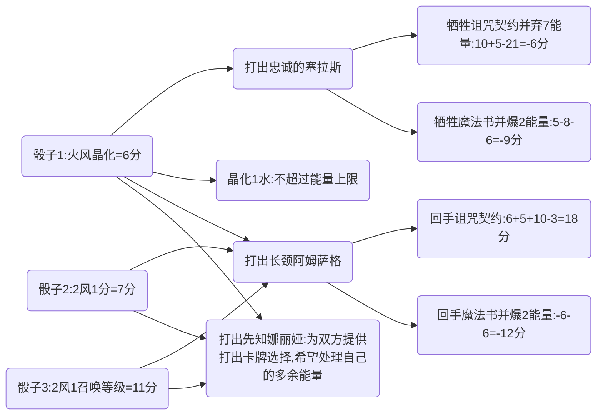

《四季物语》是一款 2–4 人卡牌轮抽与组合构筑桌游。玩家管理能量、召唤等级和水晶，并通过季节骰与卡牌效果提高终局声望点。

抽牌和掷骰会产生随机性，能量储备、召唤等级、卡牌组合与游戏速度仍可规划。本文把这些选择换算为预计声望点，用同一尺度比较轮抽选牌与局中行动。

这些数值来自作者的对局经验和近似假设，用于比较选择。它们不属于官方规则，也不构成已经证明的最优策略。

本文面向熟悉基础规则、希望复盘资源效率的玩家。第一次接触游戏时，建议先阅读 [Libellud 官方英文规则书](https://cdn.svc.asmodee.net/production-libellud/uploads/2022/03/SEASONS_RULES_EN.pdf)。

2023 年 9 月 27 日，我根据与 [hdfbuaa](https://boardgamearena.com/player?id=91665234) 的交流修订了捣蛋魔骰、神圣金杯、**5.3.5 游戏速度**和**5.3.6 利用随机性**。hdfbuaa 是 2022 年 BGA《四季物语》世界杯决赛胜者；文中的策略判断仍由作者负责。

## 术语与估值符号

- **能量（Energy token）**：水、土、火、风四类标记。本文统一称“能量”。
- **召唤等级（Summoning gauge）**：玩家场上最多可有的力量卡数量。
- **打出卡牌（Summon）**：支付召唤费用，把力量卡从手牌放入场上。后文统一称“打出卡牌”。
- **晶化（Transmute）**：按当前季节的比率把能量换成水晶。
- **水晶（Crystal）**：游戏中的计分标记，也可支付部分效果。
- **声望点（Prestige point）**：官方规则中的胜利分。表格里的“分”“牌分”“估分”均以声望点计。
- **卡牌估值**：本文模型对一张牌预计贡献的声望点。估值会随打出时点、组合和对手行动变化。

## 一、一些假设

### 1.1 游戏总回合数

游戏总月数的下限是36个月。

| 游戏速度/玩家倾向 | 平均每回合推进月数 | 推算总回合数 |
| :--: | :--: | :--: |
| 慢速 | ~1.5个月 | ~24回合 |
| 中速 | ~2个月 | ~18回合 |
| 快速 | ~2.5个月 | ~14回合 |

按上表所示，**游戏总回合数预计在14~24回合**。

### 1.2 玩家平均打出牌数
一般玩家打出牌数最少在8张左右（由效果弃置手牌，或无法打出），最多可在15张左右（由效果牺牲场上牌，即可再多打出）。

由于抽牌和群体发牌的效果较多，且大多数玩家倾向于抽牌，玩家一般会打出更多的牌，本文根据经验估计**玩家平均打出牌数为11张**。

## 二、资源的分值量化

### 2.1 能量

基准模型假设每枚能量都在晶化价值最高的季节换得 3 水晶，因此记作 **每枚能量价值 3 分**。低价晶化、超过储存上限和奖励行动会在后文单独调整。

### 2.2 召唤等级

基准模型假设玩家会在终局前打出计划中的全部手牌。召唤等级每提高 1 格，最多可多保留一张场上牌，并可避免未打出手牌带来的 5 分罚分。

因此，召唤等级仍限制打出卡牌时，记作 **每格召唤等级价值 5 分**；达到所需上限后，额外等级在本模型中记作 0 分。

抽一张最终无法打出的牌会增加 5 分罚分；已有富余召唤等级时不计这项成本。

### 2.3 晶化
晶化的价值由换得的水晶和当回合放弃的其它行动共同决定，本文按机会成本计算。

## 三、牌价值与策略分析

### 3.1 牌价值表

下表保留作者对全扩卡池的原始估值，并按“估分”降序排列。“牌价值”列展示计算过程，“评价”列记录对局经验。卡牌名称和文字沿用作者当时使用的中文版本；具体规则以所用版本的规则书和卡面为准。本文把作者按当前模型与开局灵活性选出的牌列为“第一手候选”；表中前 11 张牌（从麦瑟迪的魔灯到水晶泰坦）属于这一组，具体理由按打出时点、资源负担和组合条件逐牌说明。

| 卡牌 | 估分 | 花费 | 牌分 | 效果 | 牌价值 | 评价 |
| :--: | :--: | :--: | -- | :--: | -- | ---- |
| 麦瑟迪的魔灯 | 44 | 3水3风 | 24分 | 常时：不可被免费打出。能量上限-1。 每回合结束时：获得3分。 | 慢速：~(24-4)x3+24-3x6=66分 中速：~(18-4)x3+6=48分 快速:~(14-4)x3+6=36分 | 较早打出时，模型估值为 36–66 分。 |
| 捣蛋魔骰 | 40 | - | 8分 | 激活：重骰自己的骰子并+2分 | 慢速：8+2x(24-2)=52分 中速：8+2x(18-2)=40分 快速：8+2x(14-2)=32分 | 多数回合都会重骰，按游戏速度估值为 32–52 分。每个骰子的重骰期望不同，一般按 8 分估计：1）玩家自选骰面的期望价值可近似视为重骰期望；2）除“2 能量 + 1 召唤等级”和抽牌外，多数重骰结果的期望收益更高；3）还可通过留下不利骰面或控制游戏速度制造分差。 |
| 恶灵匕首 | 40 | 水风风 | 6分 | 激活：牺牲或弃置一个神仆，获得4能量。 | 每次弃置：5+3x4+6-3x3=14分 每次牺牲：14-牌分 | 持有至少 2 个神仆时，每次弃置按模型净增 14 分；同时补充能量、释放召唤等级并处理负分神仆。 |
| 凛冬权杖 | 40 | 2水 | 6分 | 常时：冬天时你所有能量可以用作地能量。 激活：弃置一张魔器牌，获得3能量。 | 激活次数x14分 | 魔器牌数量较多，通常能稳定找到弃置对象；每次激活按模型把 1 张牌换成 14 分。 |
| 元青花瓷 | 34 | 水地火 | 6分 | 常时：打出牌时获得1能量 | 一般：(11-1)x3-3=27分 极限：(15-1)x3-3=39分 | 按打出 11–15 张牌计算，模型估值为 27–39 分；触发条件适用于多数构筑，并能持续补充能量。 |
| 奇异宝箱 | 34 | 水火 | 4分 | 回合结束时：如果能量数量>=4则+3分 | 慢速：(24-4)x3-2=58分 中速：(18-4)x3-2=40分 快速：(14-4)x3-2=28分 | 按游戏速度估值为 28–58 分；维持至少 4 个能量即可触发。 |
| 春意权杖 | 33 | 3地 | 9分 | 常时：每次打出牌+3分 | 第一年：~33分 第二年：~24分 | 按平均打出 11 张牌计算，第一年和第二年打出的估值约为 33 分和 24 分，触发条件适用于多数构筑。 |
| 阿尔戈斯之心 | 33 | 2地 | 7分 | 回合结束时：如果该回合触发激活，获得1地 | 慢速：~16x3+7-6=~49分 中速：~12x3+1=~37分 快速：~8x3+1=~25分 | 假设第二年打出并每回合激活，模型估值为 25–49 分；与丰收羊角组合时，每回合可把获得的地能量转为 5 分。 |
| 邪术魔蛭 | 30 | 2分/5分/8分 | 8分 | 对手打出牌前需付给你1分 | 2人：2x11+8-2=28分 3人：3x11+8-5=36分 4人：4x11+8-8=44分 | 按每名玩家打出 11 张牌估计，2–4 人局分别约值 28、36、44 分，且无需额外行动。 |
| 水晶球 | 30 | 地火 | 6分 | 激活:1）看牌堆顶牌，可以花4能量免费打出；2）花3分弃置牌堆顶牌。 | (牌堆顶目标牌估值-12)x打出卡牌次数-3x弃置次数 | 当牌堆顶卡牌估值高于 12 分的能量成本时，免费打出产生正收益；预先查看牌堆顶也会提高其它抽牌效果的价值。 |
| 水晶泰坦 | 30 | 火/火+3分/火+8分 | 9分 | 牺牲：丢弃所有手牌和水晶，选择牺牲对手的一张牌 常时：对手牺牲牌前需要给你3水晶。 | 牺牲：对手被牺牲牌估值+牌花费-(12分/15分/20分)=28分/25分/20分 不牺牲：(6分/4.5分/4分)x触发次数+(6分/3分/-2分) | 主动牺牲通常安排在第一年清空手牌和水晶后；命中关键牌时，按人数估值约为 20–28 分，并会移除对手的核心效果。 不主动牺牲时，平均每名对手触发 1 次接近模型基准，触发 2 次则高于基准；仍需记录传牌形成的牺牲效果。 |
| 贪婪的菲格林 | 28 | 3分/6分/9分 | 7分 | 季节转换时：偷每个对手1分 | 第一年：28分/35分/46分 第二年：20分/23分/30分 第三年：12分/11分/14分| 只要对手仍有分数可转移，第一年打出时按人数估值约为 28–46 分，晚打出的估值相应下降。 |
| 伊欧里斯雕像 | 28 | 水地火 | 6分 | 打出时：能量上限-1。 每次季节转换时:获得1能量，或获得2分并看牌堆顶牌。 | ~(12-1)x3+6-3x3=30分 | 按第一年较早打出并触发 11 次计算，模型估值约为 30 分；能量上限减少 1 格，需要预留储存空间。 |
| 神仆石像 | 28 | 水地火风 | - | 打出时：获得10水晶。 激活：获得神仆数量的分数。 | 第二年，2神仆：~10x2-2=~18分 第二年，3神仆：~10x3-2=~28分 | 第二年打出时，2 个神仆约值 18 分，3 个神仆约值 28 分。 |
| 神秘望远镜 | 26 | - | 8分 | 激活：花费2分，观看牌堆顶3张牌并以任意顺序放回。 | 8分+激活次数x(牌价值差-2) | 按抽 3 选 1 的估值，每次激活约净增 6 分，并能提高抽单张牌效果的命中率或限制对手抽牌；能够多次激活时可作为构筑核心。 |
| 吸血鬼王冠 | 25 | 水风 | - | 打出时：抽一张牌或弃一张牌，获得其牌分数量的能量。 | 7能量：3x7-6=15分 10能量：3x10-6=24分 抽牌：牌价值-5 弃牌:+5 | 弃置牌分为 7 或 10 的牌时，可获得 7 或 10 个能量，模型净值约为 15 或 24 分；晶化特权和提高储存上限的效果可帮助兑现这些能量。 |
| 神圣金杯 | 25 | 水地火风 | 10分 | 打出时：免费打出卡牌4选1 | 牌价值-2+花费-7=~25分 | 按揭示 4 张并立即打出其中 1 张计算，模型估值约为 25 分；使用前需预留 2 格召唤等级。**锦标赛牌组中可匹配牌较少，估值相应降低。** |
| 永恒圣杯 | 25 | 水地火风 | 10分 | 回合结束时：可以放置一个能量到牌上 激活：花费牌上的4个能量，免费4选1打出牌 | 激活次数x(牌价值-2+牌花费-17)-2=激活次数x(~12)-2 | 按每次约 12 分计算，激活 2 次接近模型基准，激活 3 次约再增加 12 分；实际结果受揭示卡牌影响，方差较大。**锦标赛牌组中可匹配卡牌较少，估值相应降低。** |
| 时间护符 | 25 | 2水 | 9分 | 打出时：获得2能量。弃置任意数量手牌，并抽取相等数量牌。 | 9分+提升的牌价值=~20分 | 单独使用约值 9 分；更换低估值手牌时，净收益等于新旧卡牌的估值差。 |
| 泽拉神盾 | 25 | 风 | 5分 | 需要牺牲时：可以牺牲该牌替代，并获得10分。 | 触发效果：牺牲收益+10+5-3=牺牲收益+12 配合知识药剂：3x5+12=27分 | 触发替代牺牲时，在原牺牲收益之外约增加 12 分；配合知识药剂时模型估值为 27 分。 |
| 熔岩之心 | 25 | 火/2火/3火 | - | 常时：对手打出牌时你获得1火。 牺牲：获得3火。 | 2人：(3-1)x(11-2)+3x3+5-3=30分 3人：2x9x2+8=44分 4人：2x9x3+5=59分 | 按人数估值约为 30–59 分；火能量超过储存上限或低价晶化时，实际收益会低于表中上限。 |
| 放逐者伊贵姆 | 25 | 3分 | 7分 | 打出时：声明一种牌，所有对手展示手牌，若有该种牌，对手将所有该种牌弃置，然后你获得其花费的能量。 | 3x4+7-3=15分 | 命中时可移除对手的核心牌并补充能量；实际价值取决于手牌记忆、声明时点和目标牌是否仍在手中。 |
| 拉格菲尔德之球 | 25 | 水地火风 | -5分 | 打出时：获得20分。 常时：你小于12分的牌的花费均为5水晶。 | 3分+花费价值差=~20分 | 手牌的原能量花费越高，改用水晶支付所节省的价值越多；同时需要其它效果消耗可能溢出的能量。 |
| 时光魔环 | 25 | 水地2分/水地1分/水地 | 12分 | 常时：当季节指示物一回合移动至少3格时，获得4水晶或1能量 | ~5x4+(4/5/6)=24分/25分/26分 | 触发 4 次时，按人数模型估值为 24–26 分；其他玩家争夺慢速骰面时，触发次数会减少。 |
| 克罗夫的表盘 | 25 | 水地火 | 12分 | 打出时：+2召唤等级。回合结束时：如果打出牌比一个对手多，则可以重掷季节骰 | 5x2+12-3x3=13分 与回合数相关牌配合可以获得额外的10~20分收益 | 独立估值约为 13 分；与按回合触发的卡牌配合时，可额外增加约 10–20 分。 |
| 辉煌权杖 | 24 | 水地火风 | 8分 | 打出时：获得打出魔器牌x3的分数 | 一般：~7x3-4=17分 极限：14x3-4=38分 | 魔器牌较多时，后期模型估值约为 17–38 分。 |
| 远古药剂 | 23 | 水地火风 | - | 牺牲：4选2：1）每个能量晶化4分；2）抽2选1；3）+2召唤等级；4）获得4能量 | 5-12+ 1）1分x能量数量 2）牌价值-5=\~15分 3）2x5=10分 4）3x4=12分 =\~20分 | 四项效果可按当前资源缺口组合，常见选择的模型收益约为 10–20 分。 |
| 乞者号角 | 23 | 地风 | 8分 | 回合结束时：如果能量数量<=1则+1能量 | 2+3x(~8)=26分 | 触发条件要求回合结束时至多保留 1 个能量；约触发 8 次时，模型估值为 26 分。 |
| 天命不凡 | 23 | - | - | 抽牌阶段结束时：玩家抽2选1 | 平均价值23分 |  |
| 财富之手 | 22 | 地火风3分 | 9分 | 常时：打出卡牌能量花费-1(至少为1) | ~8x3-3=21分 | 同样是打出卡牌少花费1能量，这张牌限制条件严于元青花瓷，而且花费较高前期不好打出 |
| 时光沙漏 | 22 | 水地火风 | 6分 | 季节变换时：获得1能量 | 第一年：(11-1)x3-6=24分 第二年：7x3-6=15分 第三年：3x3-6=3分 | 尽早打出可增加触发次数，但需要预留能量储存空间，避免超过能量上限。 |
| 贪吃锅 | 21 | - | - | 激活：放置一个能量在牌上，7能量时牺牲该牌，获得15水晶并返还能量 | 15+5=20分 | 投入 7 个能量并完成牺牲后，模型净值为 20 分；同一回合用晶化特权处理返还的 7 个能量可提高收益。盗窃妖精会从其多次激活中得分。 |
| 龙头骨 | 21 | 水地火 | 9分 | 激活：可以牺牲3张牌，获得15分 | 每次收益：3x5+15-？=~20分 | 牺牲 3 张 0 分或负分牌时，可释放 3 格召唤等级；实际收益还需扣除被牺牲卡牌的牌分。 |
| 伊欧的藏宝袋 | 20 | 火风 | 6分 | 常时：每个晶化能量+1分 | 1x晶化 | 每晶化 1 个能量额外获得 1 分；晶化约 20 个能量时，该效果贡献约 20 分。 |
| 魔法书 | 20 | 水地 | 8分 | 打出时：获得2能量 常时：储存能量上限+3 | 8分 配合吸血鬼王冠、拉格姆的吊饰能获得~15分的加成 | 独立估值约为 8 分；与吸血鬼王冠或拉格姆的吊饰配合时，储存空间可增加约 15 分收益。 |
| 盗窃妖精 | 20 | 0分/3分/6分 | 6分 | 常时：每次对手激活牌时，你偷他1分，再获得1分 | 2人局触发2次：(2+1)x2+6=12分 2人局触发10次：(2+1)x10+6=36分 | 触发时收益高于大部分其它激活效果，主要用于限制对手的激活牌 |
| 火之护符 | 20 | 2火 | 6分 | 打出时：抽牌4选1 | 四张揭示牌中的最高估值-5=~20分 | 揭示 4 张牌并保留估值最高的一张；按目标牌估值约 25 分计算，本牌净值约为 20 分。 |
| 暗影小鼠 | 20 | 2分/4分/6分 | 8分 | 打出时：偷取每个对手的2个能量 | 18分/22分/26分 | 按人数估值约为 18、22、26 分；对手能量不足时，实际收益相应降低。 |
| 篡夺者渡鸦 | 20 | 火 | 2分 | 打出时：复制对手的一张魔器牌，额外花费该牌的能量。对应牌离场时此牌将被牺牲。 | 牌价值-1=~24分 | 复制对象估值约为 25 分时，扣除 1 个火能量后净值约为 24 分；收益取决于场上是否有可复制的魔器。 |
| 阿尔戈斯的纠缠 | 20 | 地风 | 14分 | 打出时：使对手一张神仆牌的效果失效 | 8分+效果价值 | 生效时通常约值 20 分，是针对持续神仆效果的反制牌。 |
| 力量药剂 | 19 | 2火 | - | 牺牲：2召唤等级+抽1牌 | 牌价值+4=~19分 | 实际等于提供3召唤等级，召唤等级不足时的关键牌 |
| 伊欧的仆从 | 19 | 风 | (-5分) | 常时：不能获得水晶。 打出时：获得1风，+1召唤等级。 激活：花费1风将这张牌传给下家。 | 常时：10分+对手失去分数 终局尾家：15分+对手失去分数 | 通过禁止获得水晶压低持有者的终局收益；末轮传递时，对手可用于处理它的行动最少。 |
| 伊斯塔的卷轴 | 18 | 2火 | 7分 | 打出时：声明一个能量，从牌堆顶翻牌直到发现花费对应能量的牌并获得手牌，可以弃置第一张牌并再次触发效果。 | 翻得目标牌估值+7-5-6=~18分 | 常用于寻找花费包含水能量的目标牌；可弃置第一张匹配牌再翻一次。 |
| 阿鲁斯的模仿 | 18 | 水地风 | 10分 | 打出时：弃置或牺牲1张牌，+12分 | 12+5+10-9=18分 牺牲：18分-牌分 | 弃置 1 张手牌时模型估值为 18 分；选择牺牲时还需扣除目标牌牌分，通常优先处理 0 分或负分牌。 |
| 知识药剂 | 17 | 2水 | - | 牺牲：获得5能量 | 3x5+5-2x3=14分 | 基础模型估值为 14 分；用于支付开局卡牌、终局晶化或在晶化特权回合供能时，还需计入由这 5 个能量完成的后续效果。 |
| 古墓护符 | 17 | 2火 | 8分 | 打出时：看弃牌堆顶3张牌，1张加入手牌，放1张牌堆顶，1张牌堆底 | 牌价值-3分=~17分 | 从弃牌堆顶 3 张中取回估值约 20 分的牌时，扣除 2 个火能量后净值约为 17 分；弃牌顺序决定可选范围。 |
| 时光魔靴 | 16 | - | 8分 | 打出时：移动季节指示物1~3格 | 8分 | 独立牌分为 8 分；终局可提前 1–3 个月结束，并改变未打出手牌罚分和按回合触发次数。 |
| 能量护符 | 16 | 水地火风（可选） | 2分 | 打出时：2能量/5分/1牌/1召唤等级 | 2分+3分/2分/牌价值-8/2分=~16分 | 按资源缺口从 2 个能量、5 分、抽 1 张牌或 +1 召唤等级中选择；阿尔戈斯恶魔降低召唤等级后，可用 +1 等级抵消。 |
| 神仆罗网 | 16 | 火风 | 7分 | 打出时：从牌堆顶翻牌直到发现神仆并获得手牌，可以弃置第一个神仆并再次触发效果。 | 翻得目标神仆估值+7-5-6=~16分 | 常用于寻找特定神仆；可弃置第一个神仆再翻一次。 |
| 神谕猫头鹰 | 16 | 水风 | 10分 | 打出时：展示玩家数量张牌，所有玩家每回合可以买其中1张牌 | 4分+2x(牌价值-5分) | 能量和召唤等级充足且自己处于末位时，可优先购买揭示牌；按两次购买计算，模型估值约为 16 分。 |
| 长颈阿姆萨格 | 15 | 水风 | 8分 | 打出时：每个玩家弹一张魔器牌回手 | 平时：2分 终局尾家：+5分+牌效果分=7+？ | 净收益等于己方魔器再次打出所获效果与时点收益，再扣除对手可重打魔器的收益。 |
| 凝望者提图斯 | 15 | 1火/2火/3火 | 4分 | 每回合结束时：每个对手给你1分，如果有对手没有分，则牺牲这张卡 | 2人：~10x2-3+4=21分 3人：~8x3-6+4=22分 4人：~8x4-9+4=27分 | 按持续触发估值为 21–27 分；任一对手清空分数即可令其被牺牲，因此实际触发次数通常低于上限。 |
| 诅咒契约 | 15 | 水 | -10分 | 打出时：获得2能量，10分和1召唤等级。 被牺牲时：弃置所有能量 | 2x3+10+5-10-3=8分 | 基础模型估值为 8 分；获得的 2 个能量、10 分和 1 格召唤等级可立即支持其它卡牌，牺牲前先消耗所持能量可减少弃置损失。 |
| 拉格姆的吊饰 | 15 | 水火风 | - | 打出时：获得已打出魔器牌数量的能量 | 7能量：7x3-3x3=12分 | 获得 7 个能量时模型净值约为 12 分；魔法书提供的额外储存空间可减少溢出。 |
| 龙魂 | 15 | - | 8分 | 激活：弃1分重置一张其它牌 | 8分+激活效果价值 | 净收益等于被重置效果的价值减 1 分；适合配合神仆石像、恶灵匕首等高收益激活效果。 |
| 艾塞尔的喷泉 | 15 | 2地 | 7分 | 回合结束时：如果没有手牌，获得3分 | ~8x3+1=25分 | 限制条件较为严格，基本只能早早打出卡牌，抽牌就大概率吃不到喷泉分，因此较大限制了其它牌和抽牌的收益，导致总体收益低 |
| 重生王座 | 15 | 水火火 | 10分 | 打出时：弃1张牌：抽1张牌+使用特权数-1 | 6~8分+牌价值差=~15分 | 按表中假设估值约为 15 分，低于本文 17 分的平均卡牌估值。 |
| 拉格斐德的仆从 | 14 | 火风 | 10分 | 打出时：所有拥有10水晶的玩家+1召唤等级抽一张牌，抽的牌可以弃置 | 独占：牌价值+4分 独占+弃置：5+4=9分 | 仅自己达到 10 水晶时，可独占 +1 召唤等级和抽 1 张牌；若弃置抽到的牌，模型净增 9 分。 |
| 暗影诡计 | 14 | 火 | 4分 | 打出时：抽2张牌，选1张手牌给打出卡牌最少的对手 | 1分+2x牌价值差 终局：+5分 | 相对低分而稳定的抽牌手段 |
| 水之护符 | 14 | 2水 | 6分 | 打出时：获得4能量 | 12分 |  |
| 复活药剂 | 14 | 地火 | - | 牺牲：从弃牌堆顶5张牌选1张加入手牌，其它牌放入弃牌堆底。 | 回收目标牌估值-6分=~14分 | 通常用于回收弃牌堆顶 5 张中的已知目标牌，因此可直接用该牌估值减去 6 分能量成本。 |
| 乌姆的封印箱 | 13 | 水水地 | 10分 | 终局：如果你的场上只有魔器，获得20水晶 | 20+10-9=21分 | 满足终局条件时模型估值为 21 分，通常用牺牲效果清除场上的神仆。 |
| 阿尔戈斯之鹰 | 13 | 地风 | 4分 | 打出时：获得10分+1召唤等级。 牺牲：每个对手+6分-1召唤等级 | 10+5+4-2x3=13分 牺牲：5-6+5=4分 | 牺牲时模型净值为 4 分；对手需要当前召唤等级时，降低其等级可增加额外收益。 |
| 叛逃者斯彼得威 | 13 | 召唤等级数量分数 | 7分 | 激活：当一名对手抽牌时，你可以代替其抽牌，并将斯彼得威置于对手场上 | 2-召唤等级+牌价值 | 召唤等级低于 6 时牌分较高；每次代替抽牌可用新牌价值抵消传递成本，终局持有者则承担未能继续传递的成本。 |
| 食肉铁青树 | 13 | 地火风 | 12分 | 回合结束时：如果你没有能量，可以看牌堆顶一张牌，并可以花1召唤等级抽牌 | 3分+触发次数x(牌价值-10分) | 触发需要清空能量并支付召唤等级；只有召唤等级富余时，抽牌收益才容易超过成本。 |
| 先知娜丽娅 | 12 | 3分 | 8分 | 打出时：抽玩家人数张牌，由自己分给每个人1张 | 5分+~7分=~12分 | 自己决定每名玩家获得的牌；把最高估值牌留给自己并分出其余牌时，模型估值约为 12 分。 |
| 灰脸路易士 | 12 | 火风 | 6分 | 打出时：复制一个对手的所有能量 | 3x(~4)=~12分 | 对手持有约 4 个能量时，按每个 3 分计算，模型估值约为 12 分。 |
| 诅咒灵魂 | 12 | 水 | -5分 | 打出时：获得10水晶+1水。 激活：花费1水把这张牌传给下家。 回合结束时：失去3分。 | 假设最终留给对手：10-3+3+5=15分 | 最终传给对手并使其承担至少一次回合结束扣 3 分时，模型估值约为 15 分；执行该计划需要保留 1 个水能量和传递行动窗口。 |
| 赛琳娜的法典 | 12 | 水风 | 6分 | 打出时：弹一张花费能量的魔器牌回手 | 牌价值-牌花费 | 净收益等于重打目标牌的效果价值减去再次支付的能量花费。 |
| 阿尔戈斯的守望者 | 12 | 风 | 6分 | 打出时：选择一项：1）每名玩家弃1张手牌；2）每名玩家弃4个能量。 | 2分+ 1)弃手牌：牌价值-5 2)弃能量：3x4=12分 | 比较灵活的牌，常用弃能量，也可用于弃对手最后一张关键牌，或弃自己多余牌 |
| 丰收羊角 | 12 | 水地 | 4分 | 每回合结束时：弃1能量。如果弃了地能量则+5分。 | 8回合：(5-3)x8+4-6=14分 | 单独使用价值有限；与其它牌联动时收益可能提高。 |
| 伊斯特的竖琴 | 12 | 风 | 8分 | 激活：花费2个相同能量，+3分+1召唤等级 | 5分+激活次数x2分 | 每次激活按模型净增 2 分；连续使用会消耗同色能量，需要同时检查能量需求。 |
| 忠诚的塞拉斯 | 11 | 3火 | 14分 | 打出时：每个对手牺牲一张牌 | 对手牺牲0分：5分 对手牺牲6分：5+6=11分 对手牺牲更多：11+分 | 常见的开局威胁；对手通常会预留低分牌作为牺牲目标。 |
| 梦境药剂 | 11 | 2风 | - | 牺牲：弃掉所有能量，免费打出一张牌 | 花费-1 伊欧里斯符文魔方：19分 神仆石像：11分 席迪特的魔灯：17分 | 净收益等于免付的卡牌花费减去弃置能量的价值；用于伊欧里斯符文魔方、神仆石像和席迪特的魔灯时，表中示例分别为 19、11、17 分。 |
| 奥拉夫的祈福雕像 | 11 | 3水 | - | 打出时：获得20分 | 11分 | 免费打出可免去价值约 9 分的能量花费，并可作为后续牺牲目标。 |
| 拉格菲尔德之盔 | 11 | 3风 | 10分 | 终局：打出的牌比所有对手多时获得20水晶 | 20+10-3x3=21分 | 终局打出牌数严格多于每名对手时，模型净值为 21 分；平手无法获得 20 水晶。 |
| 暗影席德 | 11 | 地/2地/3地 | 6分 | 打出时：如果你拥有最多分，则偷取每个对手5分 | 13分/20分/27分 | 打出时保持全场最高分即可触发；2–4 人局的模型估值分别为 13、20、27 分。 |
| 风之护符 | 10 | 2风 | 6分 | 打出时：+2召唤等级 | 10分 | 召唤等级护符 |
| 伊欧里斯符文魔方 | 10 | 20分 | 30分 | - | 10分 | 免费打出可免去 20 分花费，使净收益由 10 分提高到 30 分。 |
| 乌姆的灵魂牢笼 | 10 | 2分 | 10分 | 打出时：下一个打出牌的玩家选择一项：弃置打出的牌并不发动效果，或牺牲一张牌 | 8分+- 牺牲：5-牌分 | 自己打出下一张牌时，可用 0 分或负分牌承担牺牲；对手打出下一张牌且缺少低分牺牲目标时，受到的损失更高。 |
| 地之护符 | 9 | 2地 | 6分 | 打出时：+9分 | 9分 | 小分护符 |
| 光之树 | 7 | 2地 | 12分 | 激活:1）弃一个能量，本回合可晶化；2）花3水晶买一个能量。 | 12-6=6分 | 能量辅助牌，本身没有分值产出 |
| 席迪特的魔灯 | 7 | 3地3火 | 24分 | 终局：每个能量价值3分 | 24-6x3=6分 | 常规打出净值约为 6 分；免费打出可免去价值约 18 分的能量花费。 |
| 远古珠宝 | 7 | 火火 | 10分 | 游戏结束时：若牌上有3能量，获得35分，否则-10分。 激活：花费3个相同能量在牌上放置一个能量。 | 35+10-3x9-3x2=12分 | 完成条件后的模型净值约为 12 分，并需投入 9 个同色能量；适合处理中期反复溢出的能量，否则会挤压其它卡牌需求。 |
| 毁灭者凯恩 | 6 | 3风 | 9分 | 激活：花1能量扣其它对手4分 | 1分x使用次数 | 本模型只按每次激活净增 1 分计算，主要用于消耗多余能量。 |
| 伊欧的转化器 | 6 | 水地 | 6分 | 常时：当选择骰子上获得分数时可以晶化，晶化后在回合结束时获得2分 | 2分x触发次数 | 每次触发按模型增加 2 分，主要用于处理多余能量。 |
| 伊欧里斯复制器 | 6 | 水 | 7分 | 激活：花费1水，将一张7分的复制牌置于场上。 | 4分-1分x激活次数 | 将多余召唤等级转化为分数 |
| 阿尔戈斯恶魔 | 5 | 水地火风 | 16分 | 打出时：每个对手召唤等级-1，抽一张牌 | 常时：16-3x4+10-牌价值=14分-牌价值 终局尾家：16-3x4+5=7分 | 常规时点的净收益取决于对手抽到的牌值；终局末位或对手受召唤等级限制时，反制收益更稳定。 |
| 季节之镜 | 5 | 3分 | 8分 | 激活：将任意同种能量转为另一种能量，每个花费1水晶 | 6分-1分x激活次数 | 支付每个 1 水晶，把已有的同种能量转换为所需类型；该效果不增加能量数量。 |
| 生命药剂 | 4 | 2地 | - | 牺牲：将每个能量以4分卖出 | 1分x能量-1 | 一般用于消耗多余能量 |
| 妖精石碑 | 4 | 2地 | 6分 | 回合结束时：可以储存1能量在牌上。 激活：获得牌上任意数量的能量。 | 0分 | 基准模型记作 0 分；实际收益来自暂存原本会超过储存上限的能量。 |
| 禅意骰子 | 4 | 地风 | 10分 | 常时：可以替代骰子行动执行下列行动之一：1）召唤等级+1；2）获得1能量；3）本回合可晶化 | 4分 | 三种替代效果通常低于正常骰子行动的模型收益，只在对应资源缺口明确时使用。 |
| 风灵使者 | 3 | 3风 | 12分 | 打出时：把所有对手的能量变成风 | 12-3x3=3分 | 扣除 3 个风能量花费后模型净值约为 3 分；对手正需要非风能量支付卡牌时，转换效果才会增加额外收益。 |
| 伊斯塔的天平 | 2 | 2分 | 4分 | 激活：晶化3个相同能量 | 2分 | 本模型净值约为 2 分，只在缺少其它晶化入口时提供辅助。 |

### 3.2 牌价值分析

按卡牌估值表，整体分布近似线性，前 10 名左右与其余卡牌的估值差距较明显。

牌价值的平均值为18，标准差为9.1。

经过10万次随机采样，得到如下结果：

| 抽牌数量 | 牌价值平均值 | 牌价值标准差 |
| -------- | ------------ | ------------ |
| 抽2选1   | 23.3         | 8.5          |
| 抽3选1   | 26.0         | 8.0          |
| 抽4选1   | 28.0         | 7.6          |

而受抽牌时间影响，一定比例的牌随着时间的推移会显著减少价值，如回合收益效果、打出卡牌收益效果等。

可以认为**抽牌行动的价值为6~13分**（随时间变化）。表中的标准差为 7.6–8.5 分，说明单次抽牌结果可能明显偏离平均值。

- 抽2选1：8~18分
- 抽3选1：9~21分
- 抽4选1：10~23分

神圣金杯、永恒金杯的立即打出牌与手牌的随时打出也有区别，因为部分牌的价值依赖于特定的打出时机，例如吸血鬼王冠、时光魔靴等。我评估立即打出牌的价值大概需要再-2分（4~11分），但最大的影响是牌效果的联动变得困难，或者说价值方差被进一步扩大，因此使用这类效果前最好做好充分的准备。

## 四、行动的分值对比与策略分析
### 4.1 骰子行动

| 资源组合 | 分值 |
| :--: | :--: |
| 抽牌 | 10~13 |
| 2资源+召唤等级 | 6+5=11 |
| 1资源+召唤等级 | 3+5=8 |
| 2资源+3分 | 6+3=9 |
| 2资源+2分 | 6+2=8 |
| 2资源+1分 | 6+1=7 |
| 6分 | 6 |

抽牌和提高召唤等级的基准估值较高。计划新增抽牌时，应同时确认召唤等级足以打出这些牌；满足这一条件后，更多抽牌通常能提高期望收益。

当召唤等级足够且没有抽牌行动时，选择2资源+分是价值最大的。

## 五、组合策略分析
前面分析了单张牌和单个行动的期望价值。

然而游戏中的牌和行动随时有着联系，只有达到最好的条件才能使得牌和行动充分地发挥应有的价值，有时它们还会达到新的高度。

因此以下分析一些资源约束和效果联动所带来的组合策略。

### 5.1 影响牌价值的资源约束与平衡策略
#### 5.1.1 时间

很多牌的价值与时间有关。

- 捣蛋魔骰，奇异宝箱等每回合产出价值的牌，每晚打出一回合就少产出分数，游戏速度快时也会少产出约6回合的分数。

前几回合由于有限的能量和召唤等级约束，能够打出的牌是有限的。

- 例如，第一年最多塞3张起手牌，第一回合最多从骰子获得2能量1召唤等级...

因此如果需要尽早打出的牌过多，一些牌将受资源限制被延后打出，其价值将降低。在轮抽时应当考虑这种情况，动态调整一些牌的评估价值。

另外，选择时间相关牌时需要考虑时光魔靴和克罗夫的表盘对游戏速度的影响。

- 表盘能显著改变游戏速度。对手持有时应降低它的收益，自己持有时则提前规划触发时点。

#### 5.1.2 召唤等级

召唤等级决定了打出牌的最大数量，召唤等级的来源由3个部分组成：骰子、牌效果、以及特权。

以2人游戏为例，12个骰子的召唤等级面比例为$27/60=0.45$，先手一定获得召唤等级的概率为$1-(1-0.45)^3=0.83$，后手一定获得召唤等级的概率为$3 \times 0.45^2 \times (1-0.45)+0.45^3=0.43$，则玩家能够从骰子获得召唤等级的期望按下表计算。

| 速度 |        召唤等级期望         |
| :--: | :---------------------: |
| 快速 | $14 \times (0.83+0.43)/2=8.8$  |
| 中速 | $18 \times (0.83+0.43)/2=11.3$ |
| 慢速 | $24 \times (0.83+0.43)/2=15.1$ |

计算显示，慢速对局中的召唤等级通常充裕；当每回合推进 2 个月以上或骰面未提供所需等级时，部分卡牌可能无法打出，其估值需要扣除未打出的 5 分罚分及失去的卡牌效果。

从另一方面，玩家需要从抽牌阶段开始关注牌效果的召唤等级需求，调整自己的召唤等级需求总量，避免被召唤等级卡死。

举例一些牌效果对召唤等级需求的影响：

- **风之护符**提供2个召唤等级，自身消耗1个召唤等级，因此该牌的召唤等级需求为-1。轮抽保留该牌将使原总召唤等级需求-2，抽到该牌将使原总召唤等级需求-1；
- **远古药剂**牺牲后不占用召唤等级，它的效果可以获得1张手牌，也可以获得2个召唤等级，因此该牌的召唤等级需求为-2~1；
- **神圣金杯**需要额外打出 1 张牌；若抽到另一张神圣金杯，则需要额外打出 2 张牌，因此该牌的召唤等级需求为 2–3；
- **永恒圣杯**一般会发动 2–3 次，需要额外打出 2–4 张牌，因此该牌的召唤等级需求为 3–5；快速对局较难同时取得这些等级和触发次数。

个人认为轮抽后手牌的召唤等级总需求在7~8已经足够保险。

在确定召唤等级稀缺时，玩家应尽早使用特权提升召唤等级以最大化牌价值。

#### 5.1.3 能量

玩家获取能量数量和能量种类的时机会影响打出卡牌时间，从而影响牌价值。因为能量种类上难以总结得到一般规律，下面对能量数量做一些分析。

以2人游戏为例，12个骰子的面产出能量比例为$85/60=1.42$，由于骰面能量多少与选取优先级弱相关，玩家从骰子获得能量的数量期望按下表计算。

| 速度 |  每年数量期望  | 总数量期望      |
| :--: | :------------: | --------------- |
| 快速 | $5 \times 1.42=7.10$  | $14 \times 1.42=19.88$ |
| 中速 | $6 \times 1.42=8.52$  | $18 \times 1.42=25.56$ |
| 慢速 | $8 \times 1.42=11.36$ | $24 \times 1.42=34.08$ |

根据计算可以看到，每年获得能量的数量期望约为9。以上按照每回合3个骰子的平均期望计算，实际可以由玩家主动选择来提升数量。

有很多牌的效果可以提供大量能量，玩家需要结合考虑第一年和第二年打出卡牌所需的能量数量，防止过多能量需求导致牌打不出来，过少能量需求导致能量溢出，以及考虑能量溢出的可能处理方式。

- 举例：如果玩家在第一年打出捣蛋魔骰、邪术魔蛭、阿尔戈斯的守望者 3 张牌，能量可能在第一年后半段超过储存上限，未能晶化的部分按每枚 3 分扣减。可以考虑把阿尔戈斯的守望者替换为能消耗更多能量的牌。

### 5.2 晶化能量

尽管本文假设每个能量晶化3分，但在实际对局中能量提供的分往往存在很大变数。

一个原因是能量爆棚和被迫晶化，相关的讨论已经在上文中提及；另一个原因则是**[特权：晶化+1]**行动带来的附加分值。

来计算一下这个行动一回合能够产生的极限附加分值（简单的乘法）：

|                       相关效果                        | 晶化能量极限数量 | 1特权附加分值 (回合-5分) | 2特权附加分值 (回合-12分) | 3特权附加分值 (回合-20分) | 4特权附加分值 (回合-29分) |
| :---------------------------------------------------: | :--------------: | :-------------------------: | :---------------------------: | :---------------------------: | :---------------------------: |
|                       能量存储                        |        7         |              7              |              14               |              21               |              28               |
|                 水之护符 恶灵匕首                 |        4         |              4              |               8               |              12               |              16               |
|                       知识药剂                        |        5         |              5              |              10               |              15               |              20               |
|                        贪吃锅                         |        6         |              6              |              12               |              18               |              24               |
|        妖精石碑 吸血鬼王冠 拉格姆的吊饰        |        7         |              7              |              14               |              21               |              28               |
| (+魔法书) 妖精石碑 吸血鬼王冠 拉格姆的吊饰 |        10        |             10              |              20               |              30               |              40               |

根据上表，如果一个玩家提前屯了7个季节3分的能量并提前打出了一张知识药剂，那么他使用3次晶化特权的分值收益为21+15-20=16分，这相当于1张普通牌的价值。

同一回合可晶化的能量越多，晶化特权的附加分越高。按上表，20 个能量配合不同储存与增益效果，可在 4 次特权中产生约 20–40 分附加收益。

为了利用这一附加分，下面给出一些策略：

- 因为这个操作，适当的富裕能量有机会产生附加分值。在轮抽中，如果发现大量的获得/囤积能量效果，考虑成套地获得它们，依赖晶化特权取得分值领先；
- 在早期囤积能量时（水之护符、贪吃锅、妖精石碑等），可以考虑将来打算卖出能量的季节，存对应季节的高分能量，避免胡乱存储导致晶化时少分。由于防时光魔靴推进终局，一般选择第二年秋季或第三年春季卖出；
- 在准备使用晶化特权时，可以提前打出知识药剂、水之护符等牌，避免在使用晶化特权当回合使用能量打出卡牌导致晶化能量数量减少。

其它特权（+召唤等级、换能量、抽 2 弃 1）的直接模型收益通常不高于所付成本。**晶化特权能够直接增加每枚能量的分值**，因此一般玩家会保留特权使用次数，等待能量较多的晶化回合。

**案例：[晶化的威力](https://boardgamearena.com/gamereview?table=341140729)**

虽然这一局yiyuiii的对手完全没有卡yiyuiii导致分数偏高，但这不影响我们欣赏yiyuiii使用3特权晶化25个能量所获得的巨量水晶。

### 5.3 对抗策略

《四季物语》以个人资源经营为主，但完整牌库包含多种直接影响对手的效果。时光魔靴会改变关键季节的到达顺序，忠诚的塞拉斯会迫使对手牺牲卡牌；在特定局面中，这些效果可能造成 30 分以上的收益变化。

在对抗里，我们按最大化(自己价值-对手价值)这一目标进行分析。

下面对每个机制和牌展开做分析。

#### 5.3.1 季节骰

玩家轮流选择季节骰并取得骰面资源，最后留下的季节骰决定本轮季节指示物前进的格数，也决定游戏速度。

下面列出一些季节骰的要素及其影响：

| 要素名称 |              可能影响              |
| :------: | :--------------------------------: |
| 能量个数 |    超过能量储存上限、部分效果的触发条件    |
| 能量种类 |    打出卡牌条件、未来能量晶化的时机    |
|   召唤等级   |         打出卡牌时机、能量处理         |
|   晶化   |    能量处理、部分效果的触发条件    |
|   抽牌   | 能量处理、打出卡牌时机、对手未知的效果 |
| 游戏速度 |    全局部分效果的价值、触发条件    |

优势是相对的，对手减分等同于自己加分，因此玩家不仅需要考虑每个骰子的资源给自己带来的价值，也要考虑剩下的骰子会给对手带来什么价值。

下面举一个例子对相关的策略分析进行解释，希望读者有所收获。

**案例：[资源的抉择](https://boardgamearena.com/archive/replay/230119-1002/?table=340323492&player=84626341&comments=)** 

在上述场景中，轮到yiyuiii先手拿取骰子，pys88后手拿取骰子，并且yiyuiii将先手行动。下面讨论yiyuiii本回合该如何行动。

首先列出本回合的主要决策树图：

```mermaid
graph LR
D1(骰子1:火风晶化=6分)
D2(骰子2:2风1分=7分)
D3(骰子3:2风1召唤等级=11分)
A1(打出忠诚的塞拉斯)
A2(打出长颈阿姆萨格)
A3(打出先知娜丽娅:为双方提供打出卡牌选择,希望处理自己的多余能量)
A4(晶化1水:不超过能量上限)
R1(牺牲诅咒契约并弃7能量:10+5-21=-6分)
R2(牺牲魔法书并爆2能量:5-8-6=-9分)
R3(回手诅咒契约:6+5+10-3=18分)
R4(回手魔法书并爆2能量:-6-6=-12分)
D1 --> A1
D1 --> A4
D1 --> A2
D1 --> A3
D2 --> A2
D2 --> A3
D3 --> A2
D3 --> A3
A1 --> R1
A1 --> R2
A2 --> R3
A2 --> R4
```

再比较 4 种回合行动的收益：

- 先知娜丽娅：pys88 的能量接近上限，打出先知娜丽娅可能为其提供消耗能量的卡牌，因此该行动价值较低；
- 长颈阿姆萨格：pys88将选择回手诅咒契约，获得18分的正收益，因此考虑把长颈阿姆萨格留到终局打出；
- 忠诚的塞拉斯：pys88最优选择牺牲诅咒契约，由于会弃置7个能量，将为其带来-6分的收益；
- 晶化1水：0收益

从决策树推算，打出长颈阿姆萨格会让 pys88 获得约 18 分正收益，因此其净回报明显低于其它三个相近选项。

本回合有 3 个较优选择：

- 选择1：获得火风晶化，打出忠诚的塞拉斯，然后对手获得2风1召唤等级。回合价值6-11=-5分，忠诚的塞拉斯产生6分的效果价值；
- 选择2：获得火风晶化，晶化1水，然后对手获得2风1召唤等级。回合价值6-11=-5分；
- 选择3：获得2风1召唤等级，打出先知娜丽娅，看看能不能消耗能量，然后对手获得火风晶化。回合价值11-6=5分。

获得 2 风和 1 召唤等级的表面回合价值为 5 分，但 yiyuiii 下回合可能超过能量上限；pys88 则可通过晶化调整能量储备。计入这两项后续影响后，选择 3 的实际回合价值可能降至约 1 分。

另一个关键问题是，如果这回合不打出忠诚的塞拉斯，留到以后再打，牌价值会变动多少呢？

这个问题与机会成本有关。pys88 的诅咒契约大概率会继续留场，因此忠诚的塞拉斯无论何时打出都会牺牲诅咒契约。本回合可以同时弃置 7 个能量；如果 pys88 记得 yiyuiii 在轮抽中拿到忠诚的塞拉斯，之后会尽量减少能量储备。假设之后只能弃置 5 个能量，本回合不打忠诚的塞拉斯的机会成本为 2 个能量，即 6 分，此时选择 3 的回合价值再减 6 分，与选择 1 相等；如果之后只能弃置 3 个能量，机会成本为 12 分，选择 3 会比选择 1 少 6 分。

计入延后打出忠诚的塞拉斯的机会成本后，选择 1 的估值高于其它选项，因此应当选择 1。

#### 5.3.2 特定时点的起始/末位玩家

时点上的争夺一般和特定效果有关。价值相关的效果有：

- 伊欧的仆从、诅咒灵魂、阿尔戈斯恶魔、暗影诡计、先知娜丽娅、长颈阿姆萨格：争取最后一回合的末位，使对手获得无法打出或转移的牌，并承担相应罚分；
- 放逐者伊贵姆：抢每年的起始玩家，能够在对手尚未打出卡牌时狙击其手牌；
- 晶化特权：抢晶化回合的起始玩家，能够防止对手的时光魔靴提前转移季节。

争夺相关的效果有：

- 时光魔靴：可以方便地跳过对手的时点/抢到自己的时点，独有时光魔靴的玩家必定可以获得想要的时点；
- 克罗夫的表盘：可以在时点前调速以使自己获得时点，但抢不过时光魔靴。

错过重要时点可能损失 5 分，例如终局多留 1 张手牌；能量低价晶化、关键牌被牺牲或规划被打断时，损失可能超过 20 分。

当需要考虑时点争夺时，应综合相关价值和抢夺能力制定策略。

#### 5.3.3 牌效果

牌与牌的效果经常相互影响，导致牌价值的不断变动。因为效果交互比较琐碎，下面以表格形式穷举出一些常见情况供参考。

|                            关键牌                            |                            相关牌                            |                             说明                             |
| :----------------------------------------------------------: | :----------------------------------------------------------: | :----------------------------------------------------------: |
|                           盗窃妖精                           |   神仆石像、贪吃锅、水晶球、捣蛋魔骰、诅咒灵魂等激活效果牌   | 在对手有大量激活效果时盗窃妖精的价值大量提升，因此在传牌时可留下诅咒灵魂给自己尽早打出，留下其它激活效果给对手 |
|                        阿尔戈斯的纠缠                        | 邪术魔蛭、盗窃妖精、贪婪的菲格林、阿尔戈斯的纠缠等持续效果神仆 | 对手依靠持续神仆效果得分或限制行动时，阿尔戈斯的纠缠可令其中一张神仆牌的效果失效。 |
|                            魔法书                            |    吸血鬼王冠、拉格姆的吊饰、妖精石碑等大量获得能量效果牌    | 魔法书增加 3 格储存空间，使每个大量获得能量的效果最多保留 3 个额外能量；按基准估值相当于最多 9 分，并可叠加晶化特权。 |
|                           神仆石像                           |                            神仆牌                            |        2 张神仆时接近估值基准，3 张时新增触发使收益明显高于基准，可在轮抽时提前规划        |
|                           泽拉神盾                           |             远古药剂、知识药剂、泽拉神盾等牺牲牌             |                与高价值牺牲效果配合时，可重复取得对应效果收益                |
|                  神秘望远镜、伊欧里斯雕像                  |                       抽1张牌效果的牌                        |               看牌堆顶使抽1张牌的效果大幅升值                |
|             龙头骨、阿鲁斯的模仿、乌姆的灵魂牢笼             |     诅咒契约、拉格菲尔德之球、吸血鬼王冠等小于等于0分牌      |                    牺牲它们腾出召唤等级又加分                    |
|                      长颈阿姆萨格、赛琳娜的法典                      |         时光魔靴、吸血鬼王冠、诅咒契约等具有打出效果的魔器牌         | 令目标魔器回到手牌并再次打出；净收益等于再次触发的效果价值减去重打花费，并受行动时点限制。 |
|                      古墓护符、复活药剂                      |     龙头骨、阿鲁斯的模仿、泽拉神盾、各种药剂等牺牲效果牌     |                      牺牲+复活=使用2次                       |
|                       拉格菲尔德的仆从                       |    诅咒契约、拉格菲尔德之心、阿尔戈斯之鹰等获得水晶效果牌    | 开局先达到 10 水晶，并在对手均未达到 10 水晶时打出，可独占 +1 召唤等级和抽 1 张牌。 |
|             阿尔戈斯之心+丰收羊角+大量激活效果牌             |                                                              |                     稳定的每回合5分产出                      |
|                    恶灵匕首+乌姆的封印箱                     |                                                              |     匕首可在终局前清空自己的神仆，提高乌姆的封印箱满足条件的概率     |
|                     食肉铁青树+坚定之骰                      |                                                              |                      稳定每回合抽一张牌                      |
| 贪吃锅 和/或 知识药剂 和/或 吸血鬼王冠 和/或 水之护符 和/或 其它获得能量牌 |                                                              |               能够在单回合共同享受晶化特权增值               |
| 财富之手+元青花瓷+元青花瓷/春意权杖+复活药剂x2+不多于5张的弃牌堆 |                                                              |           可以形成单回合无限计分循环；组件要求严格，实际对局很少集齐           |

尤其在轮抽时需要注意打散对手会产生高价值的牌组合，搜集自己的高价值牌组合。

了解牌效果的交互影响后，我们可以开始尝试从大局的角度进行一些分析。

**案例：[管中窥豹](https://boardgamearena.com/archive/replay/230119-1002/?table=339038924&player=89973675&comments=)** 

这个案例取自BGA积分前5名的玩家[JeroenDemeyer](https://boardgamearena.com/player?id=89973675)，已知本局游戏共16回合，假设对手的效果不会影响玩家分数，试计算以这手牌起手在终局的理想分数。

按平均每回合骰子产出9分，16回合共产出144分；起手9张牌记作-45分；下面估计手牌价值。

|      手牌      | 估分 |                             说明                             |
| :------------: | :--: | :----------------------------------------------------------: |
|    遗忘之瓶    | 33分 | 计算打出卡牌数量：9-1(梦境药剂)+2(神谕猫头鹰)+1(远古药剂)+2(普通抽牌)=13张，牌价值为6-9+3x12=33分 |
|    时光魔环    | 24分 |                 估计触发次数为3~4次，计24分                  |
| 阿尔戈斯的纠缠 | 8分  |                           用于反制对手的持续神仆效果                           |
|    梦境药剂    | 11分 |                  用于拉远古药剂，12-1=11分                   |
|    远古药剂    | 26分 | 若用于2召唤等级4能量，则15+10=25分 若用于抽牌4能量，因第二年抽牌，估计15+12=27分 |
|   神谕猫头鹰   | 28分 |                因第二年抽牌，估计4+12x2=28分                 |
|    辉煌权杖    | 20分 |             计算魔器牌数量：13-4-1=8张，估计20分             |
|    坚定之骰    | 4分  |                                                              |
|  放逐者伊贵姆  | 12分 |                    期望炸3能量，估计12分                     |

手牌估分总计166分。

估计终局理想分数：144-45+166=265分，实际终局总分212分，相差53分。

实际终局分数通常低于理想估值，因为部分资源损失难以完全避免。本局的差额来自低于基准的能量晶化、使用交换能量特权、抽牌价值偏低，以及终局仍有 2 张手牌未能打出。

#### 5.3.4 轮抽

按卡牌估值平均 17 分计算，轮抽获得的 9 张牌合计 153 分，约占理想终局分数的 60%。前述案例中，轮抽选择可以形成 50 分以上的估值差，因此轮抽是影响胜负的主要阶段之一。

轮抽是一个对抗性的博弈过程。第一手选择保持隐藏，会给后续判断带来不确定性；之后每次公开选择都会暴露部分计划，也可能拿走对手需要的卡牌。记录这些选择，可以据此调整后续攻防与卡牌联动。

轮抽包含一连串相互影响的行动。需要展开分析时，可以使用[博弈树](https://zhuanlan.zhihu.com/p/161492435)表示后续选择与结果。

一般来说，在判断每张牌的期望价值后，从高价值到低价值依次拿牌即可，但同时也要注意牌效果的潜在联动。

下面通过一局轮抽讲述玩家如何通过博弈树对轮抽过程进行分析并指导选牌。

**案例：[轮抽博弈](https://boardgamearena.com/archive/replay/221214-1000/?table=328390269&player=93342702&comments=84626341;)**

这个案例取自BGA积分前5名玩家[Korekiyo Shinguji](https://boardgamearena.com/player?id=93342702)和[JeroenDemeyer](https://boardgamearena.com/player?id=89973675)的对局，首先给出Korekiyo Shinguji视角的开局。

这组牌暂时没有可见的效果联动，可先按各牌的独立估值排序。

其中贪婪的菲格林和奇异宝箱的估值最高。盗窃妖精和龙魂需要激活效果配合，当前牌组尚未提供；考虑后续卡牌仍可能补齐联动，且第一手选择保持隐藏，盗窃妖精也可列入第一手候选。

这手牌的第一手候选是奇异宝箱和盗窃妖精。Korekiyo Shinguji 选择了盗窃妖精。奇异宝箱的预期价值更高，盗窃妖精留给对手也难以发挥作用，因此我会在第一手选择奇异宝箱。

然后看JeroenDemeyer视角的开局。

这手牌中，凛冬权杖和力量药剂都会增加召唤等级，组合后可能产生富余；阿尔戈斯的纠缠和长颈阿姆萨格需要等待其它联动牌。剩余卡牌中，凛冬权杖和伊欧里斯雕像估值最高。凛冬权杖还能把魔器牌转换为能量，因此应作为第一手选择；阿尔戈斯的纠缠和长颈阿姆萨格可放在第 2–3 手选择。

第一手选择结束后，双方看到剩余的全部 16 张牌，之后进入近似完全信息的博弈。

其中牌效果的配合有（第一手所选牌由方括号标注）：

- 伊欧里斯雕像 + 食肉铁青树/力量药剂：可指定自己抽牌，或了解对手抽牌
- [凛冬权杖] + 力量药剂/食肉铁青树：凛冬权杖使抽牌效果升值
- 食肉铁青树 + 坚定之骰：稳定每回合抽一张牌
- [凛冬权杖] - 伊斯特的竖琴：召唤等级富余的冲突，不太需要触发伊斯特的竖琴效果，导致伊斯特的竖琴贬值
- [盗窃妖精] - [凛冬权杖]/伊斯特的竖琴/龙魂：使盗窃妖精大幅升值
- 伊欧的藏宝袋 - 伊斯特的竖琴：使伊欧的藏宝袋晶化能量减少，贬值
- [盗窃妖精] - 阿尔戈斯的纠缠：封锁盗窃妖精的额外价值

双方选牌顺序：

- Korekiyo Shinguji：[盗窃妖精] -> 食肉铁青树 -> 贪婪的菲格林 -> 伊欧里斯雕像 -> 凝望者提图斯 -> 阿尔戈斯的纠缠 -> 阿尔戈斯的守望者 -> 坚定之骰 -> 风之护符

- JeroenDemeyer：[凛冬权杖] -> 龙魂 -> 伊斯特的竖琴 -> 伊欧的藏宝袋 -> 力量药剂 -> 灰脸路易士 -> 复活药剂 -> 奇异宝箱 -> 长颈阿姆萨格

其中的细节：

- 食肉铁青树的独立估值较低，但它能与凛冬权杖联动，因此 Korekiyo Shinguji 的第二手选择同时压低了 JeroenDemeyer 的组合收益；
- JeroenDemeyer 第二手选择龙魂，可能是为了让凛冬权杖在一回合内生产 6 能量并配合晶化特权，随后第三手选择伊斯特的竖琴；这两张牌的独立期望价值仍然不高，而且它们的激活效果会提高盗窃妖精的收益；
- Korekiyo Shinguji 在第六手选取阿尔戈斯的纠缠。JeroenDemeyer 在尚未看到对应神仆时缺少提前选择它的理由；继续延后则可能因其它卡牌价值更低而被对手顺带选走，因此第六手是较稳妥的取得时点；
- 双方低估了奇异宝箱的价值；
- 这一局的长颈阿姆萨格没有可重复触发的己方魔器，净收益接近表中的独立估值，因此优先级靠后。

这局游戏由Korekiyo Shinguji以18分差距胜出。

个人评价Korekiyo Shinguji的手牌预期相对高出大概50分，但他在游戏中频繁使用了坚定之骰+食肉铁青树进行抽牌，抽牌质量或许是分差缩小的原因。

#### 5.3.5 游戏速度

游戏速度是最值得注意、也最容易被针对的价值影响因素。它主要影响：

- **牌价值**。玩家通常会选择适应同一游戏速度的牌，使整组卡牌共同受益。奇异宝箱和捣蛋魔骰按回合得分，更偏好慢速；时光魔环更偏好快速。把不同速度偏好的牌放在同一组会降低峰值，但能减少速度变化带来的方差。
- **召唤等级和能量限制**。游戏速度会改变可获得的召唤等级和能量。资源紧缺时，慢速能提供更多骰面补充机会；资源充足时，抽牌并加快终局可能更有利。

对应策略包括：

- 从牌效果、召唤等级需求和能量需求分析双方偏好的游戏速度。
- 选择净收益更高的游戏速度。慢速适合回合得分、打出卡牌增益、增加出牌数和弥补资源短缺；对手从慢速获得更多收益时，快速更有利。
- 使用捣蛋魔骰、日晷等改变速度的牌，或通过选骰控制游戏速度。

**案例：[打乱节奏](https://boardgamearena.com/archive/replay/230920-1000/?table=419786402&player=91665234&comments=84626341;)**

这个案例取自 BGA 2022 年《四季物语》世界杯决赛中 [hdfbuaa](https://boardgamearena.com/player?id=91665234) 与 [abcdefujii](https://boardgamearena.com/player?id=87707530) 的对局。hdfbuaa 采用较快的游戏速度，压缩了对手慢速牌组补充召唤等级的时间，最终取得 76 分优势。

本局轮抽时 abcdefujii 似乎希望利用季节之镜与 2 张丰收羊角的联动获得价值。这个组合需要较多回合，而 hdfbuaa 的牌组无需延长对局，因此选择提速。abcdefujii 在第一年打出神圣金杯和忠诚的塞拉斯，占用了 3 格召唤等级；第二年又打出季节之镜和时光魔环，剩余召唤等级无法容纳 2 张丰收羊角，预定的每回合计分联动未能实现。

按本文估值，abcdefujii 可在第一年保留忠诚的塞拉斯、季节之镜和丰收羊角，第二年补入另一张丰收羊角与神圣金杯，以提高这些卡牌的联动收益并缩小分差。第一手选择的丰收羊角独立估值仍然偏低，因此不建议把主要构筑集中在它上面。

#### 5.3.6 利用运气

随机结果会改变单局胜负，长期稳定成绩也说明决策质量具有持续影响。前文按价值均值比较选择；本节改用胜率衡量风险，讨论领先或落后时如何利用价值方差。

首先我们看一个抽象例子：

一个双人游戏，你有100分，对手有200分，你最后有两个选择：
1. 稳定获得50分；
2. 99%概率获得0分，1%概率获得200分。

选择 1 的期望收益是 50 分，胜率是 0%；选择 2 的期望收益是 2 分，胜率是 1%。当前目标为取胜，因此应选择 2，接受较低期望收益来换取 1% 的翻盘概率。

这个例子说明：比较行动时，应根据当前目标选择指标。追求单局胜利时，胜率比期望分数更直接。

利用随机性的策略分为两类：
- **分数期望落后时主动增加方差**。抽牌带来的方差最大，其次是骰子和捣蛋魔骰。牌组处于劣势时，可以放慢游戏速度并增加抽牌机会。
- **分数期望领先时降低方差**。可以加快游戏速度、阻断对手抽牌，并减少神谕猫头鹰、暗影诡计等高方差发牌效果。[hdfbuaa](https://boardgamearena.com/player?id=91665234)很擅长这类领先管理，而我过去经常忽略它。
